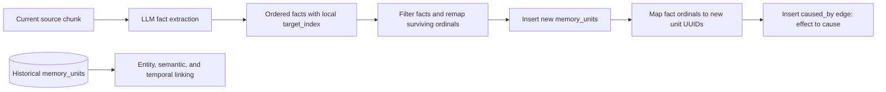

# Hindsight Causal Extraction Boundary: Local Evidence, Not Historical Inference

## Overview

1. Ordinary Hindsight retain extracts explicit causal relations only among facts produced from the current source chunk. It does not compare a new memory unit with historical memory units to infer new causal edges.
2. An **extraction group** is the contiguous ordered fact segment associated with one original chunk. Its causal references use local zero-based fact indexes; it is not a database table, a whole document, a write batch, or a bank-wide history scope.
3. Causal extraction happens before `memory_units` rows exist. After the new facts are filtered and inserted, retain converts the extraction-local indexes into the UUIDs of those newly processed units and persists directed `caused_by` links from effect to earlier cause.
4. New units can connect to existing units through canonical entities, semantic nearest-neighbor links, and temporal proximity. Those mechanisms do not create or imply a `caused_by` relation.
5. The practical consequence is that causal continuity can stop at a chunk or retain-call boundary. Recall can traverse only causal edges that were explicitly extracted and stored; it does not repair missing edges by treating similarity, shared entities, or temporal proximity as proof of causation.

## Terminology

- **Memory unit**: A fact-level `memory_units` row containing fact text, embedding, type, time, tags, and provenance.
- **Extraction group**: The ordered facts attributed to one original input chunk and sharing one local causal-index namespace.
- **Local causal index**: A zero-based `target_index` emitted by fact extraction. It identifies an earlier fact inside the same extraction group, not a database row or historical memory.
- **Causal edge**: A `memory_links` row written by ordinary retain with type `caused_by`, direction effect to earlier cause, and weight `1.0`.
- **Existing memory unit**: A unit already committed in the same bank before the current fact batch is inserted.
- **Write batch**: One transaction-level collection of processed facts. A write batch may contain multiple independently extracted groups; combining them for insertion does not expand the causal scope.

## 1. The Central Boundary

Hindsight's current causal mechanism is local extraction followed by identifier materialization. It is not historical causal discovery.

**Hindsight extracts explicit causality from the current chunk; it does not infer new causal edges by comparing a new memory with historical memories.**

The distinction is temporal as well as conceptual: the LLM emits `causal_relations` while it is extracting facts from chunk text, before the corresponding `memory_units` rows have been inserted. The later database phase does not ask which old units may have caused the new one; it only translates already-extracted fact ordinals into the UUIDs created for the current processed fact list.



There is deliberately no arrow from historical `memory_units` to LLM causal extraction or causal-edge materialization. Historical data participates in other retain-time linking paths, but not in deciding whether a new `caused_by` edge exists.

## 2. What an Extraction Group Is

An extraction group is a local positional namespace, not a stored graph object. In the ordinary path, Hindsight chunks an input item, extracts each chunk independently, records how many facts came from each chunk, and later reconstructs a contiguous fact segment for that chunk. That segment is the extraction group.

For example, two chunks can each produce two facts:

```text
Chunk A extraction group:
  local fact 0: A cause
  local fact 1: A effect, caused_by target_index 0

Chunk B extraction group:
  local fact 0: B cause
  local fact 1: B effect, caused_by target_index 0
```

Both relations use `target_index=0`, but they identify different causes. When the groups are assembled into one global processed sequence, Hindsight adds the start offset of each group, so the relations become `global fact 1 -> global fact 0` and `global fact 3 -> global fact 2`. The second relation must never become `global fact 3 -> global fact 0` merely because both groups used the same local ordinal.

In this design, **earlier** always means earlier in the ordered fact list of the same extraction group. It does not mean that the cause row existed in the database before the current retain operation. Both the effect and its earlier cause normally become new `memory_units` rows from the current extraction, and the edge is materialized only after both new UUIDs are available.

| Possible scope | Is it the extraction group? | Reason |
|---|---|---|
| One original chunk's returned fact segment | Yes | Its facts share the local `target_index` namespace used during conversion. |
| One whole document containing several chunks | No | Chunks are extracted independently and cannot ordinarily make direct cross-chunk causal references. |
| One database write batch | No | The consumer may combine several extraction groups only for efficient insertion. |
| All units in the bank | No | Historical unit IDs are not inputs to ordinary causal extraction. |
| Recall-time graph candidates | No | Recall consumes stored edges; it does not participate in retain-time extraction. |

## 3. From Extracted Relation to Stored Causal Edge

The causal edge is created through six bounded transformations.

1. **Chunk extraction:** Hindsight sends one source chunk to the retain LLM. When causal extraction is enabled, the schema and prompt permit only backward-looking `caused_by` references to earlier facts in the returned list, with the prompt limiting each fact to two causal relations.
2. **Local validation:** For fact position `i`, parsing accepts a causal target only when `0 <= target_index < i`. The first fact therefore cannot have a valid backward causal relation.
3. **Group offset:** Hindsight converts the local target into the position of that target in the combined extracted-fact sequence by adding the extraction group's start index. This preserves the group boundary while allowing several groups to share one later list.
4. **Survivor remapping:** A degenerate extracted fact may be rejected before storage. Hindsight remaps source and target ordinals to the surviving fact sequence and drops a relation whose target was rejected instead of silently redirecting it.
5. **Memory-unit insertion:** The surviving processed facts are inserted, producing a `unit_ids` list aligned one-to-one with their fact positions.
6. **Causal persistence:** For each retained relation, the writer selects `from_unit_id = unit_ids[current_fact_index]` and `to_unit_id = unit_ids[target_fact_index]`, rejects invalid or self references, and inserts `caused_by` with weight `1.0`.

The causal writer receives the current aligned `unit_ids` and their extracted relations. It performs no semantic search, entity search, temporal search, or bank-wide causal candidate query.

## 4. Concrete Boundary Examples

The same-chunk case can create a causal edge because both facts occupy one extraction-local namespace.

```text
Current chunk:
  "Maya lost her job. Because of that, she could not pay rent."

Extraction output:
  Fact 0: Maya lost her job.
  Fact 1: Maya could not pay rent.
          causal_relations=[{target_index: 0, relation_type: caused_by}]

Stored result:
  MU_RENT --caused_by, weight 1.0--> MU_JOB
```

The history-only case does not create a causal edge, even when a human reader knows that an old fact is the cause.

```text
Already stored:
  MU_OLD_JOB: Maya lost her job.

Current chunk:
  "Maya could not pay rent."

Ordinary causal result:
  no NEW_RENT --caused_by--> MU_OLD_JOB edge
```

The extractor sees only the current chunk and cannot emit `MU_OLD_JOB` or any other historical UUID as `target_index`. Semantic similarity, a shared `Maya` entity, or close timestamps may later make the two units graph neighbors, but none of those observations is converted into causal evidence.

The separate-chunk case has the same boundary even within one document or one retain request:

```text
Chunk 1: "Maya lost her job."
Chunk 2: "She later could not pay rent because of that."
```

Because the chunks are independently extracted, Chunk 2 cannot use its local `target_index` to address a fact extracted from Chunk 1. The write batch may contain both units, but batch colocation does not authorize a cross-group causal edge.

## 5. How New Memory Units Connect to Existing Memory Units

Hindsight does connect new units with existing bank state, but it uses distinct mechanisms with distinct evidence meanings. Only the causal row represents an extracted causal assertion.

| Mechanism | Input from the new fact | Historical lookup | Stored or query-time connection | Does it infer causality? |
|---|---|---|---|---|
| Causal | Extraction-local `target_index` | None | `caused_by` between units represented in the current processed fact list | Yes, but only the relation explicitly emitted from current chunk evidence |
| Entity | Extracted or caller-supplied entity names | Resolve names against the bank's canonical entity registry | New `unit_entities` postings share an entity with old units; recall traverses the posting relationship | No |
| Semantic | New fact embedding | Bounded ANN search over same-bank, same-fact-type `memory_units`, plus direct comparison within the new batch | `semantic` links above the configured similarity threshold | No |
| Temporal | New fact date | Bounded nearest-before and nearest-after lookup for same-bank, same-fact-type units | Bidirectional `temporal` links with time-distance-derived weights | No |

The semantic path is the closest match to “compare a new memory with historical memories,” but its result is only semantic proximity. Retain must not relabel that proximity as `caused_by`: two facts can be highly similar because they paraphrase one event, share a topic, contradict each other, or describe repeated events without either causing the other.

Entity resolution operates on canonical entity identities rather than searching historical memory text for causal statements. A new fact and an old fact become reachable through the graph when both post to the same canonical entity, but shared participation by `Maya`, `rent`, or `job` is not itself causal evidence.

Temporal linking finds nearby dated facts using bounded indexed lookups. Temporal order is necessary for many causal claims but insufficient to prove them, so a temporal edge remains separate from a causal edge.

## 6. Recall Does Not Repair Missing Causal Edges

Recall uses the graph that retain stored; it does not reinterpret other edges as missing causal assertions.

Link Expansion starts from semantically retrieved memory-unit seeds and performs one bounded expansion pass. It can find candidates through shared entities, semantic links in either stored direction, and outgoing causal links. For the ordinary `effect --caused_by--> cause` direction, an effect seed can reach its explicitly stored cause, while the reverse traversal is not implied by that row.

An old cause may still appear in recall because it shares an entity, is semantically similar, falls near the requested time window, or independently ranks in semantic or keyword search. Its presence in the result set does not mean Hindsight discovered or asserted a causal relationship. The recall pipeline preserves those signals as retrieval evidence, fuses their ranks, and may rerank the candidate, but it does not write a new `caused_by` row.

PostgreSQL temporal spreading can traverse already stored causal edges across a bounded multi-hop frontier when a time window is active. That traversal consumes causal evidence; it does not create causal evidence that retain omitted. Link Expansion likewise cannot recover a causal edge that was never extracted.

## 7. Design Consequences and Failure Boundaries

The local extraction boundary gives causal rows a clear provenance: each ordinary `caused_by` assertion must be explainable from one chunk and its ordered extracted facts. The same boundary creates limitations that callers and evaluators must understand.

- **Chunk boundaries can break causal continuity.** If the cause appears only in one chunk and the effect only in another, ordinary extraction cannot directly link them even when both chunks belong to the same document or write batch.
- **Separate retain calls cannot create a new cross-call causal edge.** A later retain does not inspect causal candidates from earlier calls.
- **Batch colocation is not evidence sharing.** Combining several extraction groups into one transaction changes ordinal bookkeeping and write efficiency, not what the extractor was allowed to reference.
- **Similarity is not promoted to causality.** Semantic, entity, and temporal connections can improve retrieval without changing their evidence type.
- **Filtering can remove a causal edge.** If a referenced cause fact is rejected before insertion, survivor remapping drops the relation rather than redirecting it to another unit.
- **Recall budget cannot recover absent graph structure.** Larger candidate limits may surface related facts independently, but cannot turn their relationship into a stored causal assertion.

There is one source-level fallback caveat. If an LLM response exceeds the output limit, `_extract_facts_with_auto_split` recursively splits the original chunk, extracts the halves separately, and concatenates their fact lists. The current code does not visibly offset the second half's local causal ordinals before concatenation, while downstream conversion treats the concatenated facts as one original-chunk group. Static inspection therefore identifies a potential incorrect-target risk for causal relations emitted by the second or later sub-extraction. This caveat has not been verified with a live LLM and database run, and it does not introduce historical-memory scanning.

History-aware causal inference would be a separate feature, not a wider interpretation of the current extraction group. It would require a bounded historical candidate-retrieval step, an explicit directional causal evaluation using the current fact and candidate evidence, and a persistence contract that records why the historical target was selected. None of those steps exists in ordinary retain today.

## 8. Source Map and Evidence Status

This document is a static source trace of `dev@1ed6c8d25` on 2026-09-13. It describes ordinary built-in retain and recall behavior; transfer import can restore legacy causal types but does not change the ordinary extraction boundary. No live LLM, database, ANN, or recall operation is claimed.

- Overall retain-to-recall graph design: [`graph-retrieval-flow.md`](./graph-retrieval-flow.md).
- Chunking, causal prompt/schema, local validation, group conversion, and output-too-long splitting: [`fact_extraction.py`](../../hindsight-api-slim/hindsight_api/engine/retain/fact_extraction.py).
- Fact filtering, survivor-index remapping, insertion order, and streaming group offsets: [`orchestrator.py`](../../hindsight-api-slim/hindsight_api/engine/retain/orchestrator.py).
- Existing-unit semantic ANN, temporal neighbors, and final causal UUID mapping: [`link_utils.py`](../../hindsight-api-slim/hindsight_api/engine/retain/link_utils.py).
- Entity preparation and resolution: [`entity_processing.py`](../../hindsight-api-slim/hindsight_api/engine/retain/entity_processing.py) and [`entity_resolver.py`](../../hindsight-api-slim/hindsight_api/engine/entity_resolver.py).
- Extraction-group offset tests: [`test_causal_relation_offsets.py`](../../hindsight-api-slim/tests/test_causal_relation_offsets.py) and [`test_async_batch_retain.py`](../../hindsight-api-slim/tests/test_async_batch_retain.py).
