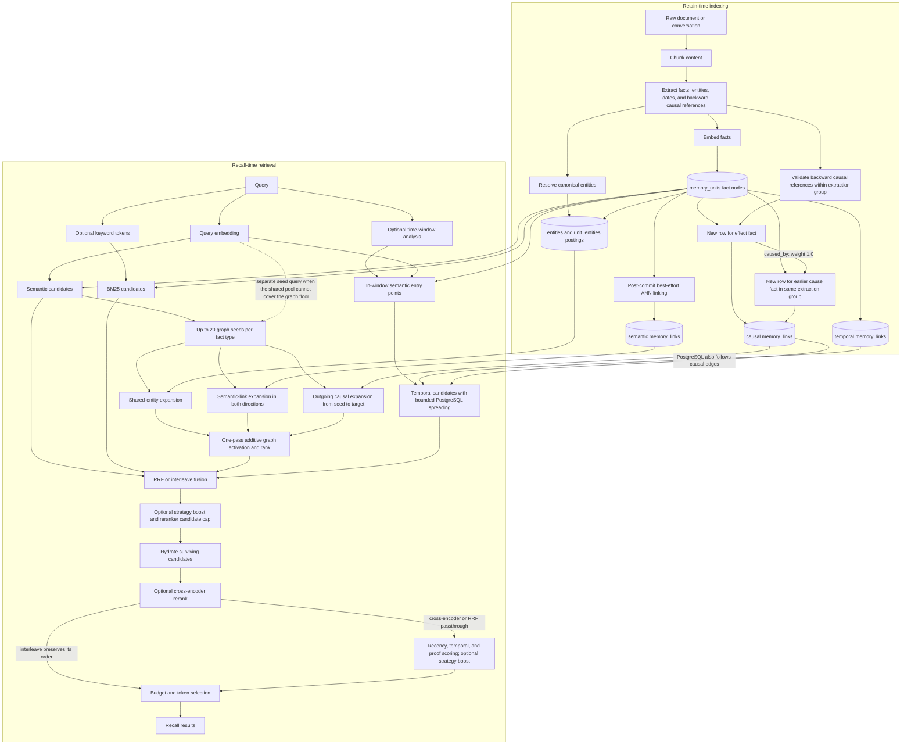

# Hindsight Graph Retrieval: Retain-Time Links to Recall-Time Evidence

## Overview

Hindsight graph retrieval is a semantic-seeded recall arm that expands stored entity, semantic, and causal connections once, ranks the resulting fact candidates, and contributes that ranked list to the same fusion pipeline as semantic, keyword, and optional temporal retrieval. It is not a standalone GraphRAG answer generator: it neither extracts graph entities from the query nor generates the final answer.

Causal relations have two distinct recall roles. `LinkExpansionRetriever` follows outgoing causal edges for one bounded pass, while PostgreSQL temporal retrieval can follow temporal and causal edges through a bounded multi-hop frontier when the query has a time window. Ordinary retain stores `caused_by` from an effect fact to an earlier cause fact extracted from the same group; **earlier** means earlier in that group's fact order, not a memory unit that already existed in the bank. Edge direction directly determines which causal neighbor a seed can reach.

Scope: static source trace of `dev@ef1179c65`, the built-in PostgreSQL and Oracle stores, and `LinkExpansionRetriever`. The example values are illustrative; no live LLM, embedding model, or database run is claimed.

## Terminology

- **Memory unit**: A fact-level `memory_units` row containing text, embedding, fact type, time, tags, and provenance.
- **Entity posting**: A `unit_entities` row connecting a memory unit to a canonical `entities` row.
- **Memory link**: A directed `memory_links` row whose type is temporal, semantic, or causal.
- **Graph seed**: A semantically matched memory unit used as the starting point for Link Expansion.
- **Link Expansion**: The built-in one-pass graph retriever; candidates discovered during the pass do not become another frontier.
- **Temporal spreading**: The separate PostgreSQL temporal-arm traversal that can add newly discovered candidates to a bounded frontier.
- **Recall arm**: One ranked candidate list: semantic, BM25 keyword, graph, or temporal.
- **ANN**: Approximate nearest-neighbor vector search, used for semantic recall and semantic-link construction.
- **RRF**: Reciprocal rank fusion, which combines arm ranks without comparing their raw score scales.

## 1. End-to-End Flow

The graph is written during retain and read during recall. The solid arrows show normal data dependencies; the dashed query-embedding arrow shows the fallback seed query used only when the shared semantic pool cannot cover the graph seed threshold.



The diagram separates two mechanisms that both read causal links: one-pass Link Expansion produces the graph arm, while temporal spreading belongs to the temporal arm. A causal candidate is not a fifth recall arm.

## 2. Retain-Time Graph Construction

Retain creates fact nodes first, then connects those nodes through canonical entity membership and directed links. The retrieval-critical entity postings, temporal links, and causal links are written with the fact batch; the streaming path defers semantic links until all batches have committed.

### 2.1 Stored structures

| Structure | Construction | Direction | Recall consumer |
|---|---|---|---|
| `memory_units` | One row per processed fact, with its embedding and provenance | Not an edge | Every recall arm |
| `entities` + `unit_entities` | Entity resolution followed by fact-to-entity membership | Membership is structurally symmetric at query time | Link Expansion entity signal; observation provenance traversal |
| `memory_links: semantic` | Same-bank, same-fact-type ANN neighbor above the configured similarity threshold | Stored direction is an indexing detail; Link Expansion reads both directions | Link Expansion semantic signal |
| `memory_links: caused_by` | Valid extraction-local reference from a later effect fact to an earlier cause fact | Effect -> cause, weight `1.0` | Link Expansion causal signal; PostgreSQL temporal spreading |
| `memory_links: temporal` | Nearby dated facts, bounded per source | Written bidirectionally | PostgreSQL temporal spreading |

`unit_entities` is the entity-retrieval source of truth. Entity-shaped `memory_links` are not required by Link Expansion; the graph-view endpoint can derive entity edges from postings.

### 2.2 Causal extraction and persistence

Ordinary LLM-based extraction emits only the canonical `caused_by` relation. A causal reference must target an earlier fact in the same extraction group, so the extracted relation is backward-looking by construction. Both facts normally become new memory-unit rows during the current retain operation; the reference does not identify or search for a historical row already stored in the bank:

```text
Fact 0: Maya lost her job.
Fact 1: Maya could not pay rent. causal_relations=[{target_index: 0, relation_type: caused_by}]

Persisted edge:
MU_RENT --caused_by, weight 1.0--> MU_JOB
```

After fact filtering, retain remaps extraction ordinals to the surviving fact sequence. It inserts the new `memory_units` rows, obtains their real IDs, maps the current fact to `from_unit_id` and the referenced earlier fact from the same extraction group to `to_unit_id`, rejects invalid indices and self-links, and then inserts the causal row. The causal writer does not compare the new units with historical units or search the bank for possible causes. Separately extracted chunks cannot create a direct `caused_by` edge between each other because their fact indices never share one extraction group.

See [Hindsight Causal Extraction Boundary](./causal-extraction-boundary.md) for the extraction-group definition, concrete same-chunk and history-only examples, and the distinction between causal, entity, semantic, and temporal linking.

Transfer import may restore historical `causes`, `enables`, and `prevents` rows. Normal retain does not create those types, but recall accepts them so imported graph evidence remains usable.

### 2.3 Transaction and post-commit boundary

For the built-in SQL path, fact insertion, `unit_entities`, temporal links, inline semantic links when enabled, and causal links share the fact-batch transaction. The streaming path deliberately skips inline semantic links, commits each fact batch, and then runs one best-effort ANN pass over the committed units.

The final streaming ANN pass uses up to 20 same-type neighbors per seed and the default `0.7` similarity floor. Failure does not roll back already committed facts, entity postings, temporal links, or causal links; vector recall remains available, while the semantic graph signal is incomplete until a later relink, reprocess, or repair operation.

## 3. Recall Orchestration and Graph Seeds

Recall computes the query embedding before entering the store-owned recall boundary. For the default PostgreSQL store, the apparent four-arm retrieval is physically ordered to respect connection ownership and seed dependencies.

1. Optional time-window analysis runs before the store call.
2. Semantic retrieval and enabled BM25 retrieval run as one combined SQL statement for all requested fact types.
3. If a time window exists, temporal retrieval runs on the same database connection after the combined semantic/BM25 query.
4. The connection is released.
5. Graph retrieval runs concurrently across fact types, with one Link Expansion call per fact type.
6. The returned semantic, BM25, graph, and optional temporal lists enter downstream fusion.

Semantic retrieval is the baseline arm. BM25, temporal retrieval, graph retrieval, and cross-encoder reranking are independently enabled by bank configuration and are enabled by default.

### 3.1 Seed reuse and fallback

Each fact type receives at most 20 graph seeds. The normal combined semantic query fetches enough rows for both the semantic arm and graph seeding when the semantic result floor is less than or equal to `graph_seed_min_similarity`; candidates clearing the graph floor are reused without another ANN query.

If a request sets the semantic floor above the graph seed floor, the shared semantic result pool cannot prove that it contains every valid graph seed. `LinkExpansionRetriever` therefore runs its own semantic seed query at the graph floor. `None` means the shared pool is unusable and triggers this query; an explicitly empty shared list means the compatible query ran and found no seeds, so no second query is issued.

No seed means no Link Expansion result for that fact type. The graph arm does not extract entity names or relation types from the query itself.

## 4. One-Pass Link Expansion

Link Expansion issues one combined expansion query per fact type and merges three independently scored signals. The three signal queries share the complete seed set, but candidates found by them never become new seeds.

| Signal | Executable traversal | Direction | Raw candidate score |
|---|---|---|---|
| Entity | seed -> `unit_entities` -> shared entity -> another unit | Symmetric through shared membership | Count of distinct seed entities shared by the candidate |
| Semantic | seed -> `semantic` link -> neighbor, plus incoming semantic link -> seed | Both stored directions are read | Maximum stored similarity weight |
| Causal | seed `from_unit_id` -> causal link -> target `to_unit_id` | Outgoing only | Maximum stored causal weight |

For a normal `caused_by` row, outgoing traversal means an effect seed reaches its cause. The reverse is not implied: a cause seed does not reach the effect through that row because recall does not invert the relation. Entity or semantic expansion may still surface the effect independently.

### 4.1 SQL bounds and filters

PostgreSQL entity expansion derives the distinct entities of all seeds, caps candidates per entity at the default 200, and then counts distinct shared entities per candidate. Fact type and requested update-time bounds are applied before that per-entity cap so ineligible rows do not consume the bounded fan-out.

Semantic expansion unions outgoing and incoming `semantic` rows and keeps the maximum weight per candidate. Causal expansion reads only links whose `from_unit_id` is a seed and whose type is `causes`, `caused_by`, `enables`, or `prevents`.

For non-observation facts, the entity, semantic, and causal expansions share one SQL common-table-expression query. If the query exceeds the default 10-second Link Expansion timeout, the retry drops only entity expansion and returns semantic plus causal candidates. Observation expansion also uses one fused query, but it does not use this timeout fallback.

### 4.2 Graph-arm score

The Python merge deduplicates by memory-unit ID and adds the strongest contribution from each signal:

```text
entity_score   = tanh(distinct_shared_entity_count * 0.5)
semantic_score = max(semantic_link_weight), or 0
causal_score   = max(causal_link_weight), or 0

activation = entity_score + semantic_score + causal_score
```

The entity transform stays below `1.0`: one, two, three, and four shared entities contribute approximately `0.462`, `0.762`, `0.905`, and `0.964`. Semantic and causal weights each contribute up to `1.0`, so convergent evidence can approach an activation of `3.0`.

`activation` orders only the graph arm. Downstream RRF consumes the graph rank, not the raw activation magnitude, and the normal recall response does not expose activation as its final relevance score.

### 4.3 Observation entity expansion

Observations are consolidated memories whose entity evidence comes from their supporting source facts. Their entity path is therefore longer than the ordinary fact path:

```text
seed observation -> its source facts -> source entities -> connected source facts
                 -> observations supported by those connected facts
```

PostgreSQL reads observation provenance from `source_memory_ids`; Oracle reads it from `observation_sources`. Both backends fuse observation entity, semantic, and causal expansion into one database fetch and return the same three signal groups to the Python scoring merge.

## 5. Temporal Retrieval Is a Separate Causal Consumer

Temporal retrieval runs only when time-window analysis or the caller supplies a window. It first selects semantically relevant `memory_units` whose event or mention time overlaps the window, then narrows that pool to entry points distributed across the window.

On PostgreSQL, the temporal arm can perform up to five spreading iterations. Each iteration reads outgoing `temporal`, `causes`, `caused_by`, `enables`, and `prevents` rows from a bounded frontier, applies a per-source neighbor limit of 10, requires the target to pass the temporal semantic floor and request filters, and admits candidates until the temporal budget is exhausted.

Causal link types affect propagation strength: `causes` and `caused_by` use a `2.0` causal multiplier, `enables` and `prevents` use `1.5`, and temporal links use `1.0`, before the common `0.7` decay. A newly admitted candidate can enter the next frontier when its combined temporal score exceeds `0.2`; this is the multi-hop behavior that Link Expansion intentionally does not have.

Oracle returns the time-window entry points but skips spreading because the current traversal depends on PostgreSQL `unnest`. Therefore “temporal retrieval follows causal chains” is a PostgreSQL capability, not a backend-independent guarantee.

## 6. Fusion, Reranking, and Response Selection

Graph retrieval returns candidates, not answers. Every graph candidate must survive the shared downstream pipeline before it appears in a recall response.

1. Optional per-arm candidate caps run before fusion; the default `0` disables this cap.
2. RRF normally combines semantic, BM25, graph, and any temporal ranks using `1 / (60 + rank_in_arm)` per appearance. Interleave is an explicit alternative that round-robins the arm lists while preserving each arm's leading candidates.
3. Optional strategy boosts can change the pre-reranker ordering, then the effective reranker candidate cap trims the merged set. The default effective cap is 300, with optional per-budget overrides.
4. Only surviving candidates are hydrated with full payloads.
5. Cross-encoder mode reranks hydrated candidates. RRF passthrough mode skips the cross-encoder but still applies combined scoring seeded from RRF order.
6. Combined scoring multiplies normalized relevance by recency, temporal proximity, and proof-count adjustments, then applies any configured additive strategy boost. Interleave bypasses this scoring and preserves interleave order.
7. At most `2 * thinking_budget` scored candidates continue to chunk enrichment and token-budget selection.
8. The final response includes only candidates that fit the requested result and token constraints.

The default budget function is fixed: low, mid, and high map to thinking budgets of 100, 300, and 1000. Adaptive budget mapping is available but is not the default.

## 7. Worked Causal Example

This example shows all three Link Expansion signals and the causal direction from an effect seed to its cause. The facts, extraction, similarity, and rankings are illustrative static values rather than captured runtime output.

### 7.1 Retain output

Assume one extraction group produces these facts in order:

| Fact ID | Text | Entities | Causal reference |
|---|---|---|---|
| `MU_JOB` | Maya lost her job. | Maya, job | None |
| `MU_RENT` | Maya could not pay rent. | Maya, rent | `caused_by -> MU_JOB` |
| `MU_MOVE` | Maya moved to a cheaper apartment. | Maya, apartment | `caused_by -> MU_RENT` |

Assume the bank already contains `MU_OLD`, “Maya previously compared apartment moving companies,” with entity `Maya`. The streaming ANN pass measures similarity `0.86` between `MU_MOVE` and `MU_OLD`, above the default `0.7` semantic-link floor.

The relevant logical rows are:

```text
unit_entities:
  MU_JOB  -> Maya
  MU_RENT -> Maya, rent
  MU_MOVE -> Maya, apartment
  MU_OLD  -> Maya

memory_links:
  MU_RENT -> MU_JOB   caused_by  weight=1.0
  MU_MOVE -> MU_RENT  caused_by  weight=1.0
  MU_MOVE -> MU_OLD   semantic   weight=0.86
```

### 7.2 Query and seed

For the query “Why did Maya move to a cheaper apartment?”, assume `MU_MOVE` is the only memory unit above the graph seed floor. Link Expansion reads all three signals from that seed:

| Candidate | Entity contribution | Semantic contribution | Causal contribution | Activation |
|---|---:|---:|---:|---:|
| `MU_RENT` | `tanh(0.5) = 0.462` | `0` | `1.0` | `1.462` |
| `MU_OLD` | `tanh(0.5) = 0.462` | `0.86` | `0` | `1.322` |
| `MU_JOB` | `tanh(0.5) = 0.462` | `0` | `0` | `0.462` |

`MU_RENT` is the direct causal candidate because `MU_MOVE --caused_by--> MU_RENT` is outgoing from the seed. Link Expansion does not continue from `MU_RENT` to `MU_JOB`; `MU_JOB` appears independently through the shared `Maya` entity. With a suitable time window, PostgreSQL temporal spreading could continue along the second causal edge in its own recall arm.

The graph arm therefore returns `[MU_RENT, MU_OLD, MU_JOB]` for these assumed values. Fusion can reward candidates that also appear in semantic, BM25, or temporal results, and reranking, scoring, and token selection can still change or remove them.

## 8. Controls and Failure Boundaries

The defaults below describe the scoped source revision, not immutable API promises.

| Control | Current default | Effect |
|---|---:|---|
| Graph retrieval | Enabled | Runs Link Expansion per requested fact type |
| Graph retriever | `link_expansion` | Selects the one-pass strategy |
| Graph seed floor | `0.3` | Minimum semantic similarity for a graph seed |
| Graph seed limit | `20` per fact type | Bounds expansion entry points |
| Semantic-link floor | `0.7` | Minimum retained ANN-link similarity |
| Entity fan-out limit | `200` per entity | Bounds high-degree entity expansion |
| Non-observation Link Expansion timeout | `10` seconds | Falls back to semantic plus causal expansion |
| Recall budget function | `fixed` | Maps low/mid/high to `100/300/1000` |
| Per-arm candidate cap | `0` | Disabled unless configured |
| Effective reranker candidate cap | `300` | Bounds hydration and cross-encoder work unless a per-budget override is set |

The main failure boundaries are:

- A causal edge that extraction never produced cannot be recovered by a larger recall budget.
- Separate extraction groups cannot create direct ordinary-retain causal links, so chunk boundaries can break causal continuity.
- Ordinary `caused_by` direction lets an effect seed reach its cause, not the reverse.
- Entity-resolution errors split or merge graph neighborhoods and affect every entity-based expansion.
- A failed streaming ANN pass leaves semantic recall usable but weakens semantic graph expansion.
- The non-observation timeout removes entity evidence for that attempt; observation expansion has no matching fallback.
- Expanded candidates are bounded before final tag filtering, so rejected tagged candidates are not backfilled.
- Fusion, reranking, final score filters, result limits, and token limits can remove a high-ranked graph candidate.
- PostgreSQL and Oracle share Link Expansion semantics but do not share temporal spreading behavior or observation-provenance storage.

## 9. Design Boundary and Source Map

Hindsight's Link Expansion uses graph structure to recover fact candidates that flat query similarity can miss, but it does not perform arbitrary graph walks, community summarization, or answer generation. The safest implementation name is **graph retrieval with Link Expansion**, not a standalone Hindsight GraphRAG pipeline.

Source paths are relative to `hindsight-api-slim/hindsight_api/`; test paths are relative to `hindsight-api-slim/tests/`.

- Retain extraction and writes: `engine/retain/fact_extraction.py`, `engine/retain/orchestrator.py`, `engine/retain/link_utils.py`.
- Recall orchestration: `engine/memories/postgres.py`, `engine/search/retrieval.py`.
- Link Expansion: `engine/search/link_expansion_retrieval.py`.
- PostgreSQL and Oracle expansion SQL: `engine/db/ops_postgresql.py`, `engine/db/ops_oracle.py`.
- Fusion and scoring: `engine/search/fusion.py`, `engine/search/recall_boost.py`, `engine/search/reranking.py`, `engine/memory_engine.py`.
- Focused tests: `test_link_expansion_scoring.py`, `test_recall_time_range_graph.py`, `test_observation_expansion_scoring.py`, `test_temporal_recall_selection.py`, `test_recall_pipeline_toggles.py`.

This document is source-backed design documentation. It does not prove live extraction quality, actual ANN similarity, database query plans, latency, or final answer quality without a corresponding runtime trace or benchmark.
