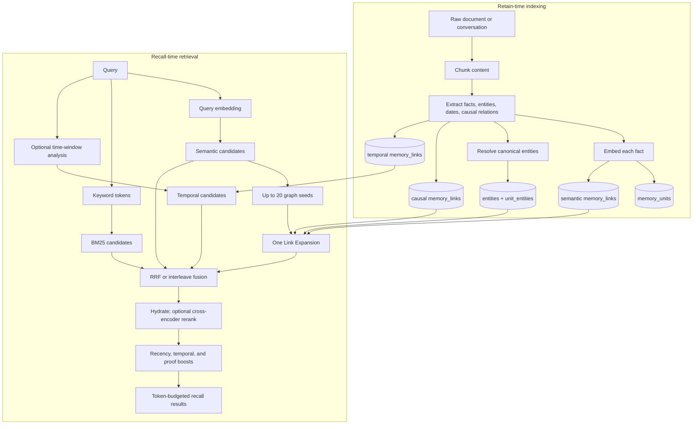

# Hindsight Graph Retrieval: From Retain-Time Indexing to Recall-Time Link Expansion

> **TL;DR:** Hindsight graph retrieval is one hybrid-recall arm, not a standalone GraphRAG (graph-based retrieval-augmented generation) answer pipeline. The default `link_expansion` retriever takes up to 20 semantic entry points, expands entity, semantic, and causal connections once, then sends graph-ranked candidates into fusion and optional reranking.

Scope: `dev@278cde1`, built-in SQL store and `LinkExpansionRetriever`.

## Terminology

The stored memory graph is built continuously; the graph retrieval arm is a bounded reader that returns candidates.

- **GraphRAG**: A broad pattern that uses a knowledge graph to retrieve evidence for generation; Hindsight does not use this as its implementation name.
- **Link Expansion**: The built-in one-pass graph strategy, not iterative breadth-first search.
- **Graph seed**: A semantically matched memory unit used as an expansion entry point.
- **Memory unit**: A fact-level `memory_units` row with text, embedding, type, time, and provenance.
- **Entity posting**: A `unit_entities` row linking a memory unit to a canonical entity.
- **Memory link**: A directed `memory_links` row: temporal, semantic, or causal.
- **Recall arm**: A semantic, keyword, graph, or temporal ranked list.
- **BM25**: The keyword/full-text recall arm.
- **ANN**: Approximate nearest-neighbor vector search, used for semantic candidates and links.
- **BFS**: Breadth-first search over an iterative frontier; current Link Expansion does not use it.
- **CTE**: A SQL common table expression used to combine graph expansions in one query.
- **RRF**: Rank-based fusion of those incompatible score spaces.

## 1. Where Graph Retrieval Sits in the End-to-End Flow

Graph retrieval sits after semantic candidate generation and before fusion. Its expanded neighbors can add candidates that vector or keyword retrieval ranked poorly or missed.



For the default Postgres store, the physical ordering is more precise than the common shorthand “four strategies run in parallel”:

1. Hindsight embeds the query.
2. Semantic and BM25 retrieval run in one combined SQL query for all requested fact types.
3. If a temporal constraint exists, temporal retrieval runs on the same connection after the combined query.
4. The connection is released, then graph retrieval runs concurrently across the requested fact types, using the semantic results as graph seeds when their thresholds are compatible.
5. All arm results are sorted, fused, hydrated, optionally reranked, scored, and packed into the response token budget.

The graph arm is therefore a **semantic-seeded second-stage retrieval arm**, not a fully independent query-to-graph path.

## 2. Retain-Time Indexing Builds the Traversable Graph

Retain converts raw content into fact-level nodes and several connection structures. For the current streaming retain path, entity and causal graph data is committed with the fact batch, while semantic graph links are added in a post-commit, best-effort ANN pass.

1. `POST /v1/default/banks/{bank_id}/memories` records document identity, chunks content, and preserves document/chunk provenance.
2. Each chunk becomes zero or more facts carrying text, type, time, entities, and optional causal relations. LLM-based extraction is nondeterministic.
3. Every fact is embedded. The vector supports both direct semantic recall and semantic graph construction.
4. Entity resolution maps names to canonical rows in `entities`; `unit_entities` persists fact-to-entity membership.
5. The write transaction inserts `memory_units`, remaps placeholder IDs to their UUIDs, and writes the retrieval-critical connections below.

| Connection | Storage | Construction | Used by Link Expansion? |
|---|---|---|---|
| Entity membership | `unit_entities` | Canonical entity resolution | Yes, through a query-time self-join |
| Semantic neighbor | `memory_links` with `link_type='semantic'` | Embedding-neighbor similarity above the configured threshold | Yes, read in both directions |
| Causal relation | `memory_links` with `link_type='caused_by'` for ordinary retain | Extracted causal relation; current writer uses weight `1.0` | Yes, read from seed to target |
| Temporal proximity | `memory_links` with `link_type='temporal'` | Nearby event dates, capped per memory unit | No; the temporal recall arm handles time separately |

`unit_entities`, not `entity_cooccurrences`, is the entity-recall truth source. The latter is a post-commit statistics cache used by entity resolution and visualization. Ordinary retain writes only `caused_by`; retrieval also reads historical/imported `causes`, `enables`, and `prevents` rows.

After all streaming batches commit, a best-effort ANN pass searches up to 20 same-type neighbors per unit, applies the default `0.7` threshold, and writes `semantic` links. If it fails, vector recall and entity expansion still work, but those semantic graph edges stay incomplete until an explicit relink, reprocess, or repair action.

## 3. Recall-Time Graph Retrieval, Step by Step

The graph arm does not parse entity names from the query. It embeds the query, selects semantically relevant memory-unit seeds, and expands the stored connections around those seeds once.

1. For each fact type, the semantic/BM25 SQL returns normal semantic candidates. Candidates above `graph_seed_min_similarity` are reused as seeds, capped at 20.
2. If a request makes the semantic floor stricter than the graph seed floor, Link Expansion runs its own seed query so valid graph entry points are not silently lost.
3. No seed means no graph result for that fact type.
4. For ordinary `world` and `experience` facts, one SQL CTE expands these three signals from the full seed set:

| Signal | Traversal | Direction | Raw candidate score |
|---|---|---|---|
| Entity | seed -> `unit_entities` -> shared entity -> other unit | Structurally symmetric through shared membership | Count of distinct entities shared with any seed |
| Semantic | seed -> `semantic` link -> neighbor | Both outgoing and incoming edges are read | Maximum stored similarity weight |
| Causal | seed -> causal link -> target | Outgoing only | Maximum stored link weight |

This is **one bounded pass**: discovered candidates never become a new frontier. Entity fan-out is capped at 200 candidates per entity by default, and each signal is limited by the recall budget.

Link Expansion then deduplicates by memory-unit ID and calculates:

```text
entity_score   = tanh(distinct_shared_entity_count * 0.5)
semantic_score = max(semantic_link_weight), or 0
causal_score   = max(causal_link_weight), or 0

activation = entity_score + semantic_score + causal_score
```

The score approaches `[0, 3]`; one, two, and three shared entities contribute about `0.462`, `0.762`, and `0.905`. Convergent evidence therefore outranks a single signal. Seeds respect bank, fact type, tags, and the update-time window. Expanded candidates are constrained by fact type/window, then tag-filtered after the budget cut without backfill.

For non-observation expansion, the default 10-second timeout falls back to semantic plus causal edges and drops the entity signal. Observation expansion uses a separate two-query path and is not covered by this fallback.

Graph `activation` ranks only the graph arm. RRF adds `1 / (60 + rank_in_arm)` per matching arm. There is no recall `top_k`: after the global reranker cap (default 300) and optional cross-encoder, only up to `2 * thinking_budget` candidates reach token-budget selection. Raw graph activation is trace/internal data, not a normal response score. Graph rank 1 therefore guarantees neither response rank 1 nor inclusion.

The iterative multi-hop traversal still present in the default Postgres recall path belongs to the **temporal arm**, not Link Expansion. When a time window exists, temporal spreading can follow temporal and causal links through a bounded frontier; Oracle currently returns only temporal entry points on that path.

## 4. End-to-End Example: From Indexing to Graph-Expanded Recall

This example follows one candidate from retain through graph expansion and final fusion. It is illustrative static analysis, not captured runtime output; actual extraction, embeddings, link weights, and ranks can vary.

### Step 1: Retain three source items

```http
POST /v1/default/banks/team-memory/memories

{
  "items": [
    {"document_id": "alice-profile", "content": "Alice builds REST APIs with Python at TechCorp.",
     "entities": [{"text": "Alice"}, {"text": "Python"}, {"text": "TechCorp"}]},
    {"document_id": "bob-profile", "content": "Bob trains fraud-detection models with Python at DataSoft.",
     "entities": [{"text": "Bob"}, {"text": "Python"}, {"text": "DataSoft"}]},
    {"document_id": "orion-project", "content": "Alice and Bob co-lead Project Orion for TechCorp.",
     "entities": [{"text": "Alice"}, {"text": "Bob"}, {"text": "Project Orion"}, {"text": "TechCorp"}]}
  ],
  "async": false
}
```

Assume extraction creates three `world` memory units:

- `MU_A`: “Alice builds REST APIs with Python at TechCorp.”
- `MU_B`: “Bob trains fraud-detection models with Python at DataSoft.”
- `MU_C`: “Alice and Bob co-lead Project Orion for TechCorp.”

### Step 2: Observe the graph index created by retain

The relevant logical rows are:

```text
memory_units: MU_A, MU_B, MU_C, each with its own embedding
unit_entities:
  MU_A -> {Alice, Python, TechCorp}
  MU_B -> {Bob, Python, DataSoft}
  MU_C -> {Alice, Bob, Project Orion, TechCorp}
```

Suppose the final ANN pass also measures similarity `0.82` between `MU_A` and `MU_C`, above the default `0.7` threshold, and persists a semantic link. This value only demonstrates scoring; retrieval reads that link in either direction.

### Step 3: Recall with trace enabled

```http
POST /v1/default/banks/team-memory/memories/recall

{
  "query": "What machine-learning work is connected to Alice through tools she uses?",
  "types": ["world"],
  "budget": "mid",
  "max_tokens": 1024,
  "trace": true
}
```

To isolate the graph behavior, assume only `MU_A` clears the graph seed threshold. Link Expansion produces:

1. **Entity expansion**
   - `MU_B` shares `Python`: entity score `tanh(0.5) ~= 0.462`.
   - `MU_C` shares `Alice` and `TechCorp`: entity score `tanh(1.0) ~= 0.762`.
2. **Semantic-link expansion**
   - `MU_C` receives the assumed semantic contribution `0.82`.
3. **Causal expansion**
   - No causal link exists in this example, so it contributes `0`.

The graph-arm activations are therefore:

```text
MU_C: 0.762 + 0.82 = 1.582
MU_B: 0.462
```

The graph arm returns `[MU_C, MU_B]`. Even if vector/BM25 ranks `MU_B` poorly, shared `Python` gives it a route into the fused pool. RRF and the cross-encoder then decide final relevance.

## 5. Observation Retrieval Uses a Longer Derived Path

Observations are consolidated memories whose entity identity is inherited from supporting source facts. Their entity expansion therefore follows provenance rather than assuming direct observation-to-entity edges.

```text
seed observation -> source units -> source entities -> connected source units
                 -> observations supported by those connected units
```

Semantic and causal observation expansion still reads `memory_links`. PostgreSQL stores provenance in `source_memory_ids`; Oracle uses `observation_sources`. This remains bounded, not iterative BFS.

## 6. What This Is—and Is Not—Relative to GraphRAG

Hindsight shares GraphRAG's general idea that structure can recover evidence that flat vector similarity misses, but its current runtime contract is narrower and optimized for continuously changing agent memory.

It does **not** start from query-extracted entities, replace vector search, iterate arbitrary hops, compute community summaries, or generate a final answer. It starts from vector-selected memory seeds, returns fact candidates, and uses SQL tables beside vector/full-text indexes rather than requiring Neo4j. Retain, consolidation, curation, deletion, and maintenance continuously update the graph.

The safest implementation name in code and documentation is **graph retrieval with Link Expansion**, not “Hindsight GraphRAG.”

## 7. Key Controls and Failure Boundaries

Graph quality and cost depend on both retain-time graph density and recall-time expansion limits. Increasing recall budget cannot recover an edge that retain never created or an entity that resolution split incorrectly.

Core defaults are: graph enabled; `link_expansion`; seed floor `0.3`; 20 seeds; semantic-link floor `0.7`; 200 candidates per entity; 10-second non-observation timeout; fixed low/mid/high budgets `100/300/1000`; per-source cap disabled; global reranker cap `300`.

Failure boundaries: entity-resolution errors change topology; fan-out caps trade exhaustive hub traversal for latency; a failed ANN pass leaves semantic edges incomplete but vector recall usable; timeout drops ordinary-fact entity evidence; causal traversal is directional; downstream filters and budgets can still remove graph candidates.

## 8. Source Map for Further Reading

Source paths are relative to `hindsight-api-slim/hindsight_api/`; test paths are relative to `hindsight-api-slim/tests/`.

- Retain: `engine/retain/orchestrator.py`, `engine/retain/entity_processing.py`, `engine/retain/link_utils.py`.
- Graph: `engine/search/graph_retrieval.py`, `engine/search/link_expansion_retrieval.py`.
- SQL: `engine/memories/postgres.py`, `engine/db/ops_postgresql.py`, `engine/db/ops_oracle.py`.
- Ranking: `engine/search/fusion.py`, `engine/search/reranking.py`, `engine/memory_engine.py`.
- Tests: `test_link_expansion_scoring.py`, `test_recall_time_range_graph.py`, `test_retain.py`, `test_observation_expansion_scoring.py`.

Source caution: stale prose says all graph signals use `memory_links` and causal score is `weight + 1.0`; code uses `unit_entities` and raw causal weight. Older BFS/MPFP descriptions are obsolete.
