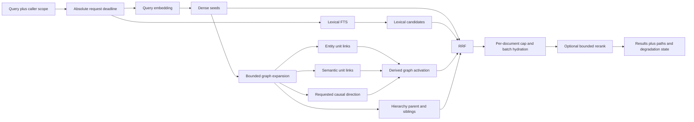

# MemOS + Hindsight: PostgreSQL-Only Graph Indexing and Retrieval

## Overview

1. The specified checkout is MemTensor/MemOS, package `MemoryOS`. MemOS stores typed memory nodes and edges, supports vector and metadata recall, can build `PARENT` summary hierarchies when reorganization is enabled, and exposes a separate seeded subgraph API. Its ordinary search path, however, matches keys/tags and vector/BM25 candidates without traversing stored edges.
2. Hindsight supplies the stronger bounded online retrieval core: fact-level units, pgvector and text-search seeds, canonical-entity postings, semantic and causal links, one-pass Link Expansion, rank fusion, and optional reranking. The useful MemOS contribution is asynchronous hierarchy/summary construction and a clear separation between ranked memory search and explicit subgraph inspection.
3. PostgreSQL remains sufficient for the proposed workload because the online path is bounded: retrieve seeds, expand indexed entity/link/hierarchy branches, fuse ranks, then hydrate a capped candidate set. MemOS now includes a PostgreSQL + pgvector graph backend, but the inspected backend does not yet implement every interface used by TreeTextMemory and is not evidence that the complete MemOS search and reorganization path is production-equivalent to its default Neo4j Community + Qdrant deployment.
4. “For high latency” is interpreted here as a deployment where embedding, extraction, reranking, or database round trips may be slow and the online path must remain predictable. The design removes generative LLM calls from recall, reuses semantic seeds, limits fan-out before hydration, and has explicit timeout degradation. No latency number in this document is a measured result; concrete budgets remain an acceptance-test decision.

## Terminology and Scope

- **MemOS**: The MemTensor/MemOS repository in `/Users/rocke_dong/codes/memos`, Python package `MemoryOS` and import namespace `memos`.
- **Memory unit**: A retrieval-sized fact, chunk, or derived summary node. Hindsight normally uses fact-level units; MemOS TreeTextMemory stores typed nodes such as working, long-term, user, raw-file, skill, preference, and derived context/summary memories.
- **Hierarchy summary**: A model-derived topic or concept node connected to bounded child memories by a directed `parent` edge. It is a retrieval projection, not authoritative source content.
- **Entity posting**: A normalized many-to-many membership row connecting one memory unit to one canonical entity.
- **Derived link**: A semantic, causal, or temporal edge computed from content rather than directly authored by a user.
- **Seed**: A unit selected directly from the query by semantic or lexical retrieval before graph expansion.
- **Link Expansion**: One bounded pass from a fixed seed set. Discovered candidates never become a new frontier.
- **Seeded subgraph inspection**: A separate operation that selects relevant center nodes, then returns their bounded neighborhoods and edge evidence. It is not the same contract as ordinary ranked recall.
- **High-fan-out key**: An entity or node with enough neighbors that an uncapped join could dominate latency and memory.

The comparison is a static source trace of Hindsight `93a32072f2285735e50a20cae418a3fb3b216a11` and MemOS `176d4f676a93e0e34ca9fd50091eff5ad3236506`. It does not claim a live PostgreSQL benchmark, model-quality result, or production SLO.

## 1. Source-Backed Comparison

Both repositories model memory as searchable nodes, but their graph paths differ. MemOS has an optional offline hierarchy builder and a separate multi-hop subgraph inspection API; Hindsight has a bounded graph arm integrated into ordinary ranked recall.

| Concern | MemOS | Hindsight | Merged choice |
|---|---|---|---|
| Primary node | Typed textual-memory node with metadata, embedding, provenance, status, and history | Fact-level `memory_unit` | Keep documents authoritative; project current chunks, facts, and optional summaries as units |
| Automatic graph | Optional model-derived `PARENT` summary hierarchy; additional relation-generation functions exist but are disabled in the inspected `process_node` path | Entity postings plus semantic, causal, and temporal links | Keep Hindsight links; evaluate bounded parent/child hierarchy as a distinct derived signal |
| Query seeds | Query embedding, exact key/tag lookup, optional in-process BM25, and backend-dependent full text | Vector semantic and keyword arm; native default is PostgreSQL FTS | Reuse Hindsight semantic and lexical seeds |
| Graph read | Ordinary search does not follow edges; `get_relevant_subgraph` separately seeds and requests neighborhoods to a caller-supplied depth | Semantic-seeded, one-pass entity/semantic/causal expansion | Keep one-pass ranked expansion; expose deeper path inspection separately if needed |
| Ranking | Candidate union followed by configured reranking/dedup; no edge-path activation in ordinary search | Intra-graph activation, then fusion and optional reranking | Preserve per-arm ranks and fuse; do not compare unrelated raw score scales |
| Recall generation | Fast query parsing is tokenization-only; fine mode invokes a dispatcher LLM | Ordinary recall can use non-generative retrieval and optional reranking | Default online path remains non-generative; generative graph work stays asynchronous |
| Database | Default server configuration is Neo4j Community + Qdrant; alternate Neo4j, PolarDB, and PostgreSQL backends exist | PostgreSQL/pgvector by default; Oracle also exists | PostgreSQL + pgvector only for this design |

### 1.1 MemOS

MemOS TreeTextMemory stores textual-memory nodes with lifecycle type, status, key, tags, provenance sources, embeddings, timestamps, and version/history metadata. Its normal search runs several candidate paths in parallel: working-memory enumeration, vector recall, exact key/tag metadata lookup, optional in-process BM25, and backend-dependent full-text recall. Fast mode derives query tokens without an LLM; fine mode uses the dispatcher LLM to derive structured keys, tags, and a rephrased query. Candidate lists are deduplicated and reranked, but the ordinary `GraphMemoryRetriever` path does not traverse stored edges.

When `reorganize` is enabled, a background worker clusters eligible nodes, asks an LLM to create topic/concept summaries, and writes `PARENT` edges from summary nodes to children. The inspected relation detector also defines `CAUSE`, `CONDITION`, `RELATE`, `CONFLICT`, `FOLLOWS`, `INFERS`, and `AGGREGATE_TO` machinery, but `process_node` currently encloses those calls in inert string blocks and returns empty relation lists. They are scaffolding, not active indexing behavior at this revision.

`TreeTextMemory.get_relevant_subgraph` is a distinct inspection API: it selects center nodes by embedding or full text and asks the graph backend for neighborhoods to a caller-supplied depth. That is real query-seeded graph access on the Neo4j path, but it is not called by standard ranked search. The default server backend is `neo4j-community`, with Qdrant supplying vector search. A PostgreSQL + pgvector backend exists with `memories` and `edges` tables, recursive-CTE path/subgraph helpers, JSONB metadata, and an IVFFlat index; however, it lacks methods such as `get_edges`, `get_neighbors_by_tag`, and `search_by_fulltext`, and several method signatures/return shapes do not match TreeTextMemory callers. Its vector search also consumes only simple `search_filter` equality fields and ignores the richer `filter` argument. The repository therefore establishes a PostgreSQL starting point, not complete backend parity.

### 1.2 Hindsight

Hindsight indexes fact-level `memory_units` with embeddings and text-search state, resolves canonical `entities`, records `unit_entities`, and stores semantic, causal, and temporal rows in `memory_links`. Retain performs expensive model and embedding work before or around a bounded database write, while semantic-link creation can be completed after committed facts in the streaming path.

Recall first obtains semantic and keyword candidates. Link Expansion reuses compatible semantic candidates as at most 20 seeds per fact type; only an incompatible semantic threshold requires a second seed query. It then issues one combined expansion query for the fixed seed set and merges shared-entity, bidirectional-semantic, and outgoing-causal evidence. Candidates do not become new seeds.

Shared-entity activation is `tanh(distinct_shared_entity_count * 0.5)`; semantic and causal contributions use their strongest link weights. This activation orders only the graph arm. The downstream fusion step consumes ranks from semantic, keyword, graph, and optional temporal arms, then caps hydration and optional reranking work.

Observation units have a separate, longer provenance path through their source facts before entity expansion; the ordinary fact path above is not a complete description of observation retrieval. The merged first version explicitly defers that observation-specific traversal.

### 1.3 What Is Actually Worth Merging

The MemOS contribution is offline hierarchy construction and the product distinction between ordinary ranked search and explicit subgraph inspection. Topic/concept summaries can bridge vocabulary gaps and provide a bounded parent-to-sibling retrieval signal, but they are model-derived projections and must retain child provenance, revision identity, and separate scoring. The inactive relation-detector branches and incomplete PostgreSQL backend are not copied as current capability.

The Hindsight contribution is the online retrieval engine: pgvector/text seeds, entity postings, derived links, bounded expansion, rank fusion, and candidate caps. The merged design evaluates one additional hierarchy branch inside the existing bounded pass; it does not import MemOS's backend abstraction or place Neo4j/Qdrant on the request path.

Three merged safeguards are improvements, not claims about current Hindsight: eligibility moves before every cap, incoming semantic degree receives its own per-seed cap, and one absolute deadline covers the primary query plus fallback. Current Hindsight filters tags after graph top-budget selection, aggregates incoming semantic edges without a per-seed cap, and issues its semantic/causal fallback without the first query's local timeout wrapper.

## 2. Design Goals and Non-Goals

The design keeps authoritative documents separate from derived facts, summaries, entities, and links. A MemOS-style summary is generated from a cluster of memories while a Hindsight link connects facts; silently treating the summary as source truth or mixing identifiers without typed provenance would invent semantics and create uncontrolled fan-out.

Goals:

1. Use PostgreSQL and pgvector as the only persistent query store; do not add Neo4j, a graph cache, or a second consistency domain.
2. Preserve exact child provenance for every generated hierarchy summary and keep hierarchy direction explicit.
3. Keep model-derived summaries, facts, entities, semantic similarity, and causality distinguishable from authoritative source content.
4. Make external model latency affect indexing freshness or an optional rerank, not database transaction duration or graph traversal depth.
5. Bound intermediate work before hydration, use deterministic tie-breaking, and return useful base retrieval when optional graph or reranking work misses its deadline.
6. Prevent a stale high-latency indexing job from publishing facts for an obsolete document revision.

Non-goals for the first version:

- General Cypher-like queries, arbitrary recursive traversal, BFS, PPR, or path discovery.
- Activating MemOS's currently disabled relation-generation branches merely because helper functions exist.
- Materializing an entity clique between every pair of units that mention the same entity.
- Making general recursive subgraph traversal part of ordinary ranked recall; deeper inspection remains a separate operation.
- Building a separate partial HNSW index for every user or bank before scale measurements justify it.
- Claiming that a hierarchy path, a cosine score, a shared entity, or an extracted causal edge proves truth.

## 3. PostgreSQL Data Model

The minimum schema has two layers. Documents are authoritative user state; units, summaries, entities, postings, and links are rebuildable retrieval state.

```text
documents
  (scope_id, document_id, current_revision, original_text, owner/visibility, timestamps)
       |
       | 1:N, same current revision
       v
memory_units
  (scope_id, unit_id, document_id?, source_revision?, kind, source_span,
   text, embedding, search_vector, fact_type, event_time, timestamps)
       | N:M                              | directed derived edges
       v                                  v
unit_entities                         memory_links
       |                              (semantic, caused_by, parent, temporal)
       v
entities
```

### 3.1 Authoritative document tables

`documents.current_revision` increments on every content edit. It owns the exact source text, scope, visibility, and deletion state. No MemOS graph node or generated summary becomes a second authoritative copy of that source.

Every source-derived unit references `(scope_id, document_id, source_revision)`. This is stricter than the inspected MemOS node table, whose edge rows store endpoint IDs without foreign keys or tenant columns; the target database must enforce same-scope endpoint integrity rather than rely only on application callers.

### 3.2 Retrieval projection tables

`memory_units.kind` distinguishes a cheap source chunk, a model-extracted fact, and a model-derived hierarchy summary. Every fact carries `document_id`, `source_revision`, and an optional source span so it remains traceable to current source text. A summary instead carries an indexer version and reaches source-backed children through `parent` links. Queries admit source units only when `source_revision = documents.current_revision`; summaries are eligible only when all returned child paths resolve to current visible units.

`entities` is a scope-local canonical registry. `unit_entities` is the membership/posting table; an entity shared by 10,000 units remains 10,000 postings rather than roughly 50 million materialized pair edges.

`memory_links` contains derived unit-to-unit edges. The first version writes `semantic`, canonical `caused_by`, optional `parent`, and optionally `temporal`; legacy Hindsight `causes`, `enables`, and `prevents` may remain readable for imports but are not newly inferred. `parent` points from a summary to a child and stores the hierarchy builder identity. The inactive MemOS relation types are not imported merely because helper code names them.

All projection tables carry `scope_id`. Unit links use composite foreign keys from `(scope_id, from_unit_id)` and `(scope_id, to_unit_id)` to prevent cross-scope edges in the database, not only in application checks.

Minimum retrieval indexes are:

```text
memory_units(scope_id, document_id, source_revision)
memory_units GIN(search_vector)
memory_units HNSW(embedding vector_cosine_ops), with scope/fact filters verified by plan and recall tests
unit_entities primary key(scope_id, unit_id, entity_id)
unit_entities(scope_id, entity_id, unit_id)
memory_links(scope_id, from_unit_id, link_type, weight DESC, to_unit_id)
memory_links(scope_id, to_unit_id, link_type, weight DESC, from_unit_id)
```

PostgreSQL native full-text search is a valid lexical baseline, but it must be called lexical/FTS rather than BM25: Hindsight's default native backend ranks `tsvector` matches with `ts_rank_cd`; only optional extension backends implement BM25 variants. Filtered HNSW behavior must be compared with exact search for the real scope distribution instead of inferred from index presence.

One projection and vector index use one fixed embedding model identity, version, and dimension. Switching models rebuilds the projection; vectors from different models must not be mixed merely because their dimensions match.

### 3.3 Minimal indexing state

Reuse Hindsight's durable async-operation mechanism or an equivalent small `index_job` row keyed by `(scope_id, document_id, revision, indexer_version)`. The state only needs `pending`, `processing`, `ready`, or `failed`, an availability time, and the claimed revision. This is a retry boundary for the present slow-indexing scenario, not a general lineage ledger.

## 4. Indexing Flow

The indexing path keeps slow work outside transactions and publishes only the current revision.

1. In one short transaction, authorize the writer, lock the source document, increment `current_revision`, store the new text, create searchable source chunks for the new revision, and enqueue the unique indexing operation.
2. A worker claims the operation in a short transaction and releases the connection. It performs extraction, entity resolution inputs, embeddings, and other remote or CPU work without holding a database connection or row lock.
3. The worker prepares fact units with exact source revision and spans. New ordinary causal edges may only be `effect --caused_by--> earlier cause` within the same extraction group; a fixed weight of `1.0` means “the extractor emitted this relation,” not calibrated causal confidence.
4. In one publish transaction, lock the source document and compare `current_revision` with the operation's revision. If they differ, discard the prepared projection as stale. If they match, batch-write units, canonical entities, `unit_entities`, and deterministic causal/temporal links, then mark the base projection ready.
5. Build semantic links in a separate idempotent enrichment step. A failure leaves dense and lexical recall usable and records `semantic links failed` rather than reporting the whole graph ready. Normal, streaming, repair, and rebuild paths use one `semantic_link_max_neighbors` value.
6. If hierarchy summaries are enabled, cluster only current eligible units in an asynchronous enrichment job, generate bounded summary nodes, and publish `parent` edges only after rechecking every child's revision and scope. A hierarchy failure leaves the base projection ready and records the hierarchy stage as failed; it never blocks direct fact recall.
7. Old revisions and summaries with no current children may be deleted later in small batches. They become invisible immediately through current-revision and current-child predicates, so cleanup is not on the correctness-critical path.

This flow adapts MemOS's asynchronous summary hierarchy while retaining Hindsight's separation of slow entity/ANN preparation from the publishing transaction. The revision compare-and-swap is a target-design requirement because extraction or summarization can finish after the user edits a source.

## 5. Retrieval Flow

The online path has no generative LLM call and performs one bounded expansion over fixed seeds.



1. Resolve the caller's scope and access policy, create one absolute deadline, and start lexical SQL while the query embedding is in flight.
2. Select bounded dense and lexical candidates under scope, current-revision, deletion, fact-type, tag, time, and visibility predicates. The dense SQL reads at the lower of the semantic-arm and graph-seed floors and returns enough ordered rows for both contracts; the application then derives the two sets at their own thresholds. This preserves at most 20 graph seeds without Hindsight's possible second ANN seed round trip.
3. Submit the fixed seed IDs to one narrow graph SQL statement. Each branch returns candidate ID, source signal, seed ID, edge/entity identifier, direction, and raw contribution rather than full text payloads.
4. Expand entity postings from seed unit to entity to eligible unit. Apply the eligibility predicate before the per-entity cap.
5. Expand semantic links in both stored directions, with an independent per-seed/per-direction cap. A write-time outgoing top-k does not bound reverse degree, so the incoming branch must be capped separately.
6. Expand `caused_by` in the requested direction: effect-to-cause for “why,” cause-to-effect for “what happened because of this,” or both for an explicitly general mode. Always preserve the stored direction in the returned explanation.
7. Expand hierarchy evidence as `seed child -> parent summary -> eligible sibling child`, with independent caps on parents per seed and children per parent. Preserve both stored `parent -> child` edges in the explanation, exclude the summary itself from source evidence unless explicitly requested, and do not recursively climb another hierarchy level in ordinary recall.
8. Fuse dense, lexical, derived-graph, and hierarchy-arm ranks with RRF. Use stable `(kind, id)` candidate keys, then a stable ID tie-break. Apply a per-document result cap before one batch hydration query.
9. Run at most one optional reranker over the bounded hydrated set when the shared deadline has enough time remaining. Otherwise return the fused order.
10. Return source text/span and the retrieval path that admitted each graph candidate. Also return which optional arms degraded, so “graph timed out” is not misread as “no relation exists.”

The fail-capable baseline uses four bounded PostgreSQL statements: lexical candidates started while embedding runs, dense seeds after embedding, graph expansion from fixed seeds, and final batch hydration. This preserves completed dense/lexical results when graph SQL times out. A measured high-RTT deployment may combine dense seed selection and graph expansion into one statement, but that mode loses the same failure isolation and must not be presented as equivalent until separately tested.

## 6. Edge Direction and Scoring

Direction is part of the evidence and must survive storage, traversal, ranking, and explanation.

| Relation | Stored meaning | Default read behavior | What it does not mean |
|---|---|---|---|
| `parent` | Derived summary A groups source-backed child B | From a child, inspect bounded parents and eligible siblings; from a requested summary, read bounded children | Every child entails the summary or every sibling is relevant |
| `semantic` | The indexer selected a similar-unit neighbor | Read both physical directions with independent caps | A symmetric truth relation |
| `caused_by` | Effect unit A names earlier cause B | Outgoing for cause-seeking; incoming for effect-seeking | Calibrated causal probability |
| `unit_entity` | Unit A mentions canonical entity E | Traverse A -> E -> eligible unit | Same event, same claim, or causality |

Use Hindsight's implemented graph activation for the derived graph arm:

```text
entity_contribution = tanh(distinct_shared_entity_count * 0.5)
semantic_contribution = max(semantic_link_weight), else 0
causal_contribution = max(causal_link_weight), else 0

derived_graph_activation =
    entity_contribution + semantic_contribution + causal_contribution
```

This score orders the existing Hindsight-derived graph arm only. Do not implement the stale source comment that describes a causal `weight + 1.0`; current Hindsight code does not add that boost. The hierarchy arm remains separate: sibling candidates are ordered by parent rank, their own query relevance, and stable ID. RRF combines arm ranks instead of adding vector distance, lexical rank, graph activation, and hierarchy values as if they shared a calibrated scale.

Every equal-score order uses a stable ID tie-break. Each returned graph candidate records the seed, signal, stored direction, traversal direction, entity or edge identifier, and contribution. This evidence is an explanation of retrieval, not a truth score.

## 7. High-Latency and High-Fan-Out Behavior

The latency strategy bounds external calls, database round trips, intermediate fan-out, and payload size separately. A final `LIMIT` alone is not sufficient because joins and aggregation may already have scanned or transferred a large neighborhood.

### 7.1 Starting caps

The following are evaluation defaults, not measured optimal values:

| Boundary | Starting value | Reason |
|---|---:|---|
| Graph seeds | 20 | Matches Hindsight's current seed ceiling |
| Entities used per seed | 8 | Bounds units with excessive entity extraction |
| Eligible units per entity | 64 | Bounds hub-entity fan-out before aggregation |
| Edges per seed/type/direction | 16 | Separately bounds outgoing and reverse degree |
| Parents per seed / children per parent | 2 / 8 | Prevents a broad summary from importing an entire cluster |
| Total narrow graph candidates | 400 | Bounds fusion input before payload hydration |

Every cap must be expressed inside the indexed branch that creates the intermediate rows, typically through a lateral subquery ordered by weight/relevance and stable ID. Eligibility is inside that subquery. Sparse visibility may still force PostgreSQL to inspect many rejected rows, so the cap does not replace `statement_timeout` or plan testing.

### 7.2 One absolute deadline

The API computes an absolute request deadline once and passes the remaining duration to embedding, SQL `statement_timeout`, graph expansion, hydration, and reranking. A fallback never receives a fresh full timeout. If the combined graph query expires, return completed base arms; do not first spend the full graph timeout and then issue an unbounded fallback query.

Degradation is explicit:

- Query embedding failure or timeout: return lexical results; run hierarchy expansion only when lexical seeds and the remaining deadline satisfy the same eligibility contract.
- Graph failure or timeout: return completed dense and lexical results.
- Reranker failure, timeout, or insufficient remaining time: return deterministic RRF order.
- Temporal inference over budget: require or use the caller's explicit time window rather than serializing an extra model/CPU stage.
- Authorization or scope-filter failure: fail closed; never retry without the filter.

### 7.3 Round trips and payloads

Index workers never hold a database connection while waiting for an LLM or embedding provider. Online recall makes at most one query-embedding call and one optional reranking call. PostgreSQL work is batched: candidate selection and bounded expansion return narrow rows, then one hydration query loads the surviving text and metadata.

Hindsight currently executes semantic/keyword retrieval before per-fact-type graph calls and returns wide graph rows; the merged plan instead uses four batched statements with narrow candidate rows until final hydration. This avoids per-entity or per-edge round trips and preserves graph-timeout degradation. A later combined SQL mode may save one round trip when PostgreSQL is across a high-RTT link, but only after actual plans, failure behavior, and pool contention are measured.

### 7.4 Observable latency

Record end-to-end and stage p50/p95/p99, connection-pool wait, embedding/reranker duration, SQL statement duration, scanned versus returned rows, candidates per arm, timeout/degradation reason, and index freshness. Use `EXPLAIN (ANALYZE, BUFFERS)` on high-degree entity, high reverse-degree semantic, restrictive-access, and deep-history cases. The existence of an index, CTE, lateral join, or green exit code is not latency evidence.

## 8. Correctness, Authorization, and Lifecycle

The following are invariants rather than optional tuning:

1. Every derived edge write validates both endpoint existence, same scope, current revision eligibility, and allowed endpoint kinds. Every read independently re-evaluates both endpoint permissions.
2. Scope, current source revision, deletion state, fact type, time, tag, and visibility eligibility run before per-entity, per-edge, per-parent, per-document, and total candidate caps. An invisible node cannot consume a cap or contribute a hidden path, entity count, or ranking boost.
3. Editing a document immediately makes older projection rows ineligible. A worker publishes only if its captured revision still equals `documents.current_revision`.
4. Rebuilding a hierarchy replaces only the selected indexer version's summary nodes and `parent` edges after the new projection is ready. Direct fact recall remains available during the rebuild.
5. Deleting a document cascades to its units, entity postings, and unit links. A derived summary with no eligible children is immediately ineligible and may be cleaned up asynchronously.
6. Derived edge construction is idempotent under a uniqueness key that includes scope, endpoints, and type. Retrying a job does not multiply edges.
7. A semantic-link failure is visible as partial indexing; it does not roll back already published source chunks or facts and does not masquerade as a complete graph.
8. The graph response retains provenance. A parent edge is reported as model-derived hierarchy membership, a semantic edge as index-derived similarity, and a causal edge as extraction output.
9. Candidate and response ordering is deterministic under equal scores.
10. PostgreSQL constraints enforce same-scope endpoint integrity. Application checks remain necessary for dynamic visibility and ownership.

## 9. Worked Example

Assume the user has two current documents whose units were grouped under one derived housing-cost summary:

```text
D_MOVE: “Maya lost her job, could not pay rent, and moved to a cheaper apartment.”
D_BUDGET: “Apartment Z costs less and is close to the train.”
```

The current indexing projection contains:

```text
memory_units:
  U_JOB     [D_MOVE]   Maya lost her job.
  U_RENT    [D_MOVE]   Maya could not pay rent.
  U_MOVE    [D_MOVE]   Maya moved to a cheaper apartment.
  U_CHEAPER [D_BUDGET] Apartment Z costs less and is close to the train.

unit_entities:
  U_JOB     -> Maya
  U_RENT    -> Maya, rent
  U_MOVE    -> Maya, apartment
  U_CHEAPER -> Apartment Z, train

memory_links:
  U_RENT --caused_by--> U_JOB
  U_MOVE --caused_by--> U_RENT
  S_HOUSING --parent--> U_MOVE
  S_HOUSING --parent--> U_CHEAPER

summary unit:
  S_HOUSING "Housing changes and lower-cost options" [derived from current child units]
```

For “Why did Maya move, and what cheaper option was noted?”, assume dense/lexical retrieval selects `U_MOVE` as a seed.

1. The causal outgoing branch returns `U_RENT`, because `U_MOVE --caused_by--> U_RENT` is one hop. It does not recursively continue to `U_JOB`.
2. The entity branch may return eligible units sharing `Maya` or `apartment`, subject to the per-entity cap.
3. The hierarchy branch follows `U_MOVE <-parent- S_HOUSING -parent-> U_CHEAPER` inside one bounded compound branch. It can return `U_CHEAPER` without recursively expanding another summary level or importing every child in the cluster.
4. The response explains that `U_RENT` arrived through an extracted causal edge and `U_CHEAPER` through a model-derived summary path. It does not describe hierarchy membership as a causal or truth assertion.
5. If `D_BUDGET` is not readable, `U_CHEAPER` contributes nothing before ranking. If either document's revision changed while the summary job was running, the stale parent path is ineligible until rebuilt.

## 10. Incremental Delivery and Acceptance Gates

Delivery should prove one real PostgreSQL path before adding more graph machinery.

1. **Baseline and schema:** Capture current dense + lexical quality and latency on a fixed corpus. Add document revision, current source chunks, composite scope constraints, and direction-covering indexes for derived links.
2. **Hierarchy slice:** Build one source-grounded summary cluster asynchronously, publish `parent` edges after revision checks, and implement `seed child -> bounded parent -> bounded eligible siblings` with permission-before-cap, deterministic RRF, narrow candidate rows, and one hydration query. This is the smallest genuinely merged user path.
3. **Asynchronous projection:** Move slow extraction/embedding outside transactions, add revision compare-and-swap publication, and prove that an edit during indexing cannot publish or retrieve stale facts.
4. **Derived graph hardening:** Reuse Hindsight entity, semantic, and `caused_by` expansion while adding reverse-degree caps, eligibility-before-cap, one absolute deadline, stable tie-breaking, and a single semantic-link neighbor setting.
5. **Optional tail stages:** Enable reranking and any temporal feature only after the bounded base path is green and their incremental answer quality exceeds their tail-latency cost.

Required fail-capable acceptance cases are:

- A hierarchy sibling is found only through the expected child-to-parent-to-child witness, with both stored edge directions preserved.
- A summary whose child is private, stale, deleted, or wrong-scope cannot leak the child, consume its cap, or boost another candidate.
- Effect-to-cause and cause-to-effect queries follow only their requested direction; one-hop mode never silently becomes recursive.
- A high-frequency entity and a high reverse-degree semantic node stay within intermediate caps.
- A private or wrong-scope intermediate node neither appears nor changes another candidate's rank.
- Updating a document while its slow index job is running makes the old projection ineligible and rejects the stale publish.
- Embedding, graph SQL, and reranker timeouts each return the documented degraded result; an authorization failure does not degrade open.
- Exact vector search and filtered ANN are compared for Recall@K on realistic scope distributions.
- `EXPLAIN (ANALYZE, BUFFERS)` confirms the intended indexes and records actual scanned/returned rows for the hot queries.
- End-to-end answer/citation quality is compared against dense + lexical baseline, then after hierarchy, entities, and semantic links are added one at a time.

## 11. Deferred Work

Defer the following until a measured failure or quality gain requires them:

- Recursive multi-hop traversal, PPR, path search, or Neo4j.
- Materialized entity-to-entity or unit-to-unit entity cliques.
- Query-time generative entity extraction.
- Hindsight observation-provenance traversal and temporal multi-hop spreading.
- Per-bank vector indexes, graph caches, adaptive cap controllers, or cross-version recovery ledgers.
- Activating MemOS's disabled pairwise relation/inference/sequence scaffolding without an implemented, source-grounded evaluation path.
- More link types than derived `parent`, `semantic`, canonical `caused_by`, and a separately evaluated temporal relation.

## 12. Source Map and Verification Boundary

The comparison and design were traced against the current checkouts. The following paths are the main executable evidence.

MemOS `176d4f676a93e0e34ca9fd50091eff5ad3236506`:

- TreeTextMemory configuration, default-disabled reorganization, and graph-backend choices: `/Users/rocke_dong/codes/memos/src/memos/configs/memory.py:143-202`, `/Users/rocke_dong/codes/memos/src/memos/configs/graph_db.py:17-265`, and `/Users/rocke_dong/codes/memos/src/memos/api/handlers/config_builders.py:29-55`.
- Parallel candidate retrieval and ordinary key/tag graph recall without edge traversal: `/Users/rocke_dong/codes/memos/src/memos/memories/textual/tree_text_memory/retrieve/recall.py:81-184,242-368`.
- Fast non-generative versus fine generative query parsing: `/Users/rocke_dong/codes/memos/src/memos/memories/textual/tree_text_memory/retrieve/task_goal_parser.py:18-105`.
- Seeded neighborhood inspection separate from ordinary search: `/Users/rocke_dong/codes/memos/src/memos/memories/textual/tree.py:233-345`.
- Active summary clustering and `PARENT` writes, plus currently inactive relation-generation calls: `/Users/rocke_dong/codes/memos/src/memos/memories/textual/tree_text_memory/organize/reorganizer.py:211-415,550-633` and `/Users/rocke_dong/codes/memos/src/memos/memories/textual/tree_text_memory/organize/relation_reason_detector.py:20-86`.
- PostgreSQL node/edge schema, IVFFlat vector index, recursive helpers, and vector-search filter boundary: `/Users/rocke_dong/codes/memos/src/memos/graph_dbs/postgres.py:1-9,116-174,642-861`.
- PostgreSQL backend parity gaps established by the absence of `get_edges`, `get_neighbors_by_tag`, and `search_by_fulltext`, contrasted with their TreeTextMemory callers: `/Users/rocke_dong/codes/memos/src/memos/graph_dbs/postgres.py` and `/Users/rocke_dong/codes/memos/src/memos/memories/textual/tree.py:295-315`.

Hindsight `93a32072f2285735e50a20cae418a3fb3b216a11`:

- Slow entity/ANN preparation outside the publish transaction and atomic fact/posting/link writes: `hindsight-api-slim/hindsight_api/engine/retain/orchestrator.py:475-554,608-696`.
- Streaming semantic-link best-effort boundary: `hindsight-api-slim/hindsight_api/engine/retain/orchestrator.py:3463-3491`.
- Canonical new causal type, extraction-list order validation, and effect-to-earlier-cause write: `hindsight-api-slim/hindsight_api/engine/causal_links.py:11-16`, `hindsight-api-slim/hindsight_api/engine/retain/fact_extraction.py:2189-2194,3061-3062`, and `hindsight-api-slim/hindsight_api/engine/retain/link_utils.py:904-1003`. “Earlier” is extraction order, not a validated event timestamp.
- Store-owned recall ordering: `hindsight-api-slim/hindsight_api/engine/memories/postgres.py:132-199` and `hindsight-api-slim/hindsight_api/engine/search/retrieval.py:874-902`.
- Seed reuse, 20-seed cap, implemented activation, post-cap tag filtering, and timeout fallback: `hindsight-api-slim/hindsight_api/engine/search/link_expansion_retrieval.py:46,167-188,231-285,346-369`.
- PostgreSQL entity, bidirectional semantic, and outgoing causal expansions: `hindsight-api-slim/hindsight_api/engine/db/ops_postgresql.py:899-995`.
- RRF combines ranks rather than raw arm scores: `hindsight-api-slim/hindsight_api/engine/search/fusion.py:29-109`.
- Native lexical scoring uses `ts_rank_cd`; optional backends differ: `hindsight-api-slim/hindsight_api/engine/sql/postgresql.py:305-416`.
- Direction-covering link indexes and entity-posting index: `hindsight-api-slim/hindsight_api/alembic/versions/f1a2b3c4d5e6_add_memory_links_composite_index.py:30-40`, `hindsight-api-slim/hindsight_api/alembic/versions/d2e3f4a5b6c7_add_memory_links_expansion_indexes.py:56-63`, and `hindsight-api-slim/hindsight_api/alembic/versions/h3i4j5k6l7m8_merge_heads_and_add_unit_entities_index.py:30-37`.

Verification performed for this document is static: repository identity, current source paths, schema/index definitions, control flow, and Markdown checks. No PostgreSQL service, LLM, embedding provider, benchmark, or answer-quality evaluation was run. All proposed caps, latency behavior, schema changes, and acceptance targets remain design decisions until implemented and measured.
