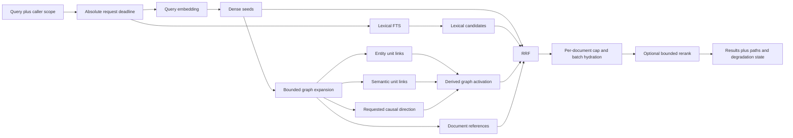

# Memos + Hindsight: PostgreSQL-Only Graph Indexing and Retrieval

## Overview

1. The specified Memos checkout is `usememos/memos`, not MemTensor/MemOS. Its graph-shaped capability is a small, explicit memo relation table: users create directed `REFERENCE` edges, comments create directed `COMMENT` edges, and reads list only the incident one-hop edges. It has no embedding index, entity graph, relevance-ranked graph search, recursive traversal, or Neo4j dependency.
2. Hindsight already supplies the useful retrieval core: fact-level units, pgvector and text-search seeds, canonical-entity postings, semantic and causal links, bounded one-pass Link Expansion, rank fusion, and optional reranking. A merged design should extend that core with Memos-style explicit human references and endpoint authorization; it should not copy Memos's substring search or pretend its relation listing is GraphRAG.
3. PostgreSQL is sufficient for this workload because the proposed online path is bounded: retrieve seeds, expand one hop through indexed adjacency/posting tables, fuse ranks, then hydrate a capped candidate set. Neo4j would add another network and consistency boundary without serving a required recursive or ad-hoc path query.
4. “For high latency” is interpreted here as a deployment where embedding, extraction, reranking, or database round trips may be slow and the online path must remain predictable. The design removes generative LLM calls from recall, reuses semantic seeds, limits fan-out before hydration, and has explicit timeout degradation. No latency number in this document is a measured result; concrete budgets remain an acceptance-test decision.

## Terminology and Scope

- **Memos**: The self-hosted note-taking application in `/Users/rocke_dong/codes/memos`, module `github.com/usememos/memos`. This document does not use “Memos” to mean MemTensor/MemOS.
- **Memory unit**: A retrieval-sized fact or note node. Hindsight normally uses fact-level units; an imported Memos note may initially remain one unit rather than being expanded into speculative subnodes.
- **Explicit reference**: A user-authored directed relation from one source document to another. It is high-confidence navigation evidence, not proof that the two texts are semantically equivalent.
- **Entity posting**: A normalized many-to-many membership row connecting one memory unit to one canonical entity.
- **Derived link**: A semantic, causal, or temporal edge computed from content rather than directly authored by a user.
- **Seed**: A unit selected directly from the query by semantic or lexical retrieval before graph expansion.
- **Link Expansion**: One bounded pass from a fixed seed set. Discovered candidates never become a new frontier.
- **High-fan-out key**: An entity or node with enough neighbors that an uncapped join could dominate latency and memory.

The comparison is a static source trace of Hindsight `93a32072f2285735e50a20cae418a3fb3b216a11` and Memos `019ca26bd316c9dea7f18b90b05d1df5e2f4c1dc`. It does not claim a live PostgreSQL benchmark, model-quality result, or production SLO.

## 1. Source-Backed Comparison

The two repositories solve different problems. Memos has a useful explicit-edge contract but no query-driven graph retrieval; Hindsight has a retrieval graph but no equivalent user-authored reference signal.

| Concern | Memos | Hindsight | Merged choice |
|---|---|---|---|
| Primary node | Whole memo | Fact-level `memory_unit` | Keep documents authoritative and index current chunks/facts as units |
| Explicit edges | User `REFERENCE`; system `COMMENT` | No equivalent user reference in ordinary recall | Add `reference` only; keep comment/thread structure outside default memory recall |
| Automatic graph | None | Entity postings plus semantic, causal, and temporal links | Keep Hindsight's derived structures |
| Query seeds | CEL filters and chronological list | Vector semantic and keyword arm; native default is PostgreSQL FTS | Reuse Hindsight semantic and lexical seeds |
| Graph read | Direct incoming/outgoing incident edges | Semantic-seeded, one-pass entity/semantic/causal expansion | Add bidirectional reference expansion to the same bounded pass |
| Ranking | Pinned/time order; no relation relevance | Intra-graph activation, then fusion and optional reranking | Preserve per-arm ranks and fuse; do not compare unrelated raw score scales |
| Authorization | Validate the target when writing and again when hydrating related memos | Bank-scoped queries and filters | Apply scope/visibility before fan-out caps and again at final hydration |
| Database | SQLite, MySQL, or PostgreSQL | PostgreSQL/pgvector by default; Oracle also exists | PostgreSQL + pgvector only for this design |

### 1.1 Memos

Memos stores nodes in `memo` and directed edges in `memo_relation(memo_id, related_memo_id, type)`. The unique key begins with the source endpoint, while `(related_memo_id, type, memo_id)` supports reverse lookup. `REFERENCE` points from the edited memo to the selected target; `COMMENT` points from a comment to its parent memo.

The write path is stronger than the retrieval path. The service accepts only client-mutable `REFERENCE` edges, ignores self-links, deduplicates targets, verifies that the target exists and is readable, and writes memo state plus relations atomically. Relation reads issue separate outgoing and incoming queries, merge them, batch-hydrate their endpoints under the caller's access scope, and only then construct the response.

Ordinary search is not graph retrieval. `ListMemos` compiles typed CEL filters into SQL, orders by pinned/time/id, and implements PostgreSQL `content.contains(...)` as `ILIKE '%literal%'`. Tags remain JSONB strings queried through `jsonb_array_elements_text`. The current PostgreSQL schema has no full-text, trigram, vector, entity, path, or relevance index for memos. The relation API performs one-hop adjacency lookup without a query seed, graph score, or recursive frontier.

### 1.2 Hindsight

Hindsight indexes fact-level `memory_units` with embeddings and text-search state, resolves canonical `entities`, records `unit_entities`, and stores semantic, causal, and temporal rows in `memory_links`. Retain performs expensive model and embedding work before or around a bounded database write, while semantic-link creation can be completed after committed facts in the streaming path.

Recall first obtains semantic and keyword candidates. Link Expansion reuses compatible semantic candidates as at most 20 seeds per fact type; only an incompatible semantic threshold requires a second seed query. It then issues one combined expansion query for the fixed seed set and merges shared-entity, bidirectional-semantic, and outgoing-causal evidence. Candidates do not become new seeds.

Shared-entity activation is `tanh(distinct_shared_entity_count * 0.5)`; semantic and causal contributions use their strongest link weights. This activation orders only the graph arm. The downstream fusion step consumes ranks from semantic, keyword, graph, and optional temporal arms, then caps hydration and optional reranking work.

Observation units have a separate, longer provenance path through their source facts before entity expansion; the ordinary fact path above is not a complete description of observation retrieval. The merged first version explicitly defers that observation-specific traversal.

### 1.3 What Is Actually Worth Merging

The Memos contribution is deliberately small: explicit human references, clear direction, atomic edge updates, efficient reverse lookup, and authorization of both endpoints. Its `COMMENT` edge is thread structure and should not enter general semantic recall by default; its substring and JSONB scans are not suitable seed mechanisms for a latency-sensitive memory engine.

The Hindsight contribution is the retrieval engine: pgvector/text seeds, entity postings, derived links, bounded expansion, rank fusion, and candidate caps. The merged design adds one signal and tighter degradation rules rather than introducing a second graph engine.

Three merged safeguards are improvements, not claims about current Hindsight: eligibility moves before every cap, incoming semantic degree receives its own per-seed cap, and one absolute deadline covers the primary query plus fallback. Current Hindsight filters tags after graph top-budget selection, aggregates incoming semantic edges without a per-seed cap, and issues its semantic/causal fallback without the first query's local timeout wrapper.

## 2. Design Goals and Non-Goals

The design keeps authoritative document structure separate from derived retrieval structure. That separation is necessary because a Memos relation connects whole memos, while a Hindsight link connects extracted facts; silently treating those identifiers as the same node would invent semantics and create uncontrolled fan-out.

Goals:

1. Use PostgreSQL and pgvector as the only persistent query store; do not add Neo4j, a graph cache, or a second consistency domain.
2. Preserve explicit document references exactly, including their original direction and endpoint authorization.
3. Keep model-derived facts, entities, semantic similarity, and causality distinguishable from user-authored edges.
4. Make external model latency affect indexing freshness or an optional rerank, not database transaction duration or graph traversal depth.
5. Bound intermediate work before hydration, use deterministic tie-breaking, and return useful base retrieval when optional graph or reranking work misses its deadline.
6. Prevent a stale high-latency indexing job from publishing facts for an obsolete document revision.

Non-goals for the first version:

- General Cypher-like queries, arbitrary recursive traversal, BFS, PPR, or path discovery.
- Treating `COMMENT` as semantic or causal evidence.
- Materializing an entity clique between every pair of units that mention the same entity.
- Reproducing Hindsight's observation-provenance traversal or temporal spreading before an evaluation shows incremental value.
- Building a separate partial HNSW index for every user or bank before scale measurements justify it.
- Claiming that an explicit reference, a cosine score, a shared entity, or an extracted causal edge proves truth.

## 3. PostgreSQL Data Model

The minimum schema has two layers. Documents and their relations are authoritative user state; units, entities, postings, and unit links are rebuildable retrieval state.

```text
documents
  (scope_id, document_id, current_revision, original_text, owner/visibility, timestamps)
       |
       | 1:N, same current revision
       v
memory_units
  (scope_id, unit_id, document_id, source_revision, kind, source_span,
   text, embedding, search_vector, fact_type, event_time, timestamps)
       | N:M                              | directed derived edges
       v                                  v
unit_entities                         memory_links
       |                              (semantic, caused_by, temporal)
       v
entities

document_relations
  (scope_id, from_document_id, to_document_id, relation_type)
  relation_type = reference | comment
```

### 3.1 Authoritative document tables

`documents.current_revision` increments on every content edit. `document_relations` stores Memos-style whole-document structure and retains the authored direction. `reference` is eligible for graph recall; `comment` is stored for thread reconstruction but excluded from ordinary recall unless the caller explicitly requests conversation context.

The target schema improves on current Memos by enforcing both endpoints with composite `(scope_id, document_id)` foreign keys. This is a new design choice, not an existing Memos property: current `memo_relation` has a uniqueness constraint and reverse index but no endpoint foreign keys.

Minimum relation indexes are:

```sql
PRIMARY KEY (scope_id, from_document_id, to_document_id, relation_type)
CREATE INDEX ON document_relations
  (scope_id, from_document_id, relation_type, to_document_id);
CREATE INDEX ON document_relations
  (scope_id, to_document_id, relation_type, from_document_id);
```

### 3.2 Retrieval projection tables

`memory_units.kind` distinguishes a cheap source chunk from a model-extracted fact. Every unit carries `document_id`, `source_revision`, and an optional source span so a generated fact remains traceable to current source text. Queries admit only units whose `source_revision = documents.current_revision`.

`entities` is a scope-local canonical registry. `unit_entities` is the membership/posting table; an entity shared by 10,000 units remains 10,000 postings rather than roughly 50 million materialized pair edges.

`memory_links` contains derived unit-to-unit edges. The first version writes `semantic`, canonical `caused_by`, and optionally `temporal`; legacy Hindsight `causes`, `enables`, and `prevents` may remain readable for imports but are not newly inferred. A user `reference` does not belong in this table because its endpoints and lifecycle are documents, not facts.

All projection tables carry `scope_id`. Unit links use composite foreign keys from `(scope_id, from_unit_id)` and `(scope_id, to_unit_id)` to prevent cross-scope edges in the database, not only in application checks.

Minimum retrieval indexes are:

```text
memory_units(scope_id, document_id, source_revision)
memory_units GIN(search_vector)
memory_units HNSW(embedding vector_cosine_ops), with scope/fact filters verified by plan and recall tests
unit_entities primary key(scope_id, unit_id, entity_id)
unit_entities(scope_id, entity_id, unit_id)
memory_links(scope_id, from_unit_id, link_type, weight DESC, to_unit_id)
memory_links(scope_id, to_unit_id, link_type, weight DESC, from_unit_id)
```

PostgreSQL native full-text search is a valid lexical baseline, but it must be called lexical/FTS rather than BM25: Hindsight's default native backend ranks `tsvector` matches with `ts_rank_cd`; only optional extension backends implement BM25 variants. Filtered HNSW behavior must be compared with exact search for the real scope distribution instead of inferred from index presence.

One projection and vector index use one fixed embedding model identity, version, and dimension. Switching models rebuilds the projection; vectors from different models must not be mixed merely because their dimensions match.

### 3.3 Minimal indexing state

Reuse Hindsight's durable async-operation mechanism or an equivalent small `index_job` row keyed by `(scope_id, document_id, revision, indexer_version)`. The state only needs `pending`, `processing`, `ready`, or `failed`, an availability time, and the claimed revision. This is a retry boundary for the present slow-indexing scenario, not a general lineage ledger.

## 4. Indexing Flow

The indexing path keeps slow work outside transactions and publishes only the current revision.

1. In one short transaction, authorize the writer, lock the source document, increment `current_revision`, store the new text, replace that document's outgoing explicit references, create searchable source chunks for the new revision, and enqueue the unique indexing operation. Reference targets must exist in the same scope and be readable by the writer. `COMMENT` edges can only be created by the comment workflow.
2. A worker claims the operation in a short transaction and releases the connection. It performs extraction, entity resolution inputs, embeddings, and other remote or CPU work without holding a database connection or row lock.
3. The worker prepares fact units with exact source revision and spans. New ordinary causal edges may only be `effect --caused_by--> earlier cause` within the same extraction group; a fixed weight of `1.0` means “the extractor emitted this relation,” not calibrated causal confidence.
4. In one publish transaction, lock the source document and compare `current_revision` with the operation's revision. If they differ, discard the prepared projection as stale. If they match, batch-write units, canonical entities, `unit_entities`, and deterministic causal/temporal links, then mark the base projection ready.
5. Build semantic links in a separate idempotent enrichment step. A failure leaves dense and lexical recall usable and records `semantic links failed` rather than reporting the whole graph ready. Normal, streaming, repair, and rebuild paths use one `semantic_link_max_neighbors` value.
6. Old revisions may be deleted later in small batches. They become invisible immediately through the current-revision predicate, so cleanup is not on the correctness-critical path.

This flow combines Memos's atomic source/reference update with Hindsight's separation of slow entity/ANN preparation from the publishing transaction. The revision compare-and-swap is new and is required because a slow extraction can finish after the user edits the memo again.

## 5. Retrieval Flow

The online path has no generative LLM call and performs one bounded expansion over fixed seeds.



1. Resolve the caller's scope and access policy, create one absolute deadline, and start lexical SQL while the query embedding is in flight.
2. Select bounded dense and lexical candidates under scope, current-revision, deletion, fact-type, tag, time, and visibility predicates. The dense SQL reads at the lower of the semantic-arm and graph-seed floors and returns enough ordered rows for both contracts; the application then derives the two sets at their own thresholds. This preserves at most 20 graph seeds without Hindsight's possible second ANN seed round trip.
3. Submit the fixed seed IDs to one narrow graph SQL statement. Each branch returns candidate ID, source signal, seed ID, edge/entity identifier, direction, and raw contribution rather than full text payloads.
4. Expand entity postings from seed unit to entity to eligible unit. Apply the eligibility predicate before the per-entity cap.
5. Expand semantic links in both stored directions, with an independent per-seed/per-direction cap. A write-time outgoing top-k does not bound reverse degree, so the incoming branch must be capped separately.
6. Expand `caused_by` in the requested direction: effect-to-cause for “why,” cause-to-effect for “what happened because of this,” or both for an explicitly general mode. Always preserve the stored direction in the returned explanation.
7. Expand an explicit reference as `seed unit -> owning document -> reference edge -> related document -> eligible current units`. Read both outgoing references and backlinks by default, preserve the authored direction, and cap units per related document; one reference must never import every fact from a large target document.
8. Fuse the dense, lexical, derived-graph, and explicit-reference arm ranks with RRF. Use stable `(kind, id)` candidate keys, then a stable ID tie-break. Apply a per-document result cap before one batch hydration query.
9. Run at most one optional reranker over the bounded hydrated set when the shared deadline has enough time remaining. Otherwise return the fused order.
10. Return source text/span and the retrieval path that admitted each graph candidate. Also return which optional arms degraded, so “graph timed out” is not misread as “no relation exists.”

The fail-capable baseline uses four bounded PostgreSQL statements: lexical candidates started while embedding runs, dense seeds after embedding, graph expansion from fixed seeds, and final batch hydration. This preserves completed dense/lexical results when graph SQL times out. A measured high-RTT deployment may combine dense seed selection and graph expansion into one statement, but that mode loses the same failure isolation and must not be presented as equivalent until separately tested.

## 6. Edge Direction and Scoring

Direction is part of the evidence and must survive storage, traversal, ranking, and explanation.

| Relation | Stored meaning | Default read behavior | What it does not mean |
|---|---|---|---|
| `reference` | Document A explicitly references document B | Read outgoing and incoming, but label which direction matched | A and B are equivalent or mutually supporting |
| `comment` | Comment document A belongs under parent B | Excluded from ordinary recall; thread mode may read child and parent separately | Causality or semantic similarity |
| `semantic` | The indexer selected a similar-unit neighbor | Read both physical directions with independent caps | A symmetric truth relation |
| `caused_by` | Effect unit A names earlier cause B | Outgoing for cause-seeking; incoming for effect-seeking | Calibrated causal probability |
| `unit_entity` | Unit A mentions canonical entity E | Traverse A -> E -> eligible unit | Same event, same claim, or causality |

Use Hindsight's implemented graph activation for the derived graph arm:

```text
entity_contribution = tanh(distinct_shared_entity_count * 0.5)
semantic_contribution = max(semantic_link_weight), else 0
causal_contribution = max(causal_link_weight), else 0

derived_graph_activation =
    entity_contribution + semantic_contribution + causal_contribution
```

This score orders the derived graph arm only. Do not implement the stale source comment that describes a causal `weight + 1.0`; current Hindsight code does not add that boost. An explicit-reference arm remains separate: the edge contribution is binary, while target units are ordered by their own bounded query relevance and then stable ID. RRF combines arm ranks instead of adding vector distance, lexical rank, graph activation, and reference values as if they shared a calibrated scale.

Every equal-score order uses a stable ID tie-break. Each returned graph candidate records the seed, signal, stored direction, traversal direction, entity or edge identifier, and contribution. This evidence is an explanation of retrieval, not a truth score.

## 7. High-Latency and High-Fan-Out Behavior

The latency strategy bounds external calls, database round trips, intermediate fan-out, and payload size separately. A final `LIMIT` alone is not sufficient because joins and aggregation may already have scanned or transferred a large neighborhood.

### 7.1 Starting caps

The following are evaluation defaults, not measured optimal values:

| Boundary | Starting value | Reason |
|---|---:|---|
| Graph seeds | 20 | Matches Hindsight's current seed ceiling |
| Entities used per seed | 8 | Bounds units with excessive entity extraction |
| Eligible units per entity | 64 | Bounds hub-entity fan-out before aggregation |
| Edges per seed/type/direction | 16 | Separately bounds outgoing and reverse degree |
| Units per referenced document | 8 | Prevents one document reference from importing a full fact set |
| Total narrow graph candidates | 400 | Bounds fusion input before payload hydration |

Every cap must be expressed inside the indexed branch that creates the intermediate rows, typically through a lateral subquery ordered by weight/relevance and stable ID. Eligibility is inside that subquery. Sparse visibility may still force PostgreSQL to inspect many rejected rows, so the cap does not replace `statement_timeout` or plan testing.

### 7.2 One absolute deadline

The API computes an absolute request deadline once and passes the remaining duration to embedding, SQL `statement_timeout`, graph expansion, hydration, and reranking. A fallback never receives a fresh full timeout. If the combined graph query expires, return completed base arms; do not first spend the full graph timeout and then issue an unbounded fallback query.

Degradation is explicit:

- Query embedding failure or timeout: return lexical results and expand only safe visible explicit references from lexical seeds.
- Graph failure or timeout: return completed dense and lexical results.
- Reranker failure, timeout, or insufficient remaining time: return deterministic RRF order.
- Temporal inference over budget: require or use the caller's explicit time window rather than serializing an extra model/CPU stage.
- Authorization or scope-filter failure: fail closed; never retry without the filter.

### 7.3 Round trips and payloads

Index workers never hold a database connection while waiting for an LLM or embedding provider. Online recall makes at most one query-embedding call and one optional reranking call. PostgreSQL work is batched: candidate selection and bounded expansion return narrow rows, then one hydration query loads the surviving text and metadata.

Hindsight currently executes semantic/keyword retrieval before per-fact-type graph calls and returns wide graph rows; the merged plan instead uses four batched statements with narrow candidate rows until final hydration. This avoids per-entity or per-edge round trips and preserves graph-timeout degradation. A later combined SQL mode may save one round trip when PostgreSQL is across a high-RTT link, but only after actual plans, failure behavior, and pool contention are measured.

### 7.4 Observable latency

Record end-to-end and stage p50/p95/p99, connection-pool wait, embedding/reranker duration, SQL statement duration, scanned versus returned rows, candidates per arm, timeout/degradation reason, and index freshness. Use `EXPLAIN (ANALYZE, BUFFERS)` on high-degree entity, high reverse-degree semantic, restrictive-access, and deep-history cases. The existence of an index, CTE, lateral join, or green exit code is not latency evidence.

## 8. Correctness, Authorization, and Lifecycle

The following are invariants rather than optional tuning:

1. A relation write validates the source owner, target existence, same scope, and target readability. A relation read independently re-evaluates both endpoint permissions.
2. Scope, current source revision, deletion state, fact type, time, tag, and visibility eligibility run before per-entity, per-edge, per-document, and total candidate caps. An invisible node cannot consume a cap or contribute a hidden path, entity count, or ranking boost.
3. Editing a document immediately makes older projection rows ineligible. A worker publishes only if its captured revision still equals `documents.current_revision`.
4. Replacing references deletes only the source document's outgoing `reference` rows. It never deletes incoming backlinks or `comment` rows.
5. Deleting a document removes its authored relations and cascades to its units, entity postings, and unit links. Soft-deleted rows are ineligible before traversal caps.
6. Derived edge construction is idempotent under a uniqueness key that includes scope, endpoints, and type. Retrying a job does not multiply edges.
7. A semantic-link failure is visible as partial indexing; it does not roll back already published source chunks or facts and does not masquerade as a complete graph.
8. The graph response retains provenance. A reference is reported as user-authored, a semantic edge as model/index-derived similarity, and a causal edge as extraction output.
9. Candidate and response ordering is deterministic under equal scores.
10. PostgreSQL constraints enforce same-scope endpoint integrity. Application checks remain necessary for dynamic visibility and ownership.

## 9. Worked Example

Assume the user has two current documents:

```text
D_MOVE: “Maya lost her job, could not pay rent, and moved to a cheaper apartment.”
D_BUDGET: “Apartment Z costs less and is close to the train.”

document_relations:
  D_MOVE --reference--> D_BUDGET
```

The current indexing projection contains:

```text
memory_units:
  U_JOB     [D_MOVE]   Maya lost her job.
  U_RENT    [D_MOVE]   Maya could not pay rent.
  U_MOVE    [D_MOVE]   Maya moved to a cheaper apartment.
  U_CHEAPER [D_BUDGET] Apartment Z costs less and is close to the train.

unit_entities:
  U_JOB     -> Maya
  U_RENT    -> Maya, rent
  U_MOVE    -> Maya, apartment
  U_CHEAPER -> Apartment Z, train

memory_links:
  U_RENT --caused_by--> U_JOB
  U_MOVE --caused_by--> U_RENT
```

For “Why did Maya move, and what cheaper option was noted?”, assume dense/lexical retrieval selects `U_MOVE` as a seed.

1. The causal outgoing branch returns `U_RENT`, because `U_MOVE --caused_by--> U_RENT` is one hop. It does not recursively continue to `U_JOB`.
2. The entity branch may return eligible units sharing `Maya` or `apartment`, subject to the per-entity cap.
3. The document-reference branch maps `U_MOVE -> D_MOVE -> D_BUDGET`, then selects at most the per-document cap of query-relevant current units. It can therefore return `U_CHEAPER` without importing every unit in `D_BUDGET`.
4. The response explains that `U_RENT` arrived through an extracted causal edge and `U_CHEAPER` through a user-authored document reference. It does not describe the reference as a causal or semantic assertion.
5. If `D_BUDGET` is not readable, its relation and units contribute nothing before ranking. If its current revision changed while an older index job was running, only units matching the new revision are eligible.

## 10. Incremental Delivery and Acceptance Gates

Delivery should prove one real PostgreSQL path before adding more graph machinery.

1. **Baseline and schema:** Capture current dense + lexical quality and latency on a fixed corpus. Add document revision, current source chunks, composite scope constraints, and explicit `document_relations` with forward/reverse indexes.
2. **Explicit-reference slice:** Implement `seed unit -> document -> reference/backlink -> bounded target units`, permission-before-cap, deterministic RRF, narrow candidate rows, and one hydration query. This is the smallest genuinely merged user path.
3. **Asynchronous projection:** Move slow extraction/embedding outside transactions, add revision compare-and-swap publication, and prove that an edit during indexing cannot publish or retrieve stale facts.
4. **Derived graph hardening:** Reuse Hindsight entity, semantic, and `caused_by` expansion while adding reverse-degree caps, eligibility-before-cap, one absolute deadline, stable tie-breaking, and a single semantic-link neighbor setting.
5. **Optional tail stages:** Enable reranking and any temporal feature only after the bounded base path is green and their incremental answer quality exceeds their tail-latency cost.

Required fail-capable acceptance cases are:

- A reference is found from both the authored and backlink side, with the authored direction preserved.
- A comment edge never appears as semantic or causal evidence in ordinary recall.
- Effect-to-cause and cause-to-effect queries follow only their requested direction; one-hop mode never silently becomes recursive.
- A high-frequency entity and a high reverse-degree semantic node stay within intermediate caps.
- A private or wrong-scope intermediate node neither appears nor changes another candidate's rank.
- Updating a document while its slow index job is running makes the old projection ineligible and rejects the stale publish.
- Embedding, graph SQL, and reranker timeouts each return the documented degraded result; an authorization failure does not degrade open.
- Exact vector search and filtered ANN are compared for Recall@K on realistic scope distributions.
- `EXPLAIN (ANALYZE, BUFFERS)` confirms the intended indexes and records actual scanned/returned rows for the hot queries.
- End-to-end answer/citation quality is compared against dense + lexical baseline, then after explicit references, entities, and semantic links are added one at a time.

## 11. Deferred Work

Defer the following until a measured failure or quality gain requires them:

- Recursive multi-hop traversal, PPR, path search, or Neo4j.
- Materialized entity-to-entity or unit-to-unit entity cliques.
- Query-time generative entity extraction.
- Hindsight observation-provenance traversal and temporal multi-hop spreading.
- Per-bank vector indexes, graph caches, adaptive cap controllers, or cross-version recovery ledgers.
- Treating every Memos relation as a memory edge or automatically converting comments into facts.
- More link types than explicit `reference`, derived `semantic`, canonical `caused_by`, and a separately evaluated temporal relation.

## 12. Source Map and Verification Boundary

The comparison and design were independently traced by the primary analysis and a GPT-6 subagent, then reconciled against the current checkouts. The following paths are the main executable evidence.

Memos `019ca26bd316c9dea7f18b90b05d1df5e2f4c1dc`:

- PostgreSQL memo and relation schema: `store/migration/postgres/LATEST.sql:53-79`.
- Explicit-reference validation, direction, deduplication, and endpoint read check: `server/api/v1/memo_relation_service.go:54-99`.
- Serializable memo/reference mutation and replacement: `store/db/postgres/memo_attachment.go:14-50,128-175`.
- Batched outgoing/incoming relation reads and access-scoped endpoint hydration: `server/api/v1/memo_service_converter.go:243-330`.
- Relation SQL and post-read pagination boundary: `store/db/postgres/memo_relation.go:41-129` and `server/api/v1/memo_relation_service.go:117-150`.
- CEL content matching as PostgreSQL `ILIKE`, not FTS: `filter/render.go:535-543,627-657`.

Hindsight `93a32072f2285735e50a20cae418a3fb3b216a11`:

- Slow entity/ANN preparation outside the publish transaction and atomic fact/posting/link writes: `hindsight-api-slim/hindsight_api/engine/retain/orchestrator.py:475-554,608-696`.
- Streaming semantic-link best-effort boundary: `hindsight-api-slim/hindsight_api/engine/retain/orchestrator.py:3463-3491`.
- Canonical new causal type, extraction-list order validation, and effect-to-earlier-cause write: `hindsight-api-slim/hindsight_api/engine/causal_links.py:11-16`, `hindsight-api-slim/hindsight_api/engine/retain/fact_extraction.py:2189-2194,3061-3062`, and `hindsight-api-slim/hindsight_api/engine/retain/link_utils.py:904-1003`. “Earlier” is extraction order, not a validated event timestamp.
- Store-owned recall ordering: `hindsight-api-slim/hindsight_api/engine/memories/postgres.py:132-199` and `hindsight-api-slim/hindsight_api/engine/search/retrieval.py:874-902`.
- Seed reuse, 20-seed cap, implemented activation, post-cap tag filtering, and timeout fallback: `hindsight-api-slim/hindsight_api/engine/search/link_expansion_retrieval.py:46,167-188,231-285,346-369`.
- PostgreSQL entity, bidirectional semantic, and outgoing causal expansions: `hindsight-api-slim/hindsight_api/engine/db/ops_postgresql.py:899-995`.
- RRF combines ranks rather than raw arm scores: `hindsight-api-slim/hindsight_api/engine/search/fusion.py:29-109`.
- Native lexical scoring uses `ts_rank_cd`; optional backends differ: `hindsight-api-slim/hindsight_api/engine/sql/postgresql.py:305-416`.
- Direction-covering link indexes and entity-posting index: `hindsight-api-slim/hindsight_api/alembic/versions/f1a2b3c4d5e6_add_memory_links_composite_index.py:30-40`, `hindsight-api-slim/hindsight_api/alembic/versions/d2e3f4a5b6c7_add_memory_links_expansion_indexes.py:56-63`, and `hindsight-api-slim/hindsight_api/alembic/versions/h3i4j5k6l7m8_merge_heads_and_add_unit_entities_index.py:30-37`.

Verification performed for this document is static: repository identity, current source paths, schema/index definitions, control flow, and Markdown checks. No PostgreSQL service, LLM, embedding provider, benchmark, or answer-quality evaluation was run. All proposed caps, latency behavior, schema changes, and acceptance targets remain design decisions until implemented and measured.
