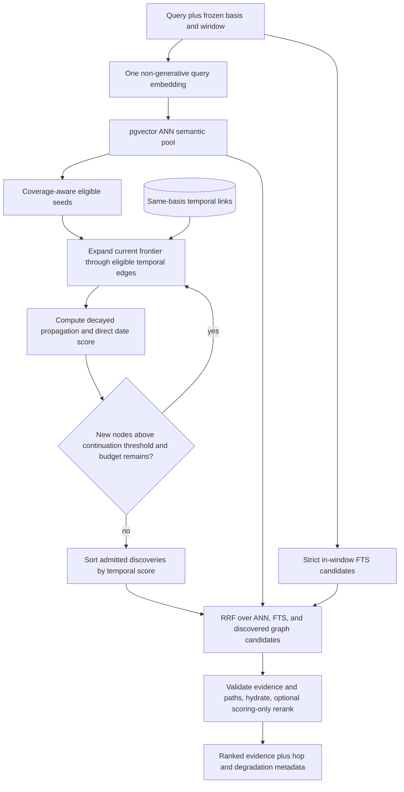

# Memos + Hindsight: Temporal Recall with ANN Semantic Search and Multi-Hop Spreading

## Overview

1. The specified Memos checkout is `usememos/memos`, not MemTensor/MemOS. Its temporal behavior is document-time browsing: filter and order memos by mutable `created_ts` or `updated_ts`. It has no event-time interval, mention time, time-aware semantic rank, temporal graph, or temporal spreading.
2. Hindsight separates event time (`occurred_start` / `occurred_end`), mention time (`mentioned_at`), and processing time, then adds a temporal recall arm. Its normal fact/event extraction during indexing is generative, while its current default recall window analyzer and retrieval path are non-generative.
3. ANN semantic retrieval and multi-hop spreading are both required foundations of the first version. PostgreSQL with pgvector HNSW finds semantically relevant entry points; traversal of PostgreSQL temporal edges then discovers additional evidence without a fixed hop limit. Hop decay and a continuation threshold control which discovered nodes keep spreading; visited-node deduplication, the node budget, and the request deadline bound execution. A two-hop discovery is the minimum acceptance example, not the maximum supported depth.
4. An allowlisted generative indexer may extract atomic facts, event/reference roles, and implicit or relative time during asynchronous indexing. Recall makes no generative call: it embeds the query once, retrieves ANN and FTS candidates, expands the temporal graph, fuses ranks, and returns evidence. An explicit `time_basis = event | referenced | mentioned | created | updated` and half-open window constrain seeds, every intermediate node, and final results.

This design incorporates the current flow and caveats documented in [`temproral-retrieval-flow.md`](./temproral-retrieval-flow.md), rechecked against the current source, and adopts the monotonic scoring rules in [`temporal-causal-propagation-scoring.md`](./temporal-causal-propagation-scoring.md). The latter is a proposed scoring contract, not current runtime behavior.

## Terminology and Scope

- **Source created/updated time**: The document timestamps exposed by Memos. They are user/import mutable in the current API and must not be described as immutable ingestion clocks.
- **Event time**: When the described event happened, stored as an `event` time-span annotation.
- **Referenced time**: A date or period mentioned by the source that is not asserted as the occurrence time of the indexed fact.
- **Mention time**: When the source recorded or mentioned the content. It remains distinct from event time even when only one of them is known.
- **Index time**: When the retrieval projection was published. It is operational metadata, not a user-facing temporal recall basis.
- **Time basis**: The timestamp family selected by the caller: `event`, `referenced`, `mentioned`, `created`, or `updated`.
- **Temporal window**: A validated half-open UTC interval `[start, end)` applied to the selected time basis.
- **Temporal coverage**: Deterministic selection across populated portions of a wide time window so one dense period does not monopolize every result.
- **ANN semantic retrieval**: Approximate nearest-neighbor search over stored text embeddings, using pgvector HNSW and cosine distance to obtain the initial semantic candidate pool. HNSW's internal index graph is not the temporal graph.
- **Temporal edge**: A stored proximity relation between two units under the same time basis, with supporting annotation IDs for event/reference time. It expresses temporal proximity, not causality.
- **Multi-hop spreading**: Repeatedly expand a frontier of eligible units through temporal edges; a discovered node above the continuation threshold can discover another node at any later hop, including nodes absent from the initial ANN pool.
- **Direct date proximity, `D(v)`**: The node's own selected-basis date score relative to the query-window midpoint, independent of its graph path.
- **Propagated score, `P(u, v)`**: Parent traversal strength multiplied by edge weight and the fixed `0.7` hop decay; one edge cannot amplify inherited strength.
- **Temporal score, `T(v)`**: The larger of direct date proximity and propagated score. It controls continuation and the spreading arm's order before rank fusion; it stays in `[0, 1]`.
- **RRF**: Reciprocal rank fusion, which combines per-arm ranks rather than adding incomparable raw similarity and path scores.
- **Deterministic analyzer**: Explicit date rules plus `dateparser`; it performs no token generation and makes no model call.
- **Generative indexer**: An asynchronous, schema-constrained model call that derives atomic facts and temporal annotations from one source chunk. Its output is a rebuildable projection, never authoritative source text.
- **Non-generative encoder**: An embedding or cross-encoder model that returns vectors or relevance scores rather than generated text. The embedding encoder is required for normal ranked recall; a scoring-only cross-encoder remains optional. Model identity is fixed per projection.

Scope: Hindsight retrieval source rechecked at `df7e126d88d8eec88a3d1804ba603315536ac174`, using the current working-tree version of `temproral-retrieval-flow.md`; the Memos comparison retains the previously inspected `019ca26bd316c9dea7f18b90b05d1df5e2f4c1dc` snapshot. This is a PostgreSQL design, not an implemented Hindsight change. No live database plan, latency, recall-quality, parser-accuracy, or multilingual evaluation is claimed.

## 1. Source-Backed Comparison

Memos offers useful time-field filtering and deterministic UI range construction; Hindsight offers richer generative event/fact indexing and relevance-aware temporal retrieval. Neither current system exactly implements the proposed combination of targeted generative indexing and strict non-generative recall.

| Concern | Memos | Hindsight | New design |
|---|---|---|---|
| Retrieval unit | Whole memo | LLM-extracted fact, observation, or raw chunk in chunks mode | Grounded extracted fact with raw-chunk fallback, revision, and ordinal |
| Time fields | Mutable create/update timestamps | Event interval, mention time, derived compatibility `event_date`, create/update time | Keep event, referenced, mention, create, update, and index time separate |
| Event-time indexing | None | Usually extracted by a generative LLM; chunks mode has no event extraction | Explicit metadata first; targeted generative fact/time extraction with validation and source provenance; deterministic fallback |
| PostgreSQL time indexes | Space/status/create-time composite index | B-tree/partial indexes on event and mention fields; stored temporal edges | GiST spans, point-time B-trees, required HNSW, and indexed temporal-edge endpoints |
| Query window | CEL created/updated range | Explicit window or default non-generative dateparser analysis | Explicit window is authoritative; deterministic analysis is optional fallback |
| Window meaning | Strict filter on chosen document timestamp | Seeds only the temporal arm; other arms and spread targets may be outside it | Strict eligibility for every arm, graph endpoint, supporting annotation, and hydrated result |
| Relevance | Pinned/time sort; content substring filters | Vector-gated temporal entries, coverage selection, graph spreading, RRF/rerank | ANN + FTS + multi-hop spreading, RRF, optional final coverage and scoring-only rerank |
| Graph behavior | None | Temporal/causal multi-hop spreading in PostgreSQL | Required same-basis multi-hop expansion without a fixed depth limit; score continuation plus node/deadline bounds |
| Generative call | None for list/filter | Normal retain extraction uses an LLM; default recall date analysis does not | Allowed only during asynchronous indexing; prohibited during recall |

### 1.1 Memos

Memos stores `created_ts` and `updated_ts` as epoch-second columns on each memo. PostgreSQL's main memo index is `(space_id, row_status, created_ts DESC, id DESC)`; there is no corresponding current index for `updated_ts`, event intervals, or temporal relevance.

Both timestamps are document attributes rather than immutable system history. Create accepts supplied timestamp values, and update masks allow callers to replace both `create_time` and `update_time`. A temporal design must therefore label them source/display time and preserve their provenance instead of treating them as trusted ingestion order.

`updated_ts` is also caller-path dependent rather than trigger-maintained: the standard web editor includes `update_time`, and dedicated relation/attachment setters advance it, but a direct API content update that omits the field need not change it. It is useful organization metadata, not a complete change log.

`ListMemos` accepts CEL predicates over `created_ts` and `updated_ts`, applies access and state predicates, then orders by pinned plus either create or update time with ID as the final tie-break. The calendar UI converts a local day or month into a half-open epoch range and filters the selected time basis. This is deterministic and useful for browsing, but it is not event-time extraction or relevance-ranked temporal recall.

References and comments do not add time semantics. Comments are excluded from the ordinary list by default, and relation lookup does not traverse or rank by timestamps.

### 1.2 Hindsight

Hindsight's normal retain path asks a generative model to classify event facts and produce `occurred_start` / `occurred_end` relative to the source date. The writer stores those fields, stores `mentioned_at`, and derives compatibility `event_date` as `occurred_start` when present, otherwise `mentioned_at`. It also constructs bounded temporal-proximity links among same-bank, same-fact-type units.

Those proximity links do not have one uniform symmetry/window contract. Cross-batch PostgreSQL linking writes new-source-to-selected-target edges and does not enforce the nominal 24-hour window before flooring far-neighbor weight at `0.3`; within-batch construction produces both directional candidates before each source's top-20 cap. Maintenance applies a different 24-hour filter. The new design retains temporal edges but gives them one explicit basis, horizon, direction, and revision contract.

Hindsight also has a zero-generative indexing fallback: `retain_extraction_mode="chunks"` turns each deterministic chunk into one raw unit, uses the source `event_date` as `mentioned_at`, extracts no entities or occurred dates, and reports zero LLM token usage. Setting the LLM provider to `none` forces this mode and disables observations. The new design preserves this degraded path but uses schema-constrained generative indexing when richer fact and event-time recall is needed.

Current retain also adds small per-fact offsets to occurred and mention timestamps to preserve ordering. The new design rejects that approach: factual time remains unchanged, and a separate ordinal plus stable ID resolves ties.

At recall, an explicit `TemporalWindow` skips natural-language analysis. Without it, the default `DateparserQueryAnalyzer` uses rules and `dateparser`, not a generative model; the optional transformer analyzer is a different injected implementation and is excluded from the new design.

The temporal arm retrieves up to 60 similarity-ranked in-window rows per fact type, selects up to 10 entry points across 8 time buckets, then PostgreSQL may spread over outgoing temporal and causal links. Its distance-ordered SQL permits an ANN index plan; a selective date predicate may instead produce an exact filtered search. Spread-target similarity is an exact cosine calculation over linked targets, not a second ANN query. The window predicate admits either an overlapping event interval or a mention/start/end point inside the window. It does not distinguish an `event` query from a `mentioned` query.

Hindsight limits spreading to five frontier batches of at most 20 sources, not five complete hop levels. It takes the top 10 stored links before filtering their targets and accepts the first path encountered for each unit. The new design processes successive breadth-first levels without a hop or batch-count cutoff, limits eligible neighbors after target checks, and resolves competing paths deterministically within each level. It retains a finite node budget and deadline and uses the referenced scoring proposal's decay and continuation rule.

The current window is not a strict result filter. Semantic, keyword, and ordinary graph arms remain unconstrained by it, and temporal spreading reapplies update-time filters but not the event/mention window. Consequently an in-window entry can retrieve an outside-window linked target. That is useful for related context but is the wrong default for a request whose contract is “recall evidence in this time range.”

Current temporal score metadata also has downstream gaps: the temporal list is not actually re-sorted by its `temporal_score`, and RRF keeps the first arm's result object for duplicate IDs without merging temporal proximity. The new design merges matching annotation evidence by ID and does not use a hidden midpoint multiplier.

### 1.3 Reuse, Correct, and Omit

Reuse from Memos:

- Explicit create/update time basis, half-open calendar ranges, authorization before pagination, stable ID tie-breaks, and ordinary chronological browsing.

Reuse from Hindsight and `temproral-retrieval-flow.md`:

- Asynchronous generative fact/event extraction, separate event intervals and mention time, caller-supplied windows, default non-generative query analysis, ANN/lexical relevance, temporal edges, multi-hop spreading, coverage-aware entry selection, and RRF.

Correct in the new design:

- Select exactly one explicit time basis; never OR mention time into an event-time query.
- Apply the same strict window predicate to ANN, lexical, seeds, every graph endpoint and edge witness, coverage, hydration, and rerank candidates.
- Distinguish ANN index traversal from temporal graph traversal; require a second-hop discovery outside the initial semantic/lexical pools.
- Give temporal links an explicit time basis and symmetric traversal. Track hop depth for explanation and tie-breaking; SQL batching and hop depth do not impose traversal cutoffs.
- Treat generated facts and temporal annotations as rebuildable, source-grounded projections: validate their schema and source spans, preserve extractor identity, and retain raw chunks as evidence and fallback.
- Preserve factual timestamps exactly and use `unit_ordinal` for deterministic ordering.
- Treat Memos timestamps as mutable source fields and Hindsight `event_date` as a compatibility key, not an independent time truth.
- Publish deterministic parsing and embeddings only for the current document revision.

Omit from the first version:

- Observation consolidation, causal inference/causal edges, and Hindsight's final temporal multiplier. Temporal edge construction, propagation decay, and actual multi-hop spreading are included in v1.

Generative calls are permitted only in the indexing projection for grounded fact and temporal extraction. Generative query analysis, query rewriting, reranking, Reflect-style retrieval, and answer generation remain excluded from recall because they add request-path latency and nondeterminism.

### 1.4 Mem0 Temporal and Graph Comparison

Mem0 supplies useful timestamp and retrieval comparisons, but its hosted temporal feature and inspected open-source implementation are different evidence boundaries. The OSS checkout inspected here is `c7ee362aff94a369af70f13f2b4f853f6793ff4c`; hosted behavior below is limited to official documentation read on September 18, 2026.

- **Hosted temporal behavior:** Platform v3 documents extraction of event dates/ranges and a ranking boost when they match the query's time. `timestamp` preserves an imported conversation's original time, and `reference_date` anchors relative dates for a search. This is documented temporal ranking, not evidence of a strict global event-window predicate or disclosed multi-hop algorithm. [Temporal Reasoning](https://docs.mem0.ai/platform/features/temporal-reasoning)
- **OSS time grounding:** `Memory.add(timestamp=...)` and `Memory.search(reference_date=...)` reject non-null values. The extraction prompt supports an Observation Date, but the inspected add path supplies no timestamp, so it defaults to the current date; storing `metadata.created_at` does not pass that value into the prompt. Its generated fact text and `created_at`/`updated_at` payload do not implement this design's separate event/reference/mention range model. [Add, extraction, and stored metadata](https://github.com/mem0ai/mem0/blob/c7ee362aff94a369af70f13f2b4f853f6793ff4c/mem0/memory/main.py#L817), [prompt date resolution](https://github.com/mem0ai/mem0/blob/c7ee362aff94a369af70f13f2b4f853f6793ff4c/mem0/configs/prompts.py#L1007), [search validation](https://github.com/mem0ai/mem0/blob/c7ee362aff94a369af70f13f2b4f853f6793ff4c/mem0/memory/main.py#L1432)
- **OSS candidate expansion:** `_search_vector_store` obtains `max(top_k * 4, 60)` semantic candidates and builds the final candidate set only from those rows. BM25 and entity-linked-memory scores change their ranking. `_compute_entity_boosts` maps matched query entities to linked memory IDs once; it does not expand a new memory frontier or add an absent memory to the candidate set. Vector retrieval plus these boosts therefore does not satisfy this design's second-hop discovery requirement. An actual ANN execution plan remains backend/runtime-dependent. [Candidate construction and entity boosts](https://github.com/mem0ai/mem0/blob/c7ee362aff94a369af70f13f2b4f853f6793ff4c/mem0/memory/main.py#L1628)
- **Hosted graph boundary:** Official Graph Memory documentation describes shared-entity connections and retrieval boosts and says they support multi-hop questions. It does not expose hop-by-hop candidate expansion or prove the OSS and hosted implementations are identical. [Graph Memory](https://docs.mem0.ai/platform/features/graph-memory)

The resulting design requirements are concrete: pass the source observation time into indexing-time relative-date normalization; keep event time separate from metadata timestamps; and demonstrate a new candidate reached through two edges outside the initial semantic/lexical pools. Hosted feature descriptions and graph-related scores alone cannot establish those properties. No Mem0 service or retrieval benchmark was run for this comparison.

## 2. Design Goals and Non-Goals

The first deliverable must exercise ANN selection followed by actual multi-hop expansion. FTS and chronological browsing complement that path but cannot substitute for either required capability.

Goals:

1. Use generative calls only for high-value asynchronous indexing work; execute the complete recall path without a generative model call. Deterministic parsing, embeddings, and a scoring-only cross-encoder remain allowed.
2. Keep event, referenced, mention, source-created, source-updated, and index time semantically separate.
3. Make the query's time basis and half-open UTC window explicit, stable for the whole request, and strict across every retrieval arm.
4. Use PostgreSQL as the only durable query store, with indexed interval overlap, point-time range filtering, FTS, required pgvector HNSW, and temporal edges.
5. Preserve source revision, exact timestamp origin, precision, timezone interpretation, and source span so every returned time is explainable.
6. Reach semantically eligible evidence absent from the initial ANN/FTS pools through multiple temporal hops without a fixed depth limit; use decayed temporal scores for continuation and bound admitted nodes, eligible neighbors, and elapsed work before hydration.
7. Keep chronological browsing and explicitly marked partial recall available during encoder or graph failures without calling that degraded path a complete v1 delivery.

Non-goals for the first version:

- Generating an answer or query at recall time, inferring causal graphs, or synthesizing observations.
- Treating source-created or source-updated time as event time.
- Neo4j, entity/causal graph expansion, or traversal without work budgets. V1 uses only same-basis temporal proximity edges in PostgreSQL and has no fixed hop limit.
- Exhaustive natural-language date understanding across all languages and domain calendars.
- Bitemporal transaction-history queries, time travel over every edit, or a general audit ledger.
- Automatically pulling evidence outside the requested time window because it is linked to an in-window unit.

## 3. PostgreSQL Data Model and Indexes

The authoritative document and its current retrieval projection remain separate. The projection copies source timestamps for indexed access but never becomes their source of truth.

```text
documents
  scope_id, document_id, current_revision, original_text,
  source_created_at, source_updated_at, indexed_at, visibility
                |
                | 1:N current deterministic chunks
                v
temporal_units
  scope_id, unit_id, document_id, source_revision, unit_ordinal,
  unit_kind, extraction_origin, extractor_version, parent_chunk_id,
  text, source_span, mentioned_at, source_created_at,
  source_updated_at, indexed_at, embedding, search_vector
                |
                | 1:N explicit event or textual date annotations
                v
unit_time_annotations
  scope_id, annotation_id, unit_id, role, time_span,
  granularity, meaning, origin, raw_text, evidence_span,
  parser_version, reference_time, interpreted_timezone

temporal_links
  scope_id, time_basis, left_unit_id, right_unit_id,
  left_annotation_id, right_annotation_id, gap_seconds, weight
  -- canonical pair: left_unit_id < right_unit_id; traversable from either end
  -- annotation IDs witness event/reference proximity; null for point-time bases
```

### 3.1 Time columns

`unit_time_annotations.time_span` is a non-empty PostgreSQL `tstzrange`. An exact timestamp uses the singleton range `[t,t]`. A day, month, or year with no exact instant uses a half-open possible-period range such as `[2024-03-01,2024-04-01)` rather than pretending the event happened at midnight on March 1. An actual duration uses its declared bounds. `granularity` records `instant`, `day`, `month`, or `year`, while `meaning` distinguishes the cases.

An annotation `role` is either `event` or `date_reference`. Caller-supplied structured metadata may assert `event`; a deterministic parser emits `date_reference` unless an explicit supported grammar ties the date to the event. This prevents a chunk such as “In 2024 we discussed cancelling the 2025 plan” from becoming one invented 2024–2025 event.

`meaning` distinguishes an `instant`, an actual `duration`, and a `possible_period` such as an event known only to have happened sometime in a month. A broad possible period is returned as uncertainty; it is not rendered as an event that lasted the whole month.

`mentioned_at`, `source_created_at`, `source_updated_at`, and `indexed_at` are independent point timestamps on the unit projection. If no event is supplied, no `event` annotation exists; mention or create time is never silently copied into one.

`origin` is one of `caller`, `generative_extraction`, `deterministic_rule`, or `source_metadata`. Derived units and annotations retain their raw chunk or parent chunk, exact supporting source byte/character span, extractor/parser version, reference time, and interpreted timezone. This is enough to inspect or rebuild the current projection without adding a history ledger.

Unit IDs and annotation IDs are immutable within one published revision; a replacement projection gets fresh IDs. Temporal-link endpoint foreign keys include `scope_id`, and event/reference witnesses must belong to their named endpoint and have the matching annotation role. Missing or unbounded times cannot produce proximity edges.

The link table requires non-null scope/basis/endpoints/gap/weight, `left_unit_id < right_unit_id`, `gap_seconds >= 0`, and `0 < weight <= 1`. Endpoint foreign keys cascade on unit deletion. Composite witness references include scope, endpoint unit, and annotation ID; both witnesses are present for event/reference edges and absent for point-time edges. The publisher validates the witness roles against the selected basis. These constraints make canonical pairs, source ownership, and cleanup part of the v1 schema.

The database enforces the following logical constraints; a migration must name constraints and adapt types to the chosen scope/document identifiers:

```sql
ALTER TABLE documents
  ADD PRIMARY KEY (scope_id, document_id);

ALTER TABLE temporal_units
  ADD PRIMARY KEY (scope_id, unit_id),
  ADD UNIQUE (scope_id, document_id, source_revision, unit_ordinal),
  ADD FOREIGN KEY (scope_id, document_id)
    REFERENCES documents(scope_id, document_id) ON DELETE CASCADE;

ALTER TABLE unit_time_annotations
  ALTER COLUMN time_span SET NOT NULL,
  ADD PRIMARY KEY (scope_id, annotation_id),
  ADD CHECK (NOT isempty(time_span)),
  ADD FOREIGN KEY (scope_id, unit_id)
    REFERENCES temporal_units(scope_id, unit_id) ON DELETE CASCADE;
```

### 3.2 Query indexes

The initial index set is:

```sql
CREATE INDEX temporal_units_mentioned_at
  ON temporal_units (scope_id, mentioned_at, unit_id)
  WHERE mentioned_at IS NOT NULL;

CREATE INDEX temporal_units_source_created_at
  ON temporal_units (scope_id, source_created_at, unit_id);

CREATE INDEX temporal_units_source_updated_at
  ON temporal_units (scope_id, source_updated_at, unit_id);

CREATE INDEX temporal_units_fts
  ON temporal_units USING gin (search_vector);

CREATE INDEX unit_time_annotations_scope_role_unit
  ON unit_time_annotations (scope_id, role, unit_id);

CREATE INDEX unit_time_annotations_span_gist
  ON unit_time_annotations USING gist (time_span);
```

A cosine HNSW index is required for normal ranked recall. One projection uses one embedding model identity, version, dimension, tokenizer, and normalization contract; changing any of them rebuilds the projection. The migration declares `embedding` as `vector(d)` for that model's supported dimension before creating this index:

```sql
CREATE INDEX temporal_units_embedding_hnsw
  ON temporal_units USING hnsw (embedding vector_cosine_ops);

CREATE UNIQUE INDEX temporal_links_pair
  ON temporal_links (scope_id, time_basis, left_unit_id, right_unit_id);

CREATE INDEX temporal_links_from_left
  ON temporal_links (scope_id, time_basis, left_unit_id, weight DESC, right_unit_id);

CREATE INDEX temporal_links_from_right
  ON temporal_links (scope_id, time_basis, right_unit_id, weight DESC, left_unit_id);
```

An ANN-capable SQL shape orders directly by `embedding <=> $query_vector` ascending with `LIMIT`; declaring an index or calculating cosine does not prove ANN execution. pgvector applies other filters after scanning approximate-index candidates, so selective scope/ACL/time predicates can underfill the pool. Require pgvector 0.8.0 or later and bounded iterative scans; verify the real filtered plan and compare against exact search. A narrow window may legitimately use an exact plan, but release evidence must also demonstrate the HNSW path on a representative larger corpus. [pgvector indexing and filtering](https://github.com/pgvector/pgvector#filtering)

The recall connection sets `hnsw.iterative_scan = strict_order` with finite `hnsw.ef_search` and `hnsw.max_scan_tuples` values from the service's ANN configuration. Reuse that owner rather than adding temporal-only copies of those settings; preflight checks the installed extension accepts them. These settings bound search effort approximately and do not guarantee exact nearest-neighbor recall. [pgvector iterative scans](https://github.com/pgvector/pgvector#iterative-index-scans)

The first slice avoids `btree_gist`, partitioning, per-user partial vector indexes, and a composite GiST until scope/selectivity plans show they are needed. B-tree/GiST time filtering and HNSW ordering are different access paths; no combined use of all indexes is assumed. Physical index scans may inspect ineligible rows, but those rows cannot enter an eligible candidate pool or consume its application-level cap. A shared ANN index does not promise recall-quality independence between scopes.

GiST and B-trees establish temporal eligibility and support indexing-time neighbor lookup and chronological browsing; `temporal_links` supplies reusable adjacency for multi-hop recall. Event/reference browsing first applies the overlap predicate and sorts by the selected intersection lower bound. GiST alone is not claimed to provide that order, nor does a result limit bound the rows examined by the sort.

### 3.3 Temporal-edge contract

V1 stores an undirected proximity graph separately for each time basis. A canonical pair is stored once and read through both endpoint indexes, so a unit indexed earlier can reach a newly indexed neighbor. No edge crosses a scope or silently changes time basis.

1. For each new unit and available basis, select up to `link_proposals_per_unit` nearest current units whose same-basis time gap is below `link_horizon`, breaking equal-gap neighbor ties by target unit ID. Point-time gap is absolute timestamp difference; interval gap is zero for overlapping/touching ranges, otherwise the distance between their nearest bounds. Coarse possible periods remain uncertain, even when their gap is zero.
2. Canonicalize each unit pair into left/right ID order before choosing witnesses. For `event` or `referenced`, consider only the corresponding role and choose the annotation pair ordered by `(gap, left_annotation_id, right_annotation_id)`. Store those IDs as the edge's witnesses, so proposals from opposite endpoints agree. For point-time bases, use the two basis timestamps and null witnesses. Do not connect a raw chunk to a fact representing the identical supporting span merely to create a duplicate-evidence hop.
3. Store `weight = 1 - gap / link_horizon`, with `0 < weight <= 1`; gaps at or beyond the horizon produce no edge. Use the same rule for within-batch and previously published neighbors. The horizon, proposal cap, and tie-break are owned by the indexer configuration, not separate insert/maintenance defaults.
4. Canonicalize and deduplicate the union of proposals from both endpoints. Each unit proposes at most the cap, but other units may propose it, so its total degree can exceed the cap. Recall therefore needs its own eligible-neighbor limit and SQL deadline; `LIMIT` alone does not bound physical adjacency scanning.
5. Event/reference traversal requires the stored witness on each endpoint to overlap the query window. Another annotation on the same unit cannot substitute for an out-of-window witness. This deliberately trades some reachability for an explainable bounded graph; it is not a complete graph of every possible annotation pair.
6. Revision replacement publishes fresh units and edges. Obsolete endpoints immediately fail current-revision checks, and later projection cleanup removes their incident edges through foreign keys. Deleting a bridge can disconnect a path; v1 does not repair every surviving node's nearest-neighbor list or guarantee that all reachable evidence remains connected after arbitrary edits.

This is a bounded-proposal graph over indexed evidence, not an always-current exact K-nearest graph. SQL range filtering answers direct time membership; repeated traversal of these edges supplies the additional multi-hop discovery required by this design.

## 4. Hybrid Indexing Flow

Indexing spends generative-model latency only where it adds durable retrieval value. All model work happens outside the user-facing recall path, and every derived unit remains traceable to immutable source evidence.

1. In one short transaction, authorize the write, lock the document, increment `current_revision`, store exact Memos-style source created/updated timestamps plus their provenance, and enqueue an idempotent job for `(scope_id, document_id, revision, indexer_version)`.
2. A worker claims the job and releases the database connection. It chunks the source deterministically by existing text/structured boundaries and prepares each raw chunk for publication as source evidence and a recall-eligible fallback unit. Once published, a chunk remains eligible even when only part of it is represented by accepted facts.
3. Caller-supplied structured event metadata creates authoritative `event` annotations before model extraction and should identify an exact source span or explicit structured item. After extraction, an annotation moves to an accepted fact only when that fact's supporting span covers the annotation span; an unmapped or chunk-level annotation remains attached to the recall-eligible raw chunk. Generated annotations for the same supported assertion cannot replace or compete with the caller value in recall; conflicting generated values are rejected from the published projection and counted for evaluation.
4. When the generative indexer is enabled, call it independently for each bounded chunk with the captured reference time and timezone. Its strict output schema contains atomic fact text, an exact supporting source span, and zero or more temporal annotations with `role`, bounds, granularity, meaning, and supporting span. The useful jobs are fact boundary extraction, event-versus-reference classification, and implicit or relative time resolution; observation synthesis, answer generation, and unused causal inference remain disabled.
5. Validate generated output before persistence: roles and enum values must be allowlisted, ranges must be valid, supporting spans must resolve inside the chunk, and quoted evidence must match the source. Reject an invalid fact or annotation independently. The raw chunk remains searchable for facts, text spans, and caller annotations not covered by accepted extracted facts rather than failing ingestion or assuming partial extraction is complete.
6. An optional deterministic parser supplements missing explicit date references and provides the no-model fallback. It normally emits `date_reference`; it emits `event` only for a narrow grammar that deterministically asserts occurrence. Identical spans are deduplicated by role and range, while a legitimate event/reference distinction remains as two annotations with visible origins.
7. `mentioned_at` comes only from an explicit caller/source field. Memos `source_created_at` may be used as a caller-declared mention time, but the mapping is recorded; it is not silently treated as an event.
8. Assign `unit_ordinal` in document order. Extracted facts link to their parent chunk and use a stable sub-ordinal. Equal timestamps retain their exact values and sort by ordinal/ID; unlike current Hindsight, indexing never adds artificial seconds to factual time. Raw chunks and accepted facts may both enter candidate retrieval: an extracted fact is preferred only when it represents the same source span and matched temporal annotation, while distinct or uncovered raw evidence remains independently eligible.
9. Build the PostgreSQL text-search vector and one required embedding per unit with the fixed non-generative encoder. Generative extraction, deterministic parsing, and encoding happen outside the publish transaction. An encoding failure leaves the job unfinished; it must not mark an embedding-free projection ready for complete ranked recall.
10. In one publish transaction, lock the document and compare its current revision with the job revision. A mismatch discards the stale projection. A match batch-inserts chunks, accepted facts, time annotations, and their bounded temporal-link proposals from Section 3.3, then marks the revision ready. Current neighbors in that transaction include units in the same batch and already published units. Concurrent publications need not discover each other; v1 promises bounded approximate adjacency, not a serially complete nearest-neighbor graph.
11. Retry an unfinished publication through the existing indexing job: a rollback exposes no partial graph, and an already published revision is reused unchanged. No graph-building step runs inside recall. Old projection rows become ineligible immediately through `source_revision = documents.current_revision` and may be cleaned later together with incident edges.

Generative extraction may be disabled or fail while raw chunks with caller times, deterministic references, embeddings, and same-basis edges still support ANN and spreading. FTS or chronological fallback is separately marked as degraded recall; it does not waive the two required v1 capabilities. No recall request starts indexing work.

## 5. Non-Generative Recall Flow

The core temporal API accepts a structured `window` and mandatory `time_basis`. A convenience adapter may run Hindsight-style rules plus `dateparser` before calling the core, but parser failure never silently broadens a request that required temporal filtering.

```text
query_text: optional
time_basis: event | referenced | mentioned | created | updated
window: {start, end} in UTC, start < end
reference_time/timezone: required only by the optional deterministic adapter
limit: bounded
cursor: available only for time-only browsing; tied to basis, window, sort, and scope
```

### 5.1 One whitelisted predicate per basis

The query compiler selects one indexed predicate; it does not use a runtime `CASE` or combine unrelated clocks with `OR`:

```sql
-- event: EXISTS an overlapping annotation with role='event'
time_span && tstzrange($start, $end, '[)')

-- referenced: EXISTS an overlapping annotation with role='date_reference'
time_span && tstzrange($start, $end, '[)')

-- mentioned
mentioned_at >= $start AND mentioned_at < $end

-- created
source_created_at >= $start AND source_created_at < $end

-- updated
source_updated_at >= $start AND source_updated_at < $end
```

The two range branches differ by an indexed `role` predicate even though their overlap operator is the same. Every branch also requires the caller's scope and visibility, a non-deleted source, and `unit.source_revision = document.current_revision`. These are eligibility conditions before application-level candidate limits, regardless of the physical index-scan order. Graph queries apply them to both endpoints and, for event/reference edges, the stored witness annotations before the per-source neighbor limit. An ineligible unit cannot act as a hidden bridge.

### 5.2 Ranked recall

Normal ranked recall always attempts ANN seed selection and multi-hop expansion. FTS can run independently while the required query encoder produces one vector; graph expansion depends on the resulting ANN seeds.



1. Validate and freeze scope, authorization, time basis, window, timezone interpretation, and one absolute deadline.
2. Start bounded lexical FTS and compute the query embedding. Retrieve the distance-ordered semantic pool with the identical strict eligibility conditions. The query remains ANN-capable; use bounded iterative HNSW scans for selective filters. Re-sort returned rows by exact cosine and stable unit ID before applying the semantic floor and coverage selection. A short pool is reported as a short pool, not proof that no other eligible evidence exists.
3. Keep narrow candidate rows: unit ID, arm, similarity/rank, selected-basis time/range, document ID, revision, and ordinal. For event/reference time, choose the matching annotation whose intersection with the query window starts earliest, breaking ties by annotation ID; use that intersection's midpoint for coverage. Return all matching annotations as evidence later.
4. Select up to `seed_limit` units from the ANN pool across `coverage_buckets` populated time buckets, round-robin by semantic rank within each bucket. Seeds enter `visited` at depth 0. Coverage only chooses starting nodes; it does not add a separate RRF vote.
5. Execute the breadth-first spreading procedure in Section 5.3 while eligible nodes can continue and execution budgets remain; there is no fixed hop limit. A target may enter even when absent from both the ANN and FTS pools, provided it passes the exact query-cosine floor and all temporal/visibility/revision checks. Admission and continuation are separate: a low temporal score can stop expansion from a result without removing the result itself. No new embedding or generative query analysis occurs per hop.
6. Sort unique graph discoveries by `(-temporal_score, hop_depth, -similarity, unit_id)`, as in the referenced scoring proposal. Fuse ANN, FTS, and graph-discovery ranks with RRF. Seeds are not copied into the graph list merely for being seeds; a non-seed unit independently found by ANN and spreading can contribute once through each arm. Merge annotations and path evidence by identity rather than retaining whichever result object arrived first.
7. Collapse only candidates with the same source chunk, supporting span, selected time basis, and matched annotation identity; prefer the extracted fact for that exact duplicate. Preserve distinct or uncovered raw evidence. Apply per-document and final-result caps. Optional final coverage diversification selects across populated buckets within this fused pool and does not trigger extra graph work.
8. Hydrate survivors and recheck their eligibility. A graph contribution also requires its retained seed-to-target path, both endpoints of every edge, and its annotation witnesses to remain eligible; remove an invalid graph contribution and omit a graph-only target if that proof fails. Recompute fusion/caps only over these validated survivors; return fewer results when necessary, without restarting traversal or admitting unvalidated replacements. This prevents an edited or newly hidden intermediate unit from supporting a returned path.
9. Optionally run one bounded scoring-only cross-encoder; it can reorder but cannot add candidates or widen the window. Return each result's time evidence plus `retrieval_arms`, and graph discoveries' `seed_id`, ordered path unit IDs, hop count, edge witnesses, direct date proximity, propagated score, and temporal score. Also return which stages ran, the deepest hop completed, and whether a node/deadline cap truncated work. An empty frontier after eligibility and continuation checks is normal completion.

Completed partial retrieval is returnable only when final eligibility/path checks and hydration finish within the same deadline. Stop expansion early enough to leave time for that work; if final validation cannot finish, return a deadline error instead of unvalidated partial evidence.

### 5.3 Bounded multi-hop spreading

Spreading processes complete breadth-first levels without a hop-count or batch-count limit. Database batches only split one level's work; newly discovered units above the continuation threshold become sources in the next level. The scoring rules follow Sections 4–5 of [`temporal-causal-propagation-scoring.md`](./temporal-causal-propagation-scoring.md), adapted to this design's strict time basis and temporal-only edges.

For each eligible unit, obtain `basis_date(v)` from the representative time in Section 6. Event/reference time uses the midpoint of the deterministically selected matching annotation/window intersection; point-time bases use that basis's timestamp. Unlike the Hindsight-specific proposal, this design does not fall back across time bases or assign missing-date defaults: a unit without a matching basis time is ineligible.

```text
D(v) = 1 - min(abs(basis_date(v) - window_midpoint) / window_half_width, 1)

traversal_strength(seed) = 1.0
temporal_score(seed)     = D(seed)

P(u, v) = traversal_strength(u) * W(u, v) * gamma
T(v)    = max(D(v), P(u, v))

gamma = 0.7
continue from v only when T(v) > 0.2 and execution budget remains
traversal_strength(v) = T(v) for a continuing node
```

The validated window has positive width. Scores and weights stay in `[0, 1]`; one edge cannot amplify its parent's inherited strength. Direct date evidence may refresh `T(v)` and let a deeper node rank higher or continue farther. Consequently decay alone is not a termination guarantee. Query cosine remains a separate eligibility gate and tie-break, not the seed's initial traversal strength or another propagation multiplier. There is no relation-type boost above `1.0`.

1. Initialize every selected seed's traversal strength to `1.0`, record `D(seed)`, and set `visited` to the unique seed IDs. Seeds start regardless of their direct date score; the total node budget includes them.
2. For every source in the current frontier, read both sides of canonical links of the selected basis. Join both endpoint units and documents, check current revision/ACL/time/witness eligibility, exclude already visited targets, require a finite stored embedding and `cosine(query, target) >= semantic_floor`, then keep at most `neighbors_per_source` targets ordered by edge weight, target cosine, and unit ID.
3. Compute each target's `D(v)`, proposed `P(u, v)`, and `T(v)`. Aggregate proposals across the entire level by target, choosing the highest temporal score, then highest propagated score, then stable seed and parent IDs. Record the chosen path's propagated score and the target's independent direct score. This exact cosine check on linked targets is not an ANN search, and proximity does not imply causality.
4. Sort level proposals by `(-temporal_score, hop_depth, -similarity, unit_id)` and admit unique targets fitting the remaining node budget. Record their parent/path and mark them visited. Each admitted target counts once, including a target whose score is `<= 0.2`; only targets with `T(v) > 0.2` enter the next frontier. Never traverse through rejected, hidden, stale, wrong-basis, or out-of-window nodes.
5. Stop when the next frontier is empty, the node budget is exhausted, or the shared deadline is reached. Report `frontier_exhausted`, `node_budget`, or `deadline` as the stop reason; only the latter two indicate work truncation. SQL batches share the remaining deadline; cancel an unfinished batch and discard that unfinished level's proposals, retaining only completed eligible levels and marking the response partial. Final validation still follows Section 5.2.

Visited nodes are never expanded again, including candidates admitted below the continuation threshold; later paths do not reopen them. The retained score is the best considered path at the node's earliest discovered hop depth, not a globally optimal score over all longer paths. Depth is recorded for explanation and deterministic tie-breaking only. The finite node budget and deadline remain mandatory even when direct date evidence keeps refreshing strength.

Initial index and retrieval limits below belong to their existing configuration owners; they are starting values, not measured quality or latency claims. The scoring component owns one named internal constant for the reference proposal's `0.7` decay and one for its `0.2` continuation threshold, with no public scoring-profile configuration. Index-build settings are recorded with the projection; recall freezes its settings once per request.

| Setting | Initial value | Meaning |
|---|---:|---|
| `link_proposals_per_unit` | 20 per available basis | Indexing-time proposals; not a bound on total undirected degree |
| `link_horizon` | 24 hours | Maximum gap for an edge, independently of the recall window |
| `ann_pool_limit` / `fts_pool_limit` | 60 / 60 | Eligible initial candidates per request scope |
| `seed_limit` / `coverage_buckets` | 10 / 8 | ANN-derived graph entry selection |
| `semantic_floor` | 0.1 | Query-cosine floor for seeds and every spread target |
| `neighbors_per_source` | 10 | Eligible unvisited neighbors considered per expanded node |
| `node_budget` | 300, including seeds | Unique nodes admitted by the temporal traversal |
| `frontier_batch_size` | 20 | Source IDs per SQL batch, without changing hop depth |
| `HOP_DECAY` | 0.7 | Internal constant: inherited-strength multiplier for every edge |
| `CONTINUATION_MIN_SCORE` | 0.2, strict `>` | Internal constant: an admitted node must exceed this temporal score to expand |

There is no separate depth or processed-batch ceiling. The traversal can continue beyond the second or fifth hop whenever scores, unvisited neighbors, and execution budgets permit; a wide graph can instead spend its node budget at shallow depth. A physical adjacency scan can examine more than 10 rows per source, and HNSW iterative-scan limits are approximate, so the service's existing request deadline and database statement timeout are required work bounds; `LIMIT` alone does not bound CPU or scanned rows. [pgvector iterative-scan limits](https://github.com/pgvector/pgvector#iterative-scan-options)

### 5.4 Time-only browsing

When `query_text` is absent, skip embeddings, FTS, spreading, RRF, and reranking. Use the selected basis index and keyset pagination. Event/reference results order by the lower bound of the earliest matching `time_span * query_span` intersection, then annotation ID, ordinal, and unit ID; point-time bases order by their timestamp plus unit ID. This is a distinct chronological browsing operation; it does not substitute for ranked recall's mandatory ANN and spreading path. Ranked recall is a bounded top-result operation and does not reuse this cursor.

## 6. Ranking, Coverage, and Time Semantics

Temporal eligibility and temporal preference are separate. The strict predicate decides whether a unit may appear; ranking decides which eligible units best answer the query.

- ANN and lexical arms measure content relevance inside the selected window; temporal spreading can add new eligible units that those initial pools missed.
- The spreading arm ranks discoveries by `T(v) = max(D(v), P(u, v))`; exact target cosine is an eligibility gate and tie-break. Along the chosen path after the seed anchor, a child's temporal score can exceed its parent's only when the child's direct date score exceeds that parent score. Different paths can rank differently because of their edge weights; there is no global rule that every shallower node outranks every deeper node. This is temporal retrieval preference, not a probability or proof of causality.
- Optional final coverage diversification represents populated periods. It is separate from `D(v)`, which explicitly favors proximity to the window midpoint within the temporal arm and never changes eligibility or multiplies the final fused score.
- RRF combines ranks without adding cosine similarity, FTS score, timestamp distance, and parser confidence as if they shared a calibrated scale.
- `origin`, `granularity`, and `meaning` are explanation fields, not hidden score multipliers. A parser-derived month is not automatically less relevant than a caller-supplied day.
- A time-only query uses chronological order, not semantic scores.

Basis semantics are exact:

| Basis | Eligibility | Representative time for coverage/order |
|---|---|---|
| `event` | An `event` annotation overlaps the query range | Midpoint of the selected annotation/window intersection for bucketing; intersection lower bound for chronological order |
| `referenced` | A `date_reference` annotation overlaps the query range | Midpoint of the selected annotation/window intersection for bucketing; intersection lower bound for chronological order |
| `mentioned` | `mentioned_at` lies in `[start, end)` | `mentioned_at` |
| `created` | `source_created_at` lies in `[start, end)` | `source_created_at` |
| `updated` | `source_updated_at` lies in `[start, end)` | `source_updated_at` |

A local calendar day is resolved once by the caller or adapter into a timezone-aware half-open UTC range, preserving Memos's correct DST-sensitive calendar behavior. Server-side field accessors must not reinterpret that range in UTC calendar terms.

## 7. Updates, Authorization, and Failure Behavior

The following are invariants:

1. All candidate-producing branches enforce scope, authorization, deletion state, current source revision, and the selected temporal window before eligible-candidate caps. Hidden or stale units never become seeds, results, or bridges. Physical ANN/adjacency scan work remains distinct from eligible-candidate counts.
2. Updating a document increments its revision. The prior projection is immediately ineligible, and a worker may publish only the revision it claimed.
3. Source created/updated timestamps remain mutable user/source metadata. `indexed_at` records projection publication but is never substituted into recall.
4. The same browse request keeps one frozen window and reference time across pages. Keyset cursors bind the scope, basis, window, sort direction, and last tuple, preventing offset drift only while indexed rows stay unchanged; live edits may legitimately change later pages and are reauthorized on every request.
5. The optional parser is deterministic and versioned. If temporal recall requires a window and parsing fails, return a validation result with no query execution rather than broad recall.
6. Query-embedding/ANN failure degrades to FTS and skips spreading because valid semantic seeds/target scores are unavailable. Spreading failure returns the completed ANN/FTS and completed hop levels. FTS failure retains ANN plus spreading. These responses identify the failed stages and set `partial=true`; they do not satisfy the complete v1 acceptance gate. If both semantic and lexical paths are unavailable, strict chronological results additionally set `content_relevance_unavailable=true`. Authorization failure fails closed.
7. All SQL and the optional reranker consume one absolute deadline. A fallback receives only the remaining time.
8. Result metadata states which arms ran or degraded, the graph stop reason and deepest completed hop, and whether the window was caller-supplied or deterministically parsed. Exhausting the frontier after score/eligibility checks is normal completion; exhausting a node/deadline budget marks truncation. Hop count is descriptive, not a stop condition. ANN approximation does not imply a completeness guarantee even when no error occurred.
9. Configuration closure separates the two dependency graphs. Indexing may reach only the allowlisted schema-constrained extractor and disables observation consolidation or unused causal generation; recall allowlists only non-generative analyzers and rejects query rewriting, Reflect, generative reranking, and answer generation. A fail-on-call provider test on the recall service proves no generative adapter is reachable from a recall request.

## 8. Worked Example

The first example separates temporal roles; the second shows ANN followed by multi-hop spreading, including continuation beyond two hops. The listed similarities are controlled illustrative fixture values, not measured embedding results.

### 8.1 Distinct time bases

Assume one current memo revision contains:

```text
“In 2024 we discussed cancelling the 2025 trip.
 The replacement planning meeting happened on March 10, 2026.”
```

Its source timestamps are:

```text
source_created_at = 2026-01-12T09:00:00+08:00
source_updated_at = 2026-09-05T18:00:00+08:00
mentioned_at      = 2026-01-12T09:00:00+08:00
```

The schema-constrained indexer produces two facts whose supporting spans resolve exactly inside the raw chunk:

```text
U1 fact="We discussed cancelling the 2025 trip."
   support="In 2024 we discussed cancelling the 2025 trip."
   A1 role=event          time_span=[2024-01-01, 2025-01-01) meaning=possible_period origin=generative_extraction
   A2 role=date_reference time_span=[2025-01-01, 2026-01-01) meaning=possible_period origin=generative_extraction

U2 fact="The replacement planning meeting happened on March 10, 2026."
   support="The replacement planning meeting happened on March 10, 2026."
   A3 role=event          time_span=[2026-03-10, 2026-03-11) meaning=possible_period origin=generative_extraction
```

The stored facts behave differently under each explicit recall basis:

1. `event` + calendar year 2024 returns `U1` through `A1`.
2. `referenced` + calendar year 2025 returns `U1` through `A2`, with `possible_period` and the exact source span exposed.
3. `event` + calendar year 2025 does not return `U1`; the trip's year is referenced, not the time of the discussion.
4. `event` + March 2026 returns `U2` through `A3`.
5. `created` + January 2026 returns both units from `source_created_at`; `updated` + September 2026 returns them from `source_updated_at`.
6. `mentioned` + March 2026 returns neither unit because the source mention timestamp is in January.

No generative call occurs for any of these recall queries. If indexing generation fails, the raw chunk remains searchable, and the deterministic parser may preserve `2024`, `2025`, and `March 10, 2026` as date references; event-basis recall may be weaker, but ingestion remains available and the system does not invent event roles.

### 8.2 ANN seed followed by continuing multi-hop discovery

Assume four current, authorized facts from separate source documents have exact UTC event annotations. The request asks about trip replanning with `time_basis=event` and window `[2026-03-01, 2026-04-01)`. Other in-window semantic matches fill the initial 60-row pool but have event times more than 24 hours from this chain and cannot bridge to it. The window midpoint is March 16, 12:00 UTC, and its half-width is 372 hours.

| Unit | Event time | Stored evidence | Query cosine | Direct date proximity | Initial retrieval |
|---|---|---|---:|---:|---|
| A | March 10, 09:00 UTC | Trip replanning was discussed. | 0.90 | `225/372 ≈ 0.604839` | In ANN pool and selected as a seed |
| B | March 11, 01:00 UTC | The missing finance sign-off paused it. | 0.45 | `241/372 ≈ 0.647849` | Outside the initial ANN and FTS pools |
| C | March 11, 17:00 UTC | Approval arrived and the reservation was confirmed. | 0.30 | `257/372 ≈ 0.690860` | Outside the initial ANN and FTS pools |
| D | March 12, 09:00 UTC | The tickets were issued. | 0.25 | `273/372 ≈ 0.733871` | Outside the initial ANN and FTS pools |

With the initial 24-hour link horizon, successive pairs each have a 16-hour gap and weight `1 - 16/24 = 1/3`. Non-adjacent pairs are at least 32 hours apart and have no direct edge. The graph is stored as canonical pairs but traverses in either direction:

```text
A -- hop 1 --> B -- hop 2 --> C -- hop 3 --> D

seed traversal strength = 1.0; seed temporal score = 0.604839
P(A, B) = 1.0      * 1/3 * 0.7 ≈ 0.233333; T(B) = max(0.647849, 0.233333) = 0.647849
P(B, C) = 0.647849 * 1/3 * 0.7 ≈ 0.151165; T(C) = max(0.690860, 0.151165) = 0.690860
P(C, D) = 0.690860 * 1/3 * 0.7 ≈ 0.161201; T(D) = max(0.733871, 0.161201) = 0.733871
```

Values are rounded only for display. Each hop's inherited score is below its parent's traversal strength; the rising temporal scores come from stronger direct date evidence as the events approach the window midpoint. B and C both exceed `0.2`, so traversal reaches D at hop 3; D can continue too if it has eligible unvisited neighbors and budget remains. The arm orders these discoveries D, C, B by temporal score. Query cosine remains a separate eligibility gate, so all three pass despite differing graph scores.

The minimum multi-hop fixture must leave enough final-result capacity for C and assert its A→B→C path; this complete example also asserts D's third-hop path. Moving B outside the window, hiding its document, or superseding its revision must eliminate both paths; narrowing the window to March 10 must return no B, C, or D. Equal-time cycles and reverse traversal must not duplicate or re-expand visited units. Temporal proximity does not establish a causal explanation.

For a separate scoring-only chain with full-weight edges and no direct-date refresh, inherited strengths are `0.7`, `0.49`, `0.343`, `0.2401`, and `0.16807` at successive hops. The fifth node is admitted but does not continue because its temporal score is below `0.2`. A node scoring exactly `0.2` is likewise admitted without continuation. This is a score-dependent stopping point, not a five-hop cap; sufficiently strong direct-date evidence can keep a longer chain active until frontier exhaustion or an execution budget stops it.

## 9. Incremental Delivery and Acceptance Gates

The first vertical slice must prove PostgreSQL HNSW retrieval followed by actual multi-hop discovery, with a two-hop path as the minimum fixture and longer paths proving the absence of a fixed depth cutoff. Grounded extraction, full time-basis coverage, and failure behavior complete v1; optional reranking is not a prerequisite. An FTS-only or ANN-only demonstration cannot close this gate.

1. **Small real ANN-plus-spreading path:** In an isolated authorized database scope, publish caller-dated units, fixed-model embeddings, and temporal links; run an ANN query, expand A→B→C, hydrate C, and independently inspect its dates, edge witnesses, path, and query plan. Use a corpus large enough to exercise HNSW, not only a three-row table with an exact scan. Keep this inspectable path ahead of a full baseline campaign or optional enrichment.
2. **Complete strict temporal coverage:** Exercise event/reference ranges, mention/create/update timestamps, revisions, authorization, all-hop eligibility, graph budgets, FTS/RRF fusion, and time-only keyset browsing. Prove that a short/error path is reported accurately and cannot silently broaden the window.
3. **Grounded generative indexing:** Add the bounded schema-constrained extractor and deterministic supplement. Validate source spans, observation/reference time, separate temporal roles, and raw-chunk fallback. Publish embeddings and temporal edges with the accepted revision. The recalled evidence must remain usable with a fail-on-call generative provider in the recall process.
4. **Quality and plan acceptance:** Compare Memos-style chronological/FTS browsing, ANN+FTS without spreading, and the complete ANN+FTS+multi-hop design on one frozen corpus. Compare filtered ANN neighbors with exact vector search, and record candidate recall, final evidence recall, per-hop contribution, score-based continuation, latency, and scanned rows. Include sparse scopes/ACLs and narrow/broad windows; document approximation and disconnected paths.
5. **Optional scoring-only reranker:** Add it only after the complete v1 path works and measured relevance gains justify its deadline cost.

Required fail-capable cases are:

- Source created time and event time differ by a year; each basis returns only its own result.
- An event is outside the window while its mention time is inside; `event` excludes it and `mentioned` includes it.
- One chunk contains several facts and unrelated dates; accepted facts have exact supporting spans, each date is preserved separately, and none becomes one invented interval.
- Malformed, ungrounded, timed-out, and partially valid extractor outputs reject only invalid derived records and leave the raw chunk searchable.
- One chunk contains facts A and B, the caller attaches an event annotation to B's exact span, and the generator accepts only A; strict event recall still returns B through the raw chunk and does not treat A as coverage of B.
- Caller annotations are not overwritten or made ambiguous in recall by conflicting generated annotations; rejected conflicts are counted, and every published origin remains visible.
- Day, month, year, exact instant, duration, unknown time, leap day, and DST-transition windows have correct half-open boundaries.
- Caller-supplied local day boundaries convert independently to UTC and never assume every day is 24 hours.
- Equal timestamps remain unchanged and order deterministically by ordinal/ID.
- A stale indexing job cannot publish after the source revision changes.
- Private, deleted, wrong-scope, and old-revision units neither appear nor consume candidate/coverage caps.
- Parser failure cannot silently turn a required temporal request into unrestricted recall.
- Embedding timeout falls back within the same strict window; authorization failure fails closed.
- Keyset pagination has no gaps or duplicates for a frozen window/reference time on an unchanged corpus; live-edit behavior is documented and reauthorized rather than presented as snapshot isolation.
- A real HNSW execution plan is observed on the intended filtered query; an index declaration, distance calculation, or an exact-search-only demonstration does not pass the ANN gate.
- Exact vector search and filtered ANN are compared for Recall@K. Selective ACL/time filters may underfill the pool; strict ordering and non-empty results alone do not prove adequate recall.
- A→B→C has no A→C edge, and C is absent from the initial ANN/FTS pools. C is absent after the first expansion level and appears after the second through B, provided B passes continuation and result caps/deadline allow it; this checks intermediate traversal state without adding a public hop-limit control.
- Extend the isolated chain to at least six hops, with only adjacent edges, each intermediate `T(v) > 0.2`, and sufficient budgets. The sixth-hop target must be discovered without a depth or five-batch cutoff. Section 8.2's 16-hour event spacing can continue through March 14 within the same window, keeping direct date evidence high.
- With full-weight edges and no direct-date refresh, verify successive scores `0.7`, `0.49`, `0.343`, `0.2401`, `0.16807`; the last candidate is admitted but not expanded. At exactly `0.2` and immediately above it, admit both and expand only the latter.
- Verify direct-date refresh independently: every edge's propagated score is no greater than parent strength, while a deeper node may receive a higher temporal score from its own date evidence. All scores stay in `[0, 1]`, and final temporal ordering is `(-temporal_score, hop_depth, -similarity, unit_id)` before RRF.
- Make B hidden, deleted, stale, wrong-scope, or out-of-window in that fixture: C cannot be reached through B. An event/reference edge whose stored witness is outside the window is rejected even if another annotation on the unit is inside it.
- Within-batch and cross-batch link creation use the same horizon, weight, and bidirectional-read semantics. Retry/revision replacement creates no duplicate canonical pair and permits no stale bridge; post-delete disconnection is reported as a graph limitation rather than silently repaired in recall.
- Cycles terminate, duplicate proposals count once, and changing SQL row/batch order does not change the best earliest-hop path on an unchanged corpus. A wide frontier still advances by actual hop depth; node/deadline truncation reports the correct stop reason.
- ANN failure, graph SQL failure, and a deadline ending mid-level return only completed eligible work with explicit partial metadata; no graph failure invokes a generative model.
- `EXPLAIN (ANALYZE, BUFFERS)` verifies actual scanned/returned rows and index usage for narrow/broad ranges, high-cardinality scopes, and sparse ACL filters.
- Indexing instrumentation records the allowlisted extractor calls and versions; a fail-on-call provider attached to the recall process proves no generative provider is invoked by any recall request.

Functional v1 success requires demonstrated ANN execution, second-hop and longer-chain discovery, score-based continuation, and budgeted termination, with the strict window and non-generative recall boundary intact. The quality comparison must isolate spreading's contribution against ANN+FTS alone and use an agreed workload and acceptance threshold before claiming a quality improvement. No latency, Recall@K, or evidence-recall result is asserted by this design document.

## 10. Deferred Work

Defer until measured evidence requires it:

- Causal/entity edges, all-neighbor repair after deletion, and Neo4j. Temporal-proximity edges, multi-hop spreading without a fixed depth limit, and monotonic propagation with direct-date refresh are v1 requirements; traversal without node/deadline budgets is excluded.
- Automatic conflict resolution among caller, generative, and deterministic temporal annotations without evaluation evidence.
- Recurring-event rules, business/fiscal calendars, timezone geocoding from place names, and Allen interval algebra.
- Bitemporal history, valid-time corrections across every source revision, and a general lineage ledger.
- Composite GiST via `btree_gist`, table partitioning, per-scope HNSW indexes, and adaptive plan selection before query-plan evidence.
- Automatic expansion through Memos references/comments or Hindsight graph relations outside the requested strict window.
- Recency decay as a universal relevance signal; chronology remains an explicit browse mode.

Generative fact/date extraction is part of indexing. Observation consolidation, unused causal inference, generative query analysis, query rewriting, generative reranking, Reflect-style retrieval, and answer generation are outside the recall boundary and require a separate latency and product decision.

## 11. Final Comparison and Summary

The design combines Hindsight-style ANN entry selection and multi-hop temporal expansion with an explicit, strictly filtered, non-generative PostgreSQL recall contract. Both retrieval mechanisms ship in the first version.

| Area | Memos | Hindsight | New design |
|---|---|---|---|
| Temporal capability | Browse/filter mutable memo create or update time | Generatively extract facts and event intervals, then use temporal retrieval and spreading | Index grounded facts/times, then ANN retrieval and multi-hop discovery inside strict PostgreSQL predicates |
| Indexing unit | Whole memo | Extracted fact, observation, or raw chunk | Extracted fact linked to an exact raw-chunk span, with raw-chunk fallback |
| Generative work | None for time browsing | Normal indexing uses it | Allowed only in asynchronous indexing for fact boundaries, temporal roles, and implicit/relative time |
| Recall work | Timestamp filtering and ordering | Non-generative default query analysis plus semantic, keyword, graph, and temporal arms | Required pgvector ANN and multi-hop spreading, FTS/RRF, optional final coverage and scoring-only reranking |
| Window contract | Strict for the selected create/update field | Temporal seeds are in-window, but other arms and spread targets may be outside | One explicit basis and window constrain every candidate-producing and hydration stage |
| Temporal graph | None | Stored temporal links and bounded spreading | Same-basis canonical proximity edges, score-based continuation without a fixed hop limit, node/deadline budgets, and per-hop eligibility |
| Failure behavior | No event-time interpretation | Depends on configured retain mode and model extraction | Invalid extraction falls back to the raw chunk; recall remains available and does not invent event roles |

The shared Hindsight components are asynchronous fact extraction, event intervals distinct from mention time, caller-supplied windows, non-generative date analysis, ANN and lexical relevance, temporal edges, spreading with decay, RRF, and coverage-aware selection. The differences are grounded annotations and raw fallback, separate time bases, strict eligibility at every hop, exact timestamps, symmetric proximity traversal, explicit breadth-first levels, and merged path evidence.

For the Section 8 memo, Memos alone can find the record by January creation or September update but cannot answer when its two described events occurred. Hindsight can extract the 2024 discussion and March 2026 meeting, but a temporal query can still receive results from unconstrained arms or outside-window spread targets. The new design performs the useful fact/time extraction during indexing, then an `event + March 2026` recall reaches only the stored meeting fact through PostgreSQL while `referenced + 2025` reaches only the trip reference; neither query invokes a generative model.

For the A→B→C fixture, ANN supplies a relevant starting point and temporal spreading adds a result missing from direct retrieval. Mem0's inspected OSS entity boosts operate within its initial semantic pool; they do not replace this traversal. The proposed design uses both semantic similarity and temporal connectivity, with the caller's chosen time basis remaining authoritative throughout.

## 12. Source Map and Verification Boundary

The current [`temproral-retrieval-flow.md`](./temproral-retrieval-flow.md) and the source entries below ground the runtime comparison. [`temporal-causal-propagation-scoring.md`](./temporal-causal-propagation-scoring.md) supplies the proposed `0.7` decay, separate direct/propagated scores, seed strength `1.0`, strict `> 0.2` continuation, and temporal-score ordering. This design retains those scoring rules, adapts dates to its strict selected time basis, and does not inherit that Hindsight-specific proposal's existing five-batch limit or causal-edge scope. Source-described behavior and proposed behavior remain separate.

Memos `019ca26bd316c9dea7f18b90b05d1df5e2f4c1dc`:

- Memo timestamps and the only current memo time index: `/Users/rocke_dong/codes/memos/store/migration/postgres/LATEST.sql:53-79`.
- Custom create/update timestamps at insert: `/Users/rocke_dong/codes/memos/store/db/postgres/memo.go:35-65`.
- Mutable `create_time` and `update_time`: `/Users/rocke_dong/codes/memos/server/api/v1/memo_service.go:404-418`.
- Caller-path-dependent update-time maintenance: `/Users/rocke_dong/codes/memos/store/db/postgres/memo_attachment.go:181-225` and `/Users/rocke_dong/codes/memos/web/src/components/MemoEditor/services/memoService.ts:32-58`.
- Time ordering and stable ID tie-break: `/Users/rocke_dong/codes/memos/server/api/v1/memo_service_query.go:11-66` and `/Users/rocke_dong/codes/memos/store/db/postgres/memo.go:170-184`.
- Calendar day/month to half-open local-time range: `/Users/rocke_dong/codes/memos/web/src/lib/calendar-utils.ts:19-72`.
- CEL timestamp fields and range rendering: `/Users/rocke_dong/codes/memos/filter/schema.go:130-157` and `/Users/rocke_dong/codes/memos/filter/render.go:313-351`.
- Access, state, filter, and pagination before relation hydration: `/Users/rocke_dong/codes/memos/server/api/v1/memo_service.go:81-154` and `/Users/rocke_dong/codes/memos/server/api/v1/memo_service_converter.go:224-332`.

Hindsight `df7e126d88d8eec88a3d1804ba603315536ac174`:

- Generative event-time extraction semantics: `hindsight-api-slim/hindsight_api/engine/retain/fact_extraction.py:255-280,1245-1293`.
- Existing zero-LLM chunks mode and provider-none forcing: `hindsight-api-slim/hindsight_api/engine/retain/fact_extraction.py:3163-3220,3260-3263` and `hindsight-api-slim/hindsight_api/config.py:3853-3859`.
- Current artificial temporal offsets: `hindsight-api-slim/hindsight_api/engine/retain/fact_extraction.py:3447-3471`.
- Compatibility `event_date = occurred_start else mentioned_at`: `hindsight-api-slim/hindsight_api/engine/memories/pg/writes.py:76-86`.
- Temporal-link construction and caps: `hindsight-api-slim/hindsight_api/engine/retain/link_utils.py:60-180,455-570` and `hindsight-api-slim/hindsight_api/engine/db/ops_postgresql.py:840-897`.
- Caller window, default non-generative analyzer, and parser failure behavior: `hindsight-api-slim/hindsight_api/engine/response_models.py:299-332`, `hindsight-api-slim/hindsight_api/engine/search/temporal_extraction.py:64-146`, and `hindsight-api-slim/hindsight_api/engine/search/retrieval.py:852-871`.
- Entry overlap, 60-row pool, 8-bucket/10-entry coverage, and spreading: `hindsight-api-slim/hindsight_api/engine/search/retrieval.py:401-457,534-607,658-788`.
- Temporal-score ordering and RRF object-retention gaps: `hindsight-api-slim/hindsight_api/engine/memory_engine.py:8077-8085` and `hindsight-api-slim/hindsight_api/engine/search/fusion.py:50-105`.
- Temporal date indexes: `hindsight-api-slim/hindsight_api/alembic/versions/b3c4d5e6f7g8_add_temporal_date_indexes.py:1-68`.
- ANN search settings and connection consumers: [`_vector_index.py`](../../hindsight-api-slim/hindsight_api/_vector_index.py), [`config.py`](../../hindsight-api-slim/hindsight_api/config.py), [`memory_engine.py`](../../hindsight-api-slim/hindsight_api/engine/memory_engine.py), and [`db/postgresql.py`](../../hindsight-api-slim/hindsight_api/engine/db/postgresql.py).
- Temporal-link maintenance: [`memories/pg/graph.py`](../../hindsight-api-slim/hindsight_api/engine/memories/pg/graph.py).

Mem0 OSS `c7ee362aff94a369af70f13f2b4f853f6793ff4c` and hosted documentation:

- Current temporal inputs, indexing, candidate construction, and entity boosts: [`mem0/memory/main.py`](https://github.com/mem0ai/mem0/blob/c7ee362aff94a369af70f13f2b4f853f6793ff4c/mem0/memory/main.py).
- Observation-date default and extraction prompt: [`mem0/configs/prompts.py`](https://github.com/mem0ai/mem0/blob/c7ee362aff94a369af70f13f2b4f853f6793ff4c/mem0/configs/prompts.py).
- Hosted claims only: [Temporal Reasoning](https://docs.mem0.ai/platform/features/temporal-reasoning) and [Graph Memory](https://docs.mem0.ai/platform/features/graph-memory), read September 18, 2026.

This document is a static source comparison and unimplemented design. No PostgreSQL migration, query plan, parser, embedding, service, latency test, or answer-quality evaluation was run. [UNVERIFIED ASSUMPTION] The proposed schema, index plans, edge construction, multi-hop implementation, numerical settings, and quality/latency acceptance gates require implementation and real isolated validation; the worked examples demonstrate the contract, not measured runtime behavior.
