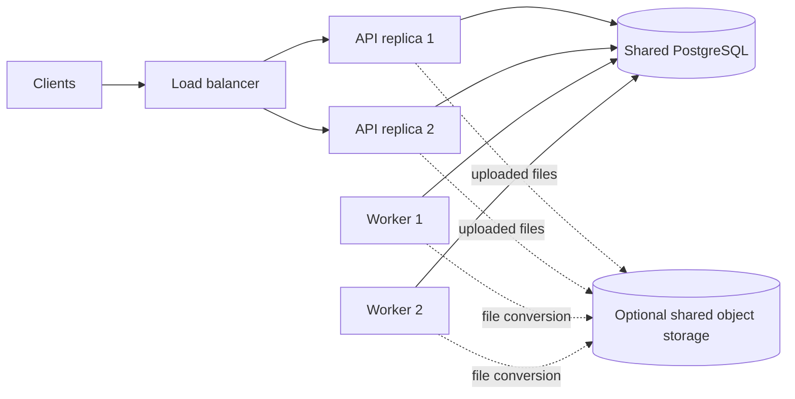

# Hindsight Multi-Node Deployment and Storage

> **TL;DR:** Hindsight supports multi-node application deployment by connecting stateless API replicas and database-backed workers to one shared external PostgreSQL database. PostgreSQL is the default and generally recommended backend; `pg0` is embedded PostgreSQL for development, while Oracle Database 23ai is an optional enterprise alternative. Core memory state lives in the database, but uploaded file bytes can use shared object storage in production.

Scope: `dev@d9efb3662`, built-in Hindsight API and worker services. This is a source-backed architecture summary, not evidence from a live multi-node or failover test.

## Terminology

- **API replica**: One stateless Hindsight API process serving retain, recall, and reflect requests.
- **Worker**: A Hindsight process that claims and executes persisted background operations.
- **Shared database**: The single logical database endpoint used by every API replica and worker in one deployment.
- **`pg0`**: An embedded PostgreSQL distribution intended for local development and small standalone use.
- **pgvector**: The default PostgreSQL extension used to store and search embeddings.
- **Object storage**: S3-compatible, Google Cloud Storage, or Azure Blob Storage used for uploaded file bytes.
- **Application-tier scaling**: Adding Hindsight API or worker processes.
- **Database-tier scaling**: Replicating, partitioning, or sharding the database itself.

## 1. Multi-Node Support Boundary

Hindsight is naturally multi-node at the application tier: API replicas can sit behind a load balancer, and worker replicas can scale independently. It does not implement its own distributed database, so database availability, replication, and sharding remain the responsibility of PostgreSQL, Oracle, or the managed database platform.

The shared database provides the coordination plane:

1. API replicas persist background operations in the database instead of an in-process or Redis-only queue.
2. Workers claim pending operations with transactional row locking and `SKIP LOCKED`, allowing workers to claim different tasks without waiting on or duplicating each other.
3. PostgreSQL schema migrations use a database advisory lock so simultaneous replica startup does not run the same migration concurrently.
4. The Helm deployment separates API Deployments from worker StatefulSets, allowing independent replica counts while giving each worker a stable identity.

This design does not make several independent `pg0` instances into one cluster. A production multi-node deployment must point every application node at the same external database and, when configured, the same object-storage namespace.

## 2. Database Persistence Model

The database is Hindsight's system of record for memory and operational state. Vector search, keyword search, graph relationships, relational metadata, and the background-task broker are colocated rather than delegated to separate required databases.

| Data | Main representation | Default persistence |
|---|---|---|
| Banks and behavior | Bank identity, disposition, background, and configuration | Database tables and JSON columns |
| Source content | Documents, converted text, chunks, hashes, timestamps, and provenance | Database text and relational columns |
| Memories | Extracted facts, fact types, dates, metadata, and embeddings | `memory_units`; vectors use pgvector on PostgreSQL |
| Memory graph | Canonical entities, fact-to-entity membership, co-occurrence caches, and typed memory links | Relational tables |
| Derived knowledge | Observations, mental models, directives, and knowledge pages | Database tables |
| Work coordination | Pending, processing, completed, failed, and retryable operations | Database-backed operation rows |
| Operations and integration state | Webhooks, delivery state, audit data, and selected tracing data | Database tables |
| Uploaded file bytes | Temporary or retained raw binary files | PostgreSQL `BYTEA` by default, or shared object storage |

Consequently, the default PostgreSQL architecture does not require a separate vector database such as Milvus or Qdrant, a graph database such as Neo4j, a search service such as Elasticsearch, or Redis as the task broker. PostgreSQL supplies vector indexes, full-text indexes, transactions, graph joins, and worker coordination in one system.

## 3. Uploaded Files Are the Main Storage Exception

Core memory records remain in the database, but raw uploaded file bytes have a separate lifecycle and a configurable backend. Production deployments should treat the database and object storage as two backup domains whenever raw files are retained outside PostgreSQL.

The file-retain flow is:

1. Hindsight writes the uploaded bytes to the configured file-storage backend.
2. A worker retrieves the bytes and converts the file to Markdown.
3. The converted text is submitted to the normal retain pipeline and persisted as document, chunk, memory, and graph data.
4. Raw file bytes are deleted after conversion by default because `HINDSIGHT_API_FILE_DELETE_AFTER_RETAIN=true`.

The default file backend is `native`, which stores bytes as `BYTEA` in PostgreSQL. This is convenient for development and small deployments. For production or large-file workloads, Hindsight recommends S3, GCS, or Azure Blob Storage to avoid database bloat and reduce binary-storage cost.

Not every runtime artifact belongs in the database. Deployment environment variables, credentials, model weights, local model caches, logs, and external monitoring history require their own configuration or backup strategy.

## 4. Recommended Database Choices

PostgreSQL is the default and the general recommendation; Oracle Database 23ai is a compatibility option for organizations already committed to Oracle. `pg0` should not be used as the shared production database for a multi-node deployment.

| Environment or requirement | Recommended choice | Reason |
|---|---|---|
| Local development | `pg0` | Zero-configuration embedded PostgreSQL with pgvector |
| Ordinary production | External PostgreSQL 15+ with pgvector | Default path, simplest operations, widest Hindsight tooling coverage |
| Multi-node production | Managed or self-hosted HA PostgreSQL 15+ with pgvector | Shared durable state for all API and worker replicas |
| Large or retained uploads | PostgreSQL plus S3, GCS, or Azure Blob Storage | Keeps large binary files out of the primary database |
| Existing Oracle enterprise estate | Oracle Database 23ai | Core retain, recall, and reflect support within an established Oracle footprint |
| Database-level horizontal sharding with true BM25 | Citus-compatible PostgreSQL with `pg_search` | `pg_search` is the documented true-BM25 option compatible with Citus |

The current documentation contains a PostgreSQL version inconsistency: the installation page says PostgreSQL 14+, while the storage page says PostgreSQL 15+. Choosing PostgreSQL 15+ is the conservative production baseline that satisfies both.

Oracle support should not be interpreted as identical operational tooling. Core memory operations are supported, but PostgreSQL retains broader support for administrative data commands, export/import workflows, operation-history maintenance, and some reconciliation behavior. Oracle is therefore appropriate when organizational database standardization outweighs those differences, not as the default greenfield choice.

Application-tier scaling alone does not require Citus or `pg_search`. Multiple Hindsight API and worker replicas can share an ordinary HA PostgreSQL service; database sharding is a separate decision for workloads that have outgrown a single PostgreSQL primary.

## 5. Production Multi-Node Requirements

A multi-node deployment is safe only when shared-state and configuration closure are deliberate. Adding replicas without aligning database, worker, model, and file-storage settings creates independent or incompatible nodes rather than one coherent Hindsight service.

1. Point every API and worker replica at the same logical write database.
2. Do not use one local `pg0` store per replica.
3. Use the same embedding provider, model, output dimension, vector extension, and text-search configuration on every node.
4. Give every worker a stable and unique ID; decommission or recover its claimed tasks before permanently removing it.
5. Disable API-internal workers when dedicated worker replicas own background processing, unless the additional internal workers are intentional.
6. If the application database URL passes through a transaction-mode pooler, provide a direct migration URL so PostgreSQL advisory-lock coordination remains valid.
7. Use shared object storage for retained uploads; never use pod-local files as cross-node durable storage.
8. Size database connection limits for the combined API and worker replica count.
9. Back up the database, retained object-storage data, deployment configuration, and secrets as separate required assets.

## 6. Source Map

The following repository files define the current architecture and are the starting points for future verification. Runtime behavior is checkout-sensitive, so re-read them before changing deployment or storage contracts.

- Service roles and stateless API scaling: [`hindsight-docs/docs/developer/services.md`](../../hindsight-docs/docs/developer/services.md)
- Production, Helm, and distributed workers: [`hindsight-docs/docs/developer/installation.md`](../../hindsight-docs/docs/developer/installation.md)
- PostgreSQL and Oracle positioning: [`hindsight-docs/docs/developer/storage.md`](../../hindsight-docs/docs/developer/storage.md)
- Oracle operational differences: [`hindsight-docs/docs/developer/oracle.md`](../../hindsight-docs/docs/developer/oracle.md)
- File-storage configuration and recommendations: [`hindsight-docs/docs/developer/configuration.md`](../../hindsight-docs/docs/developer/configuration.md)
- Core relational and vector schema: [`hindsight-api-slim/hindsight_api/models.py`](../../hindsight-api-slim/hindsight_api/models.py)
- Distributed task claiming: [`hindsight-api-slim/hindsight_api/worker/poller.py`](../../hindsight-api-slim/hindsight_api/worker/poller.py)
- PostgreSQL task-claim SQL: [`hindsight-api-slim/hindsight_api/engine/db/ops_postgresql.py`](../../hindsight-api-slim/hindsight_api/engine/db/ops_postgresql.py)
- Distributed migration coordination: [`hindsight-api-slim/hindsight_api/migrations.py`](../../hindsight-api-slim/hindsight_api/migrations.py)
- File-storage implementations: [`hindsight-api-slim/hindsight_api/engine/storage/`](../../hindsight-api-slim/hindsight_api/engine/storage/)
- Helm API and worker workloads: [`helm/hindsight/`](../../helm/hindsight/)

## Verification Boundary

This document was checked against source and deployment documentation at `dev@d9efb3662`. It does not claim that live horizontal scaling, node loss, database failover, task recovery, or backup restoration has been exercised in this documentation-only change.
