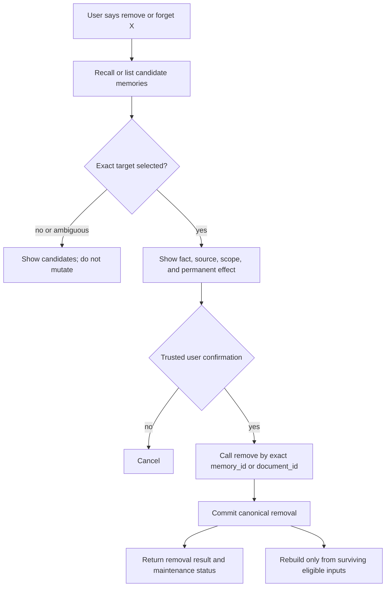

# New Memory Remove and Forget Design

## Overview

1. The new public lifecycle has one operation, **remove**. A user may say “forget this,” but the system resolves that request to removal of an exact `memory_id` or `document_id`; there is no separate invalidated state, archive, restore flow, or `unforget` API.
2. A memory unit is one independently meaningful fact written as one concise sentence and identified by an opaque, globally unique `memory_id`. It represents one source occurrence, not a semantic topic: equivalent facts from independent sources keep independent IDs.
3. Agent activities and documents are explicit source kinds. Every source fact has exactly one owning source. Removing one memory unit preserves its source and unrelated facts; removing a document removes the document, all of its revisions and representations, every memory unit owned by it, and every derived output that can no longer be trusted.
4. Removal becomes authoritative in one scoped database transaction. Search indexes, graph links, entity postings, derived insights, profile fields, caches, and concurrent publishers must follow that canonical result. Cleanup may continue after commit, but removed content must not remain eligible while cleanup is pending.
5. Ordinary retry reuses the existing operation result and cannot recreate a removed ID. Intentional future reprocessing or independent evidence may create a new ID with equivalent text; this design does not add a semantic paraphrase ban, exact-lineage suppression registry, or generalized recovery ledger.

## 1. Decision and scope

The recommended design is a single irreversible remove contract with two exact targets: a memory unit and a document. It keeps the smallest user-visible model while retaining Hindsight's strongest deletion behavior: exact identity, source-owned facts, dependent-output cleanup, and safe recomputation from surviving evidence.

### 1.1 Public decisions

- `remove_memory(memory_id)` permanently removes one memory unit and its dependent representations. It does not remove the original chat activity or document.
- `remove_document(document_id)` permanently removes the document and every memory unit owned by every stored revision of that document.
- “Forget” is user language for `remove`; it is not another database state or API.
- There is no restore operation. A new upload or intentional reprocessing is a new ingestion event and may produce new memory IDs.
- Mutation accepts exact identifiers only. Semantic recall may discover candidates, but it never chooses and deletes a target by itself.
- Scope, tenant, actor, and authorization come from trusted server context, never from model-controlled tool arguments.

### 1.2 Included

- Memory identity and source ownership.
- Candidate discovery, explicit confirmation, mutation, cleanup, and rebuild flow.
- Agent-activity and document sources.
- Single-memory and whole-document removal algorithms.
- Derived memories, profiles, graph/index cleanup, retries, concurrency, and failure semantics.
- Minimal HTTP, SDK, and agent-tool contracts.
- Compatibility notes for implementing the design on Hindsight or learning from MemOS.

### 1.3 Excluded

- Reversible invalidation, archive browsing, restore, and unforget.
- Direct editing or removal of generated profile prose; users remove its supporting memory or source instead.
- Broad deletion by arbitrary metadata filter, natural-language topic, similarity match, or bank-wide clear.
- A permanent ban on all future facts with equivalent meaning.
- Immediate erasure from expired backups or already delivered client responses.
- A new audit, policy-epoch, cross-generation mapping, or recovery framework when the existing operation and job mechanisms are sufficient.

## 2. Terms and invariants

The design separates source ownership, semantic dependency, and retrieval links because they have different deletion behavior.

- **Memory unit:** one source-backed, independently meaningful fact expressed as one concise sentence and identified by `memory_id`.
- **Source occurrence:** the exact agent-activity batch or document revision from which a memory unit was extracted.
- **Agent activity:** eligible chat, tool, or agent execution content retained as source evidence.
- **Document:** a user-managed source with a stable `document_id`; if revisions exist, removal targets the stable document and all of its revisions.
- **Derived output:** an observation, insight, summary, or profile field computed from one or more memory units.
- **Support dependency:** an explicit record that a derived output was influenced by a memory unit or lower derived output.
- **Retrieval link:** a semantic, temporal, causal, or entity edge used for recall. A retrieval link is not proof that one text was derived from another.
- **Canonical removal:** the committed database change after which the target is no longer eligible for reads or publication.
- **Maintenance:** post-removal rebuilding, orphan pruning, external-blob deletion, or index compaction that does not control whether the removed content is visible.

The following invariants are mandatory:

1. `memory_id` is an opaque server-generated UUID and never a content hash, sentence hash, vector ID, list position, or model-generated identifier.
2. A memory unit contains exactly one concise sentence. “Concise” must not remove its subject, negation, material time, uncertainty, or necessary context; punctuation counting and blind character truncation are not valid enforcement.
3. A raw memory unit has exactly one owner source. The same proposition from two independent sources produces two memory units, so removing one source cannot erase independent evidence.
4. Every derived output has explicit supports. Similarity edges, shared entities, or matching text do not count as support.
5. A removed input cannot remain hidden only in citations while its influenced generated text stays visible. The affected derived output is removed or withheld until rebuilt from eligible supports.
6. A failed rebuild never restores the removed data. It leaves the affected derived output unavailable or pending.
7. Indexes and caches are projections of canonical state, never authorities that can keep a removed memory alive.

## 3. Evidence and lessons from Hindsight, MemOS, and OAM

The new design deliberately combines Hindsight's lifecycle correctness with MemOS's simpler public deletion shape, while rejecting mechanisms that do not serve the requested remove-only contract.

| System | Evidence worth keeping | Behavior not copied |
| --- | --- | --- |
| Hindsight | UUID memory units owned by documents; document cascade; incident-link and entity cleanup; dependent observation deletion; reconsolidation from surviving facts; source-row locking before derived publication | Separate invalidation archive and restore lifecycle; the reviewed current HTTP/MCP entrypoints expose PATCH curation rather than destructive single-fact deletion; implicit treatment of chats as documents |
| MemOS | Direct memory-ID deletion; file-ID selection; graph node and incident-edge deletion; the reviewed main self-hosted endpoint uses delete rather than a separate Forget operation | Broad initial filter deletion; separate internal soft-delete/recover variants; deletion wrappers that swallow backend errors; file-based node deletion without proven original-document and vector cleanup |
| Current OAM design | Exact record identity; immediate exclusion; later cleanup; ordinary retry distinct from intentional reprocessing; no exact-lineage suppression registry | The current dual Invalidate/Restore/Delete fact controls and the current rule that Evidence Resources do not automatically produce Memory |

This proposal intentionally changes two current OAM assumptions. First, documents are allowed to produce source-owned memory units because that is an explicit requirement here. Second, the public fact lifecycle is remove-only rather than Invalidate/Restore plus Delete. Those are proposal decisions, not claims about the current OAM implementation.

Hindsight's default concise extractor currently permits one or two sentences, so the exactly-one-sentence invariant is a tighter new contract. MemOS guarantees UUID-shaped textual-memory IDs but accepts arbitrary memory strings, so its schema alone does not establish atomic facts.

## 4. Data model

The minimum model uses one source table, one source-fact table, explicit derived supports, and ordinary retrieval projections. It does not need an archive table for removed fact content.

### 4.1 Canonical records

```text
memory_sources
  scope_id
  source_id                 UUID
  source_kind               activity | document
  external_reference        trusted caller reference
  current_revision          nullable for non-versioned activities
  created_at
  PRIMARY KEY (scope_id, source_id)

documents
  scope_id
  document_id               same stable identity as source_id
  current_revision
  metadata
  created_at
  PRIMARY KEY (scope_id, document_id)
  FOREIGN KEY (scope_id, document_id) -> memory_sources ON DELETE CASCADE

document_revisions           optional when document versioning exists
  scope_id
  document_id
  revision_id
  original_content
  parsed_content
  created_at
  PRIMARY KEY (scope_id, document_id, revision_id)
  FOREIGN KEY (scope_id, document_id) -> documents ON DELETE CASCADE

agent_activities
  scope_id
  activity_id               same stable identity as source_id
  session_id
  immutable source locator
  created_at
  PRIMARY KEY (scope_id, activity_id)
  FOREIGN KEY (scope_id, activity_id) -> memory_sources ON DELETE CASCADE

memory_units
  scope_id
  memory_id                 UUID
  owner_source_id           UUID
  owner_source_revision     nullable for non-versioned activities
  text                      exactly one concise fact sentence
  fact_kind
  temporal fields
  metadata
  created_at
  PRIMARY KEY (scope_id, memory_id)
  FOREIGN KEY (scope_id, owner_source_id) -> memory_sources ON DELETE CASCADE

derived_outputs
  scope_id
  derived_id
  derived_kind              observation | insight | profile_field | summary
  content
  created_at
  PRIMARY KEY (scope_id, derived_id)

derived_supports
  scope_id
  derived_id
  support_memory_id         nullable when the support is another derived output
  support_derived_id        nullable when the support is a raw memory unit
  CHECK exactly one support column is non-null
  FOREIGN KEY derived_id -> derived_outputs ON DELETE CASCADE
  FOREIGN KEY support_memory_id -> memory_units ON DELETE RESTRICT
  FOREIGN KEY support_derived_id -> derived_outputs ON DELETE RESTRICT
```

`memory_links`, entity postings, vector data, and full-text data reference `memory_id`. When they live in PostgreSQL, foreign keys use `ON DELETE CASCADE`. Shared entities are deleted only when they have no surviving postings.

Support sets are immutable after a derived output is published. Every derived output must resolve transitively to at least one raw memory unit; a derived output cannot become its own evidence or form a support cycle. Deletion removes descendants before their direct supports so the restricting support foreign keys cannot be bypassed.

### 4.2 Source ownership rule

A source fact is an occurrence, not a global truth record. Do not merge equivalent facts from different documents or activities into one row. Cross-source consolidation belongs in `derived_outputs`, whose support rows preserve all contributing identities.

This rule makes document removal deterministic: select facts by `(scope_id, owner_source_id)` and never by text, embedding similarity, entity match, or an LLM judgment.

### 4.3 Retry identity without a removal archive

The system reuses the existing ingestion operation result for an ordinary retry. A completed ingestion retry reuses its persisted output IDs instead of extracting and inserting new facts. A remove request reserves the scoped idempotency key in the existing operation mechanism, binds it to the target kind and ID, and commits the immutable removal result in the same transaction as canonical deletion and maintenance enqueue. A crash therefore cannot commit removal without the receipt needed to answer a lost response.

No removed fact text is retained as a restorable memory. If the operation system needs a receipt, it stores only the existing minimum mutation metadata: scope, request key, target kind, target ID, outcome, counts, and timestamps. It is not a second memory state or a semantic suppression registry.

When maintenance is asynchronous, the immutable remove receipt contains `operation_id` and the maintenance state at acknowledgment. Callers read the changing maintenance state through the existing `GET /operations/{operation_id}` or equivalent SDK status method; replaying the same idempotency key returns the original mutation receipt rather than rewriting history.

## 5. Public flow

The user flow separates discovery from destruction so natural language can help locate a fact without authorizing semantic deletion.



1. Discovery returns candidate `memory_id`, text, source kind, source locator, and source date. Recall is not the mutation target resolver of record.
2. The user or trusted host selects one exact memory or document and receives a destructive confirmation showing the target and cascade scope.
3. Confirmation is held by trusted application state. A model cannot manufacture confirmation by passing `confirmed=true` in tool arguments.
4. The mutation endpoint receives only the exact target ID; trusted middleware supplies scope and actor.
5. The trusted host marks the complete removal interaction as ineligible for memory extraction: candidate recall text, confirmation text, the remove command, and the tool result. Unrelated conversation content in the same turn may still be retained after those marked spans are excluded. Otherwise the discovery or confirmation exchange can immediately recreate the fact.

There is no dedicated natural-language forget classifier. An agent may discover and invoke the ordinary removal capability through its normal reasoning loop, but the trusted confirmation gate still controls the destructive call.

## 6. Shared dependency-removal algorithm

Both public operations use one set-based helper so document removal cannot drift from single-memory cleanup.

```text
plan_and_remove(scope_id, seed_memory_ids):
  1. Lock seed memory rows in stable memory_id order.
  2. After those locks block new descendant publication, traverse derived_supports from the seed set to every transitively influenced derived output.
  3. Lock affected derived rows in stable derived_id order; recompute the closure once under those locks and include any newly visible committed descendants.
  4. Record surviving eligible supports that may need recomputation.
  5. Delete affected derived outputs in descendant-first topological order; never preserve their text by merely dropping a support reference.
  6. Delete seed memory rows; relational cascades remove their vectors, full-text rows, graph links, and entity postings.
  7. Return exact counts plus the minimum rebuild/prune plan to the caller's enclosing transaction.
```

The traversal is conservative. If a derived sentence was influenced by A and B, removing A removes that derived sentence even if B survives. A later rebuild may create new content from B, but it may not reuse the old A-influenced text.

If derived outputs can support higher-level derived outputs, dependency traversal continues until no new affected IDs appear. Retrieval links are not traversed as support unless an explicit `derived_supports` record says the output depended on that input.

## 7. Remove one memory unit

Single-memory removal deletes one exact fact occurrence while preserving its source and independent facts.

### 7.1 Algorithm

1. Authenticate the actor and resolve the trusted `scope_id`.
2. Validate `memory_id` syntax, then read the scoped row. A cross-scope ID is indistinguishable from not found.
3. Begin a transaction, reserve or load the scoped idempotency key, and verify that an existing reservation is bound to the same target and operation.
4. If a committed receipt exists, return its original result before target lookup. Otherwise lock the memory row `FOR UPDATE` and re-read it after acquiring the lock.
5. If the row is absent, atomically commit `status=not_found` for this request key with no mutation.
6. Call `plan_and_remove(scope_id, [memory_id])`.
7. Delete now-unreferenced entity records and enqueue graph-neighbor repair only for affected surviving neighbors.
8. Invalidate bank/scope statistics and response caches through the existing cache mechanism.
9. Persist required rebuild work and the immutable `status=removed` receipt in the transaction. Do not call an LLM, embedding provider, or remote object store while holding database locks.
10. Commit. Only after commit return `status=removed`.
11. Run rebuild and compaction work from surviving canonical facts. Failure leaves the removed fact absent and is reported by operation status.

### 7.2 Observable result

Removing a fact immediately excludes it from direct GET/list, semantic and lexical recall, temporal and graph expansion, observations, insights, profiles, snippets, traces or exports served from current state, and new worker publication.

The original source remains. An authorized source viewer can still show the original chat or document statement. Intentional later reprocessing may produce a new memory unit with a new ID; this operation is exact record removal, not a permanent topic ban.

## 8. Remove a document

Document removal deletes the stable document identity, all revisions and representations, all directly owned memory units, and every dependent output that cannot remain trustworthy.

### 8.1 Algorithm

1. Authenticate the actor and resolve the trusted `scope_id`.
2. Begin a transaction, reserve or load the scoped idempotency key, and verify that an existing reservation is bound to this document-removal target. Return a committed prior receipt before target lookup.
3. Lock the scoped `memory_sources` and `documents` rows for `document_id` `FOR UPDATE`.
4. Require both a matching scoped document row and `source_kind=document`. If either is absent, atomically commit `status=not_found` for this request key and stop before selecting or deleting any source facts.
5. Select and lock every `memory_unit` whose `owner_source_id=document_id`, ordered by `memory_id`. This exact ownership query is the only fact-selection rule.
6. Call `plan_and_remove(scope_id, owned_memory_ids)` once for the whole set.
7. Delete the document source row. Foreign-key cascades remove every document revision, original/parsed passage row, chunk, attachment reference, and any zero-fact document record.
8. Enqueue external-blob candidates through the configured reference-safe garbage collector; do not perform remote deletion while holding the document transaction.
9. Invalidate caches and persist required graph, entity, profile, and derived-output rebuild work plus the immutable removal receipt in the same transaction.
10. Commit. From this point, no newly admitted read or publisher may use the document or its derivatives.
11. Return logical removal counts and maintenance status. External blob deletion, compaction, and backup expiry are reported separately and never weaken immediate exclusion.

### 8.2 Required boundaries

- A document with zero extracted memory units is still removed successfully.
- Removal covers all stored revisions under the stable `document_id`, not only the current vector entries.
- Equivalent facts owned by an agent activity or another document survive.
- Removing one memory unit extracted from a document does not remove the document or its sibling facts.
- A later upload is a new explicit source admission. It must not silently reuse the removed document identity unless the product intentionally defines that as a new revision and obtains user authority.

External blob garbage collection and attachment admission must share the blob catalog's per-object synchronization. The cleanup worker locks or claims the blob record, rechecks that no references survive, marks it `deleting`, and only then deletes the object; an attachment writer cannot add a reference to a `deleting` blob and must wait or create a new stored generation. If the configured store has no reference-safe garbage collector, keep the unreferenced physical blob and report cleanup failure rather than risking deletion of a live shared object.

## 9. Concurrency and publication

The critical race is a worker publishing derived text after one of its inputs has been removed. A delete-side sweep alone cannot close that race, so publishers and removers share a row-lock contract. Removal transactions use PostgreSQL `READ COMMITTED` semantics so the dependency query after a waited row lock sees every publisher that committed before the lock was acquired.

### 9.1 Lock contract

1. LLM and embedding computation occurs outside database transactions.
2. Source-fact publication locks its owning source row `FOR SHARE`, rechecks the exact source revision, then inserts the fact and source ownership in one transaction. Document removal takes the conflicting source `FOR UPDATE` lock.
3. Derived-output publication resolves every transitive raw ancestor of its direct supports, locks those raw memory rows `FOR SHARE` in sorted ID order, verifies they remain in the same scope, then locks and verifies its direct derived inputs `FOR SHARE` in sorted ID order.
4. The publisher inserts the derived row and its immutable support set in one transaction. A derived output with no live raw ancestor or with a missing direct derived input cannot publish.
5. A memory removal locks its target fact `FOR UPDATE`; a document removal first locks the source row `FOR UPDATE`, then its fact rows in sorted order. These locks freeze new descendant publication before removal computes the dependency closure.
6. Publisher and remover use the same source-to-fact-to-derived lock order. If publication wins, removal waits, sees the committed descendant, and removes it. If removal wins, publication waits and fails its support recheck.
7. Removal locks affected derived rows after the raw facts, in stable ID order, and deletes descendants before their supports to satisfy the restricting support foreign keys.
8. No lock spans model calls, remote cleanup, or response transmission.

### 9.2 Read boundary

Reads admitted after removal commits cannot include the target or an ineligible dependent output. A response fully assembled under an earlier valid snapshot may finish transmission after commit; already delivered bytes cannot be recalled. New cached responses must recheck canonical eligibility rather than trusting cache age.

### 9.3 Rebuild boundary

Index rebuilds consume existing canonical memory units and cannot re-extract deleted facts from source text. Re-extraction is a separate intentional source operation. Ordinary retry resumes or reuses its persisted operation output and cannot mint replacement IDs for work that already completed.

## 10. API and tool contract

The public contract exposes exact destructive operations and returns the difference between canonical removal and later maintenance.

### 10.1 HTTP

```http
DELETE /v1/scopes/{scope_id}/memories/{memory_id}
Idempotency-Key: <caller-generated-key>

DELETE /v1/scopes/{scope_id}/documents/{document_id}
Idempotency-Key: <caller-generated-key>
```

```json
{
  "target_type": "memory",
  "target_id": "<memory_id>",
  "status": "removed",
  "removed_memory_count": 1,
  "removed_derived_count": 2,
  "canonical_cleanup": "complete",
  "maintenance_status": "pending",
  "operation_id": "<existing-operation-id>"
}
```

Allowed `status` values are `removed` and `not_found`. A repeated request with the same idempotency key returns the original response. A fresh request for an absent target returns `not_found`; the service does not retain deleted fact content merely to distinguish “never existed” from “already removed.”

`canonical_cleanup=complete` means the target and currently served dependent content are no longer eligible. `maintenance_status` in the immutable receipt records the state at acknowledgment: `not_required` or `pending`. When it is pending, `GET /operations/{operation_id}` reports the current `pending`, `complete`, or `failed` maintenance outcome for rebuild, compaction, orphan pruning, and external-object cleanup.

### 10.2 SDK and agent tools

```text
remove_memory(memory_id) -> RemoveResult
remove_document(document_id) -> RemoveResult
```

The trusted host supplies scope, actor, grants, idempotency, and confirmation state. The tool schema does not accept tenant, scope, user, or `confirmed` fields from the model. The agent can use ordinary recall/list tools to discover candidates, but ambiguity returns candidates and performs no write.

Document removal should normally remain a UI/operator action because its cascade is broad. If an agent tool exposes it, it uses the same explicit trusted confirmation gate and displays the number and source scope of affected memory units before execution.

## 11. Failure and retry semantics

Removal failure must be visible and must never be converted into success by a wrapper that swallowed a backend exception.

| Condition | Result | State |
| --- | --- | --- |
| Invalid ID syntax | `invalid_argument` | No write |
| Idempotency key already bound to another target or operation | `idempotency_conflict` | No write |
| Unauthorized or cross-scope target | `not_found` or policy-approved authorization error | No write and no existence leak |
| Ambiguous natural-language discovery | Candidate list | No write |
| Database error before commit | Operation failure | Transaction rolls back |
| Lost response after commit | Retry with same idempotency key returns the receipt committed atomically with removal | Target remains removed |
| Rebuild or model failure after commit | `maintenance_status=failed` | Target remains removed; affected derived output stays unavailable |
| External blob cleanup failure | `maintenance_status=failed` | Canonical reads stay excluded; retry cleanup only |
| Process restart | Read operation receipt and canonical state | Never repeat semantic target selection |

The service must not claim physical cleanup merely because a delete call returned. It verifies row/vector/blob counts appropriate to the configured storage backend. Active-store removal does not claim erasure from backup media before the configured backup-retention boundary.

## 12. Alternatives considered

The chosen design is the smallest approach that satisfies exact fact removal and document cascade without leaving stale derived content.

### 12.1 Hindsight-style invalidate plus remove

This approach preserves facts in an archive, supports restore, and separately offers permanent deletion. It is useful when users need reversible curation and audit access, but it introduces two meanings, two storage states, restore-time re-embedding, archived link/entity snapshots, and more concurrency paths. It is rejected because the stated product need is removal, not reversible invalidation.

### 12.2 Unified permanent remove

This is the selected approach. It exposes one lifecycle, uses exact IDs, permanently removes the selected canonical fact or document, deletes influenced derived output, and rebuilds only from surviving evidence. It preserves operation receipts but not deleted fact content.

### 12.3 Soft-delete first, background purge later

This approach immediately marks rows deleted and later physically purges them. It can simplify multi-store cleanup and restore, but it reintroduces a hidden lifecycle state and makes every reader responsible for a deletion predicate. It is deferred unless a concrete storage backend cannot provide immediate canonical deletion; even then, soft state is an internal cleanup mechanism, not a second user-visible “forget” operation.

## 13. Implementation mapping

The design can reuse current Hindsight mechanics selectively but is not a claim that current Hindsight already implements this public contract.

### 13.1 Hindsight mapping

1. Add explicit `source_kind=activity|document`; current Hindsight represents both through documents and cannot reliably infer the distinction.
2. Tighten the extraction contract from one or two sentences to one concise sentence and validate it semantically in extraction acceptance tests.
3. Expose a scoped public `DELETE /memories/{memory_id}` backed by the existing internal single-unit deletion lifecycle.
4. During transition, remove a target from both `memory_units` and `invalidated_memory_units`; the current internal hard-delete helper only addresses live rows.
5. Reuse document-owned ID selection, dependent observation deletion, co-source reconsolidation, graph/entity queues, cache invalidation, and mental-model refresh.
6. Serialize document delete with concurrent retain/reprocess through the same document-scoped row lock or compare-and-swap boundary.
7. Make HTTP, MCP, CLI, and SDK results agree on not-found, backend failure, counts, and maintenance state.
8. Count live and formerly archived facts in document removal results until the archive is removed; current Hindsight's document response counts live rows only.

### 13.2 MemOS lessons

1. Keep exact `memory_ids` and file/document identity selection, but expose separate exact routes instead of one broad request with arbitrary filters.
2. Delete graph nodes and incident edges, then verify the configured vector store was also cleaned. A graph-only `DETACH DELETE` is not complete when vectors live elsewhere.
3. Propagate backend errors. Do not catch an exception inside `delete_by_memory_ids` and then return a successful handler response.
4. Do not use regex-parsed metadata bindings as the authority for derived dependencies; use typed support rows.
5. Do not treat internal whole-cube soft-delete/recover endpoints as the public fact-removal model.

## 14. Acceptance criteria

The feature is complete only when current end-to-end tests can fail on stale visibility, wrong cascade scope, retry resurrection, and publication races.

### 14.1 Memory-unit contract

- Extraction produces one independently meaningful sentence with one unique UUID; subject, negation, time, and uncertainty survive.
- Two equivalent facts from independent sources have different IDs.
- Removing fact A from one activity leaves fact B and the raw activity unchanged.
- Removing one document-owned fact leaves the document and its sibling facts unchanged.
- Direct GET/list and every recall arm return no removed ID.

### 14.2 Derived output and graph cleanup

- Removing A from an A+B-derived observation immediately removes that observation; rebuilding from B cannot retain A-influenced wording.
- Dependent insight and profile content is withheld until rebuilt.
- Incident semantic, temporal, causal, and entity-posting rows disappear; independent neighbor facts and shared entities survive.
- Vector, lexical, graph, cache, trace, snippet, and current export surfaces all agree that the memory is absent.
- A maintenance failure leaves the removed content absent and exposes failed maintenance status.

### 14.3 Document cascade

- Removing a document deletes all revisions, originals, parsed passages, chunks, attachment references, owned memory units, and influenced derived output.
- A document that produced zero facts is still removed.
- Equivalent memories owned by a chat activity or another document survive.
- Shared blobs are retained while referenced and removed after the last reference.
- Removal counts include every direct memory state supported during migration.

### 14.4 Idempotency and concurrency

- Same idempotency key returns the same result after timeout, process restart, or response loss.
- A fresh removal of an absent ID performs no broader search or deletion.
- Removal racing extraction, embedding, observation synthesis, profile generation, or index publication never permits a candidate based on the removed input to publish afterward.
- Removal racing a document retain/reprocess has one deterministic winner under the source-row lock; a late worker cannot recreate the removed source.
- Ordinary ingestion retry does not recreate removed IDs; explicit intentional reprocessing may create new IDs.
- Lock-order tests prove source, fact, and derived-row acquisition does not deadlock under concurrent memory and document removals.

### 14.5 Authorization and agent behavior

- Cross-scope IDs do not reveal existence and change no data.
- The model cannot choose tenant/scope or forge confirmation.
- An ambiguous “forget X” request performs no mutation.
- Candidate discovery, confirmation, the removal command, and the tool result are excluded from capture when they repeat removed content; unrelated turn content remains eligible.
- Document removal displays its cascade before trusted confirmation.

## 15. Delivery sequence

The implementation should prove the smallest real removal path before adding wider mutation features.

1. Add or confirm source kind, exact source ownership, unique memory IDs, derived-support records, and foreign-key cleanup.
2. Implement the shared dependency-removal transaction and single-memory route.
3. Verify direct read, every recall arm, graph/vector cleanup, dependent-output withholding, and same-key retry on one isolated real scope.
4. Implement document removal by exact ownership using the same helper, including a zero-fact document.
5. Add publisher row locks and race tests for extraction and derived publication.
6. Wire SDK/UI/tool surfaces with trusted scope, confirmation, and capture suppression.
7. Add maintenance reporting for only the existing asynchronous jobs and external stores actually configured.
8. Defer restore, semantic bans, bulk filters, generalized purge ledgers, and new recovery machinery until a concrete user need proves removal insufficient.

## 16. Source map and evidence boundary

This design is source-based. No service, database mutation, or runtime deletion was executed while writing it.

- Hindsight revision: `df633a4c464e9d0fef4f8252756bf8cfb37728b2`.
- MemOS revision: `176d4f676a93e0e34ca9fd50091eff5ad3236506`.
- OAM design revision: `33ab1a8f6812a6634c5b7d138ad316a165eed2eb`.
- Existing Hindsight capability summary: `learning/design_points/memory-remove-and-forget.md`.
- Hindsight memory/document schema: `hindsight-api-slim/hindsight_api/models.py:90-180`.
- Hindsight concise extraction contract: `hindsight-api-slim/hindsight_api/engine/retain/fact_extraction.py:255-280` and `:1039-1055`.
- Hindsight document deletion and dependent maintenance: `hindsight-api-slim/hindsight_api/engine/memory_engine.py:9578-9760`.
- Hindsight internal single-memory hard deletion: `hindsight-api-slim/hindsight_api/engine/memory_engine.py:10068-10226`.
- Hindsight reversible archive implementation, which this proposal does not adopt: `hindsight-api-slim/hindsight_api/engine/memories/pg/writes.py:327-510`.
- Hindsight publisher support locking: `hindsight-api-slim/hindsight_api/engine/consolidation/consolidator.py:730-761`.
- Hindsight stale-derived cleanup: `hindsight-api-slim/hindsight_api/engine/retain/fact_storage.py:146-184`.
- MemOS textual memory UUID and content shape: `../MemOS/src/memos/memories/textual/item.py:299-320`.
- MemOS public delete modes and result behavior: `../MemOS/src/memos/api/handlers/memory_handler.py:371-474`.
- MemOS hard/soft tree deletion: `../MemOS/src/memos/memories/textual/tree.py:402-417` and `:621-648`.
- MemOS file-ID graph deletion: `../MemOS/src/memos/graph_dbs/neo4j.py:1896-2019`.
- MemOS internal soft-delete/recover boundary: `../MemOS/src/memos/api/routers/server_router.py:465-500` and `../MemOS/src/memos/graph_dbs/neo4j.py:2127-2185`.
- Current OAM lifecycle contract and proposal divergences: `../agent-memories-p/open_agent_memory_design/design/main.md:15`, `:31-42`, and `../agent-memories-p/open_agent_memory_design/design/data-model.md:149-155`.

The document defines a proposed contract. Implementation availability, runtime correctness, cleanup latency, and backup erasure remain unverified until the acceptance matrix runs against the target product and configured storage backends.
