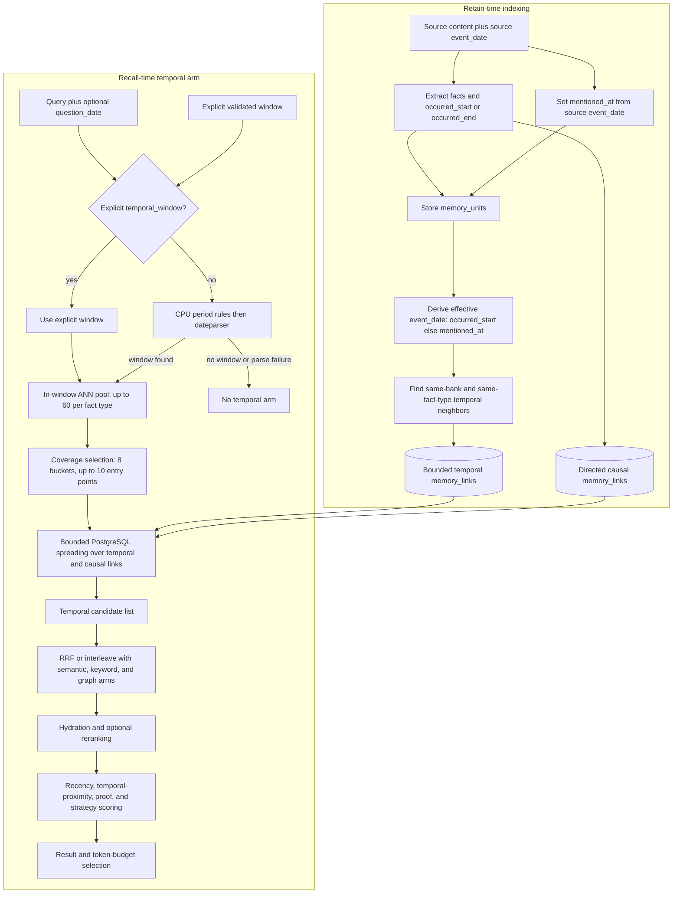

# Hindsight Temporal Retrieval Flow: Time-Windowed Recall with Bounded Graph Spreading

## Overview

1. Hindsight temporal retrieval is an optional fourth recall arm. It activates only when recall has a time window, either supplied explicitly as `temporal_window` or extracted from the query relative to `question_date`; an explicit window wins, and disabling temporal retrieval skips both window extraction and the arm.
2. The temporal arm is not a global date filter. It selects semantically relevant entry points whose event or mention time overlaps the requested window, then PostgreSQL may spread outward over stored temporal and causal links. The semantic, keyword, and graph arms remain free to return memories outside the event-time window.
3. Entry-point selection is bounded and coverage-aware per fact type: fetch up to 60 in-window ANN candidates above the temporal semantic floor, divide the window into 8 buckets, and retain up to 10 entry points by round-robin coverage across populated buckets.
4. PostgreSQL spreading is a bounded multi-hop candidate expansion over outgoing `temporal`, `causes`, `caused_by`, `enables`, and `prevents` rows.
5. Temporal candidates join the same fusion, reranking, scoring, and token-selection path as the other recall arms. A memory returned by several arms gains RRF evidence from each rank, but the current first-arm-wins merge can discard the temporal result object's `temporal_proximity` when the same memory appeared earlier in semantic, keyword, or graph results.
6. The built-in default temporal path is generative-LLM-free: an explicit window is used directly, otherwise CPU period rules and `dateparser` attempt to produce one. Language coverage is uneven, and correct date parsing does not by itself guarantee multilingual semantic relevance because entry-point selection still depends on the configured embedding model.

Scope: static source trace of the built-in PostgreSQL memory store on `dev@93a32072f2`. The examples explain executable behavior; they are not live query-analysis, embedding, database-plan, latency, or answer-quality evidence.

## Terminology

- **Event time**: When the remembered event happened, represented by `occurred_start` and optional `occurred_end`.
- **Mention time**: When the source conversation or document mentioned the fact, represented by `mentioned_at`.
- **Effective link time**: The denormalized `event_date` used to build retain-time temporal links; it is `occurred_start` when present, otherwise `mentioned_at`.
- **Temporal window**: The inclusive event/mention-time range that activates and seeds the temporal recall arm.
- **Query analyzer**: The CPU component that converts a natural-language temporal expression into a structured window. The default is `DateparserQueryAnalyzer`.
- **`dateparser`**: A Python date-parsing library used as the generic multilingual fallback after Hindsight's explicit period rules. It is not an LLM and does not generate an answer.
- **Entry point**: An in-window, similarity-gated memory unit selected as the starting node of the temporal arm.
- **Temporal spreading**: PostgreSQL's bounded outward traversal from entry points over temporal and causal `memory_links` rows.
- **Update-time window**: The separate exclusive `created_after` / `created_before` bounds, which filter `updated_at` even though their public names say “created.”
- **Thinking budget**: The per-fact-type maximum number of temporal candidates, including entry points, that the arm may admit.

## 1. End-to-End Flow

Temporal recall depends on dates and links created during retain, then adds one ranked candidate list to the ordinary recall pipeline.



The time window creates a temporal candidate arm; it does not replace semantic relevance, reranking, or final token selection. No window means the temporal arm is absent rather than an empty always-on search.

## 2. The Four Time Concepts Are Not Interchangeable

The implementation carries four distinct notions of time. Treating them as one “date filter” leads to incorrect API and retrieval expectations.

| Time concept | Source | Consumer | Boundary |
|---|---|---|---|
| `occurred_start` / `occurred_end` | Retain-time fact extraction or imported fact data | Temporal entry overlap, temporal proximity, response metadata | Describes when the event happened. |
| `mentioned_at` | The retained source item's `event_date` | Fallback entry overlap and proximity when event time is absent | Describes when the source mentioned the fact. |
| `question_date` | Recall caller | Relative-date parsing and final recency-scoring anchor | “Last week” is resolved relative to this value; it is not itself a result filter. |
| `created_after` / `created_before` | Recall caller | Every retrieval arm, including temporal entry points and spread targets | Despite the names, these are exclusive bounds on `memory_units.updated_at`, not event time. |

`memory_units.event_date` is a compatibility and indexing field derived at write time as `occurred_start` when available, otherwise `mentioned_at`. Retain-time temporal-link construction reads this effective value. Recall-time entry selection instead uses the richer interval and mention fields directly so a period can overlap a query window even when its start is outside the window.

The practical API distinction is:

```text
temporal_window = "prefer memories associated with this event-time range"
created_after / created_before = "consider only memories updated inside this processing-time range"
question_date = "interpret relative query dates and recency as of this instant"
```

## 3. Retain-Time Temporal Data and Links

Temporal recall starts with fact-level time metadata. Extraction attempts to normalize relative expressions against the source item's date and writes `occurred_start`, `occurred_end`, and `mentioned_at`; if no event date can be derived, a fact may still have only its mention time or no usable time.

After the fact rows are inserted, retain constructs temporal links among units in the same bank and the same fact type. `world`, `experience`, and `observation` form separate temporal neighborhoods; proximity alone does not create a cross-type link.

For a temporal gap `gap_hours`, the stored link weight is:

```text
temporal_link_weight = max(0.3, 1.0 - gap_hours / 24)
```

The current builder has two candidate paths with a subtle difference:

1. **Database-neighbor lookup:** for each newly inserted unit, the database fetches the nearest dated units before and after it, keeps the 20 closest overall, and the writer computes the formula above. The visible rows can include other units from the current batch as well as older stored units. This query has no explicit 24-hour predicate, so a new unit can link to farther historical neighbors; gaps of 16.8 hours or more all receive the `0.3` floor.
2. **Within-batch neighbors:** new units are grouped by fact type and sorted by effective time. This path considers only pairs no more than the default 24 hours apart and emits both directions.

The combined candidate rows are sorted by weight and capped at 20 outgoing temporal links per source unit before insertion. Pairs among units in the current batch receive both directions because every new unit is a source and the explicit within-batch path also emits reverse rows. A link from a newly retained unit to a pre-existing unit is not automatically mirrored by this function, so temporal storage is not universally bidirectional across retain calls. This differs from ordinary `caused_by` for a separate reason: its normal retain direction encodes effect to earlier cause.

Example:

```text
MU_A event_date = 2026-03-10 09:00
MU_B event_date = 2026-03-10 15:00
gap             = 6 hours
weight          = max(0.3, 1 - 6/24) = 0.75

stored rows:
MU_A --temporal, 0.75--> MU_B
MU_B --temporal, 0.75--> MU_A
```

Temporal links encode proximity, not chronology or causality. When both directions exist, they support traversal either way; when only the new-to-existing row exists, PostgreSQL spreading follows that stored direction. Causal meaning remains confined to explicitly stored causal link types.

## 4. How Recall Obtains the Window

The bank's `enable_temporal_retrieval` setting, enabled by default, is the single gate for both date analysis and the temporal arm.

1. If the setting is off, recall does not parse the query for dates and does not pass a window to the memory store, even when the caller supplied `temporal_window`.
2. If the setting is on and the caller supplied `temporal_window`, Pydantic requires `end >= start`, interprets naive bounds as UTC, and passes the inclusive bounds through unchanged. Query-date extraction is skipped.
3. If the setting is on and no explicit window was supplied, recall analyzes the query. `question_date` is the reference instant for expressions such as “yesterday,” “last month,” and multilingual equivalents; without it, the analyzer uses the current time.
4. If analysis finds no supported temporal expression, or parsing raises an exception, recall degrades to no temporal arm. The semantic, keyword, and graph arms still run.

Natural-language extraction performs CPU work outside the async event loop through a single-worker executor. Period rules are tried before generic date parsing; generic parsing chooses the strongest supported match and turns a point date into that day's start-to-end range. An explicit `temporal_window` is therefore the deterministic interface when the caller already knows the intended range.

### 4.1 Default Non-Generative Analysis Path

The default analyzer converts query text into dates without calling a generative LLM.

1. It normalizes the query and tries Hindsight's explicit period rules. Chinese queries are routed through the dedicated `chinese_temporal_periods.py` rule set; common English, Spanish, Italian, French, German, and Russian periods are handled in `temporal_periods.py`.
2. If no period rule matches, a cheap prefilter checks whether generic parsing could produce an accepted match. Queries that cannot pass this check return no window without loading `dateparser`.
3. `dateparser` searches the allowed locales, using `question_date` as the relative base and preferring past interpretations. It returns candidate date spans rather than an answer.
4. Hindsight rejects weak or embedded CJK substring matches, chooses the strongest supported match, and converts a point date into that day's inclusive start and end.
5. Any parser failure degrades to no temporal constraint. Recall continues through the semantic, keyword, and graph arms.

By default, `dateparser` auto-detection considers every locale shipped by the installed library. `HINDSIGHT_API_QUERY_ANALYZER_LANGUAGES` can restrict the fallback to comma-separated codes such as `en,zh,ja`; this setting does not disable Hindsight's earlier explicit period rules. An unknown configured code fails during analyzer loading instead of silently widening detection.

The optional `TransformerQueryAnalyzer` is a different implementation that uses local FLAN-T5 generation for temporal extraction. It is used only when a caller explicitly injects it; it is not the built-in `MemoryEngine` default.

### 4.2 Language Coverage and Limits

Language handling ends once analysis produces a datetime window, but the ability to produce that window is not uniform across languages.

| Language group | Current handling | Important boundary |
|---|---|---|
| English | Explicit rules cover common relative days, weeks, months, years, weekends, and month/year forms; `dateparser` handles additional point dates. | Heuristic parsing can still be ambiguous, so an explicit window remains authoritative. |
| Simplified and Traditional Chinese | A dedicated rule set covers relative days, weekdays, weeks, weekends, months, years, quarters, ranges, rolling windows, fuzzy periods, and numeric CJK dates. | Malformed or impossible offsets deliberately degrade to no temporal arm rather than failing recall. |
| Japanese | A few isolated shared Han-character tokens such as `昨日`, `今日`, `明日`, and `去年`, plus an isolated compatible CJK numeric date such as `2025年3月3日`, match existing Chinese-oriented rules. | There is no dedicated Japanese period rule set. CJK boundary rejection means those same tokens or numeric dates can fail inside an ordinary Japanese sentence; `先週` and `来週` have no explicit rule and pure Japanese text does not pass the ASCII-digit-or-English-word fallback gate unless it contains a numeric form. |
| Spanish, Italian, French, German, and Russian | Common relative periods have explicit fast-path rules; other supported point dates fall through to `dateparser`. | Coverage beyond the explicit rules depends on the installed `dateparser` locale behavior. |
| Other `dateparser` locales | Generic point-date parsing is available when the prefilter admits the query and language detection finds a supported locale. | “Supported by `dateparser`” does not imply complete Hindsight coverage for every relative-period phrase. |

The explicit-window API is the reliable cross-language boundary. A caller that already understands `先週`, an application-specific fiscal period, or another unsupported expression should resolve it once and send `temporal_window` rather than depend on heuristic parsing.

Temporal parsing and semantic relevance are separate. After a window is obtained, entry-point and spread-target selection still require the query embedding to clear the temporal semantic floor. The default local embedding model is the English-oriented `BAAI/bge-small-en-v1.5`; a Chinese or Japanese deployment should select and consistently use an appropriate multilingual embedding model, or a correctly parsed window may still yield weak semantic entry points.

## 5. Entry-Point Selection

The built-in SQL store selects entry points independently for every requested fact type. A row is eligible only when all of the following hold:

1. It belongs to the requested bank and fact type and has an embedding.
2. Its event interval overlaps the inclusive window, or one of `mentioned_at`, `occurred_start`, or `occurred_end` falls inside the window.
3. Its query cosine similarity is at least `HINDSIGHT_API_TEMPORAL_SEMANTIC_MIN_SIMILARITY`, default `0.1`.
4. It passes tag, tag-group, and optional update-time filters.

The request-level `min_scores.semantic` setting applies to the ordinary semantic arm and does not tighten this temporal-entry floor.

Each fact-type SQL arm orders eligible rows by vector distance and fetches at most 60. Python then partitions the requested time span into 8 equal buckets and selects up to 10 entry points round-robin: the best-similarity row from every populated bucket before a bucket contributes its second row, then the second-best tier, and so on. When all candidates fall in one bucket, selection reduces to similarity order.

This design balances two goals:

- The initial pool is relevance-first, so a recent but irrelevant fact does not displace the best semantic match merely because it is near the end of the window.
- The final entry set covers populated parts of a broad window, so one dense period does not monopolize every starting position.

For an entry point, temporal proximity is measured against the middle of the requested window. A period uses its own midpoint; otherwise recall uses `occurred_start`, then `occurred_end`, then `mentioned_at`:

```text
entry_temporal_proximity = 1 - min(distance_from_window_midpoint / half_window_span, 1)
```

A zero-width window gives its matching entries proximity `1.0`. The result exposes this value as both `temporal_score` and `temporal_proximity`, but spreading initializes every entry point's propagation strength to `1.0`, not to its midpoint proximity.

## 6. PostgreSQL Temporal and Causal Spreading

PostgreSQL starts with the selected entry-point IDs as a mutable frontier. Spreading is performed separately for each fact type and admits candidates until that fact type's thinking budget is exhausted.

For each frontier batch, the query reads outgoing rows whose link type is `temporal`, `causes`, `caused_by`, `enables`, or `prevents` and whose stored weight is at least `0.1`. It takes at most 10 highest-weight links per source, then keeps targets that belong to the same bank and fact type, have an embedding, clear the temporal semantic floor, and pass tag, tag-group, and update-time filters.

For a newly discovered target:

```text
causal_multiplier = 2.0 for causes or caused_by
                    1.5 for enables or prevents
                    1.0 for temporal

propagated_temporal = parent_temporal_score * link_weight * causal_multiplier * 0.7
combined_temporal   = max(target_midpoint_proximity, propagated_temporal)
```

Every first-seen eligible target is appended to the temporal arm and consumes one budget slot. Only a target with `combined_temporal > 0.2` joins the next frontier. The score can exceed `1.0` because causal multipliers are greater than one.

The traversal is bounded by:

- the thinking budget minus the entry-point count, independently per fact type;
- frontier batches of 20 source IDs;
- 10 outgoing links per source;
- at most 5 loop iterations.

The five-iteration cap counts processed frontier batches, not a clean five-hop depth. A wide frontier can spend several iterations processing nodes at the same depth. The `visited` set admits a memory only on the first encountered path, so a later stronger path neither replaces its score nor gives it a second result row.

Two scope details are easy to miss:

1. **The event-time window is not reapplied to spread targets.** It gates entry points only. An in-window event may therefore retrieve an event-time-outside-window cause or temporal neighbor through a stored edge.
2. **The update-time window is reapplied.** `created_after` / `created_before`, tags, tag groups, bank, fact type, embedding presence, and semantic similarity continue to constrain spread targets.

The per-source link limit is applied before the target joins and filters. An ineligible high-weight target can therefore consume one of the 10 inspected link positions; the query does not backfill from the eleventh edge.

Causal direction remains significant. Ordinary retain stores `effect --caused_by--> cause`, so an effect in the frontier can reach its cause. The same row does not let a cause reach its effect. Temporal traversal likewise follows stored outgoing rows: current-batch pairs normally have both directions, while a new-to-pre-existing link may have only that direction.

## 7. Fusion and Final Ranking

The temporal arm returns candidates, not final answers. After results from all fact types are collected, recall merges semantic, keyword, graph, and any non-empty temporal list.

With the default RRF path, a memory contributes `1 / (60 + rank)` for every arm in which it appears. Agreement between an in-window temporal match and semantic or graph retrieval can therefore raise the memory's fused rank even though the arms use different raw score scales. Optional interleave instead round-robins the arm lists in semantic, keyword, graph, temporal order.

After fusion, the common pipeline may cap the merged set, hydrate payloads, cross-encoder rerank, apply recency and temporal-proximity adjustments, filter by configured final scores, and enforce result and token budgets. For non-interleave scoring, temporal proximity is a secondary multiplier:

```text
temporal_boost = 1 + 0.2 * (temporal_proximity - 0.5)
```

It ranges from `0.9` to `1.1` when proximity is in `[0, 1]`; missing proximity is neutral at `0.5`. Interleave deliberately skips this combined scoring and preserves interleave order.

Two current implementation details affect how temporal rank and proximity survive this path:

1. `RetrievalResult` has `temporal_score` but no `combined_score`. The current cross-fact-type sort asks for `combined_score`, so every temporal candidate receives the same sort key and Python preserves insertion order: coverage-selected entry points first, then spread discoveries in traversal order. RRF consumes that preserved order rather than explicitly sorting by `temporal_score`.
2. RRF keeps the first `RetrievalResult` object seen for a duplicated memory, and arm order is semantic, keyword, graph, then temporal. The temporal rank still contributes to RRF, but if the memory appeared in an earlier arm, the retained object normally lacks the temporal arm's `temporal_proximity`; its later temporal boost is therefore neutral. A temporal-only candidate retains the proximity value.

These are current source semantics, not proposed behavior. They matter when interpreting a trace: membership in the temporal arm, RRF contribution, stored `temporal_score`, and final temporal boost are related but not identical facts.

## 8. Worked Example

Assume a March query resolves to `[2026-03-01, 2026-03-31]`, and one fact type has these rows and links:

```text
MU_MOVE: occurred_start = 2026-03-15
         "Maya moved to a cheaper apartment."

MU_RENT: occurred_start = 2026-02-20
         "Maya could not pay rent."

memory_links:
MU_MOVE --caused_by, weight 1.0--> MU_RENT
```

Suppose `MU_MOVE` clears the `0.1` semantic floor and becomes an entry point. March's midpoint is approximately March 16, so its displayed midpoint proximity is about `0.93`. For spreading, however, its parent score starts at `1.0`.

PostgreSQL follows the outgoing `caused_by` row:

```text
MU_RENT midpoint proximity = 0.0 after clamping because February 20 is outside the March span
propagated_temporal        = 1.0 * 1.0 * 2.0 * 0.7 = 1.4
combined_temporal          = max(0.0, 1.4) = 1.4
```

`MU_RENT` is admitted even though its event date is outside the March window, and `1.4 > 0.2` lets it continue spreading if it has eligible outgoing links and budget remains. This is intentional candidate expansion from an in-window event to related evidence; it is not proof that `temporal_window` is a hard filter.

If semantic recall also found `MU_RENT`, RRF rewards its presence in both lists. Under the current first-arm-wins merge, the semantic result object carries the final payload and the temporal rank contributes to RRF, while the temporal object's proximity does not become the later temporal boost.

## 9. Controls and Failure Boundaries

The defaults below describe this source revision, not immutable API promises.

| Control | Current default | Effect |
|---|---:|---|
| Temporal retrieval | Enabled | Allows date extraction or an explicit window to activate the arm. |
| Query analyzer | `DateparserQueryAnalyzer` | Uses explicit period rules, then non-generative `dateparser` fallback. |
| Analyzer languages | All installed `dateparser` locales | Can be restricted with `HINDSIGHT_API_QUERY_ANALYZER_LANGUAGES`; explicit period rules still run first. |
| Temporal semantic floor | `0.1` | Gates entry points and spread targets independently of `min_scores.semantic`. |
| Entry ANN pool | `60` per fact type | Bounds similarity-ranked in-window candidates before coverage selection. |
| Coverage buckets | `8` | Spreads entry points across populated parts of the window. |
| Entry-point limit | `10` per fact type | Bounds initial frontier size. |
| Stored temporal-link cap | `20` outgoing per unit | Bounds retain-time temporal graph degree after candidate generation. |
| Spread link floor | `0.1` | Ignores weaker stored temporal or causal rows. |
| Spread neighbors | `10` per source | Bounds the outgoing links inspected from each frontier node. |
| Frontier batch | `20` source IDs | Bounds each PostgreSQL spread query. |
| Spread iterations | `5` | Caps processed frontier batches. |
| Common propagation decay | `0.7` | Reduces strength at each traversed edge before the max with direct proximity. |
| Continuation floor | `> 0.2` | Controls whether an admitted target becomes a later frontier node. |
| Fixed thinking budgets | `100 / 300 / 1000` | Low, mid, and high candidate budgets per fact type. |

The principal failure and interpretation boundaries are:

- A fact with no event or mention time cannot be an entry point and does not participate in constructed temporal links.
- A query with no detected or explicit window has no temporal arm, even though recency scoring can still use `question_date` and stored dates.
- Natural-language parsing is heuristic and fail-open; use explicit `temporal_window` when the range is already known.
- Language coverage is uneven: Chinese has dedicated rules, while ordinary Japanese sentences can produce no window even when they contain a shared token such as `昨日`; Japanese-specific relative periods such as `先週` and `来週` have no explicit rule.
- A parsed window does not remove the embedding-language dependency; non-English queries still need an embedding model that can rank their relevant memories above the temporal semantic floor.
- The temporal window does not exclude outside-window results from other arms and does not constrain spread targets.
- Retain-time temporal edges express proximity only. They do not imply causality, ordering, contradiction, or support.
- Ordinary causal traversal follows stored direction, so missing or oppositely directed causal evidence is not repaired during recall.
- First-path visitation, per-source link limits, the thinking budget, and the five-batch cap can stop reachable evidence from being explored.
- Fusion, reranking, score floors, result limits, and token limits can remove a high temporal-arm candidate before the response.

## 10. Source Map and Evidence Status

This document describes the current built-in PostgreSQL path. A custom memories extension owns its own `recall_unified` implementation and may produce the four recall arms differently; it must not be assumed to use this PostgreSQL orchestration.

- Related graph overview and causal direction: [`graph-retrieval-flow.md`](./graph-retrieval-flow.md), [`graph-retrieval-QA.md`](./graph-retrieval-QA.md), and [`causal-extraction-boundary.md`](./causal-extraction-boundary.md).
- Retain-time temporal fields and normalization: [`fact_extraction.py`](../../hindsight-api-slim/hindsight_api/engine/retain/fact_extraction.py) and [`writes.py`](../../hindsight-api-slim/hindsight_api/engine/memories/pg/writes.py).
- Retain-time temporal link construction: [`link_utils.py`](../../hindsight-api-slim/hindsight_api/engine/retain/link_utils.py) and [`ops_postgresql.py`](../../hindsight-api-slim/hindsight_api/engine/db/ops_postgresql.py).
- Window validation and query analysis: [`response_models.py`](../../hindsight-api-slim/hindsight_api/engine/response_models.py), [`temporal_extraction.py`](../../hindsight-api-slim/hindsight_api/engine/search/temporal_extraction.py), [`query_analyzer.py`](../../hindsight-api-slim/hindsight_api/engine/query_analyzer.py), [`temporal_periods.py`](../../hindsight-api-slim/hindsight_api/engine/temporal_periods.py), and [`chinese_temporal_periods.py`](../../hindsight-api-slim/hindsight_api/engine/chinese_temporal_periods.py).
- Query-analyzer language configuration: [`config.py`](../../hindsight-api-slim/hindsight_api/config.py).
- Entry-point selection and spreading: [`retrieval.py`](../../hindsight-api-slim/hindsight_api/engine/search/retrieval.py) and [`postgres.py`](../../hindsight-api-slim/hindsight_api/engine/memories/postgres.py).
- Fusion and final scoring: [`fusion.py`](../../hindsight-api-slim/hindsight_api/engine/search/fusion.py), [`reranking.py`](../../hindsight-api-slim/hindsight_api/engine/search/reranking.py), and [`memory_engine.py`](../../hindsight-api-slim/hindsight_api/engine/memory_engine.py).
- Focused behavioral tests: [`test_query_analyzer.py`](../../hindsight-api-slim/tests/test_query_analyzer.py), [`test_temporal_extraction.py`](../../hindsight-api-slim/tests/test_temporal_extraction.py), [`test_recall_temporal_window.py`](../../hindsight-api-slim/tests/test_recall_temporal_window.py), [`test_temporal_recall_selection.py`](../../hindsight-api-slim/tests/test_temporal_recall_selection.py), [`test_recall_time_range_graph.py`](../../hindsight-api-slim/tests/test_recall_time_range_graph.py), [`test_combined_scoring.py`](../../hindsight-api-slim/tests/test_combined_scoring.py), and [`test_within_batch_link_bounds.py`](../../hindsight-api-slim/tests/test_within_batch_link_bounds.py).

Verification for this document is static and test-backed where the focused tests above exercise the mechanics. No live retain, query parsing, PostgreSQL query plan, temporal recall latency, or answer-quality benchmark is claimed.
